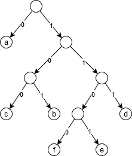

“Introduzione agli algoritmi ed alle strutture dati”, Mc. Growhill, 2023

Soluzione di un problema computazionale
$$\boxed{\text{Specifica del problema}}\rightarrow\boxed{\text{Sviluppo una soluzione algoritmica}}\rightarrow\boxed{\text{Codifica del programma}}$$
> Un algoritmo è la descrizione di un procedimento in termine di passi elementari (combinati con meccanismi di controllo) volti a risolvere il problema di interesse.

Passi elementari dipendono dal modello di computazione.

Per un problema, quanti algoritmi ci sono? Infiniti (si possono aggiungere passi inutili) con diversa efficienza.
Obiettivo: classifica degli algoritmi in base all’efficienza e tecniche di progettazione.

Efficienza di risorse si basa da
- Tempo <-
- Spazio <-
- Correttezza (es. algoritmi probabilistici)
- Manutenibilità

## Analisi e progettazione

ORDINAMENTO (problema centrale) $\begin{cases}\text{search}\\\text{DB join}\\\text{scheduling}\end{cases}$
Input: $a_{1},…,a_{2}$ numeri
Output: permutazione $a_{1},…,a_{2}$ tale che $a^{’}_{1}\leq a^{’}_{2}\leq…\leq a^{’}_{n}$

1. INSERTION SORT, incrementale $\sim n^2$
2. MERGE SORT, divide et impera $\sim n\log n$

## Insertion sort
```
[5|2|8|4|7]

[#|5|8|4|7]  [2]
[2|5|#|4|7]  [8]
[2|#|5|8|7]  [4]
[2|4|5|#|8]  [7]

[2|4|5|7|8]
```
Pseudo-codice
```
InsertionSort(A)
n = A.length

for j=2 to n {
    key = A[j]
    i = j-1
    while (i > 0) and (A[i] <= key) {
        A[i+1] = A[i]
        i = i-1
    }
    A[i+1] = key
}
```
**Correttezza?** Definiamo gli invarianti
- `for` esterno `A[1,…,j-1]` ordinata
- `while` interno  $\begin{align*}A[1,…,i]&\text{ ordinata}\\ A[i+2,…,j]&\text{ ordinata }\&>key\\ A[1,…,i]& <= A[i+2,…,j]\end{align*}$

`while b do`
- Invariante vero all’inizio
- Invariante `&b` -> Invariante dopo l’esecuzione di C

**Efficienza?** 
Analisi: Quanto l’esecuzione dell’Insertion Sort?
- <u>modello di calcolo</u> ~> modello dei costi
	Ha operazioni atomiche (elementari) 
	-> costo costante
- <u>dimensione del problema</u>
	ordinamento: numero degli elementi da ordinare
	moltiplicazione: # byte argomenti
	algoritmo sui grafi: # nodi, # archi

$=c_{1}+c_{2}+c_{3}n+(c_4+c_5+c_{9})(n-1)+\sum(t_{j}+1)(c_{6}+c_{7}+c_{8})$
```
InsertionSort(A)                       -> c1
n = A.length                           -> c2

for j=2 to n {                         -> n c3
    key = A[j]                         -> (n-1) c4
    i = j-1                            -> (n-1) c5
    while (i > 0) and (A[i] <= key) {  -> sum(tj) c6
        A[i+1] = A[i]                  -> sum(tj+1) c7
        i = i-1                        -> sum(tj+1) c8
    }
    A[i+1] = key                       -> (n-1) c9
}
```
Problema: 
- complicata e inultimente dettagliata (costanti ignote)
- dipendenza dalla specifica istanza del problema
Allora li risolviamo definendo
<u>Tempo di esecuzione</u>
-> $T_{min}(n)$   caso migliore 
-> $T_{max}(n)$   caso peggiore 
-> $T_{medio}(n)$ caso medio

Caso migliore:
A è già ordinato $\forall j\quad t_{j}=0$
$\begin{align*}T(n)&=c_{1}+c_{2}+c_{3}n+(c_{4}+c_{5}+c_{9})(n-1)\\&=\not{a}n+\not{b}\qquad\sim n\end{align*}$

Caso peggiore:
A è in ordine decrescente $\forall j\quad t_{j}=j-1$
$\begin{align*}T(n)=&c_{1}+c_{2}+c_{3}n+(c_{4}+c_{5}+c_{9})(n-1)+\sum_{j=2}^{n}(t_{j}+1)+(c_{6}+c_{7}+c_{8})\\=&\not{a^{’}}n^{2}+\not{b^{’}n}+\not{c^{’}}\qquad\sim n^{2}\end{align*}$

Caso medio:
mediamente $t_{j}+\frac{j-1}{2}$

## Merge sort

Divide et impera
- Divide il problema P in $P_{1},…,P_{n}$ sottoproblemi
- Impera, risolve i sottoproblemi $\begin{cases}\text{ricorsivamente}\\\text{soluzione banale di problema piccolo}\end{cases}$
- Combina, “unisce” le soluzioni di $P_{1},…,P_{n}$ per costruire una soluzione $P$

nel Merge sort
-> divide l’ array in due parti (uguali)
-> ordina i sottoproblemi (ricorsivamente)
-> fondo i due sottoarray ordinati

```
[5|2|4|7|1|2|3|6]
[5|2|4|7]         [1|2|3|6]
[5|2]   [4|7]     [1|2]   [3|6]
[5] [2] [4] [7]   [1] [2] [3] [6]
[2|5]   [4|7]     [1|2]   [3|6]
[2|4|5|7]         [1|2|3|6]
[1|2|2|3|4|5|6|7]
```
Pseudo-codice
```
MergeSort(A,p,r)
    if (p < r)
        q = (p+r/2)
	    MergeSort(A,p,q)
	    MergeSort(A,q+1,r)
	    Merge(A,p,q,r)

Merge(A,p,q,r) // A[p-q] e A[q-r] ordinati
	n1 = q-p+1
	n2 = r-q
	// Crea L[1,…,n1+1] e R[1,…,n2+1]
	for i=1 to n1
		L[i] = A[p+i-1]
	for j=1 to n2
		R[i] = A[q+j]
	L[n1] = R[n2] = infty
	i=j=1
	for k=p to r {
		if (L[i]<=R[j]) {
			A[k] = L[i]
			i = i+1
		}else {
			A[k] = R[j]
			j = j+1
		}
	}
```
**Correttezza?** 
Induzione su $\ell=$

**Principio di Induzione**
proprietà parametrica in $n\in\mathbb{N}\qquad P(n)=\{…n…\}$
per dimostrare che $P(n)$ vale per ogni $n\in\mathbb{N}$
$\begin{rcases}P(0)&\text{caso base}\\\text{assumendo }P(n)\text{ dimostro che }P(n+1)&\text{caso induttivo}\end{rcases}\rightarrow$ per ogni $n\in\mathbb{N}$ vale $P(n)$

**Induzione forte**
$\begin{rcases}P(0)\\\text{assumendo }P(n)\text{ vale per ogni }m<n\quad\dim P(n)\end{rcases}\rightarrow P(n)$ vale per ogni $n$

es. Alberi binari
```
    [r]       ^
   /   \      |
  []   [f]    |
 /  \         | n livelli
[f]  []       |
    /  \      |
  [f]  [f]    v
```
$P(n)=$ “per ogni albero binario di altezza $n$, # foglie $\leq 2^n$”

Procediamo per induzione
$(n=0)$ l’albero è `[r]`    # foglie = $1\leq2$
$(P(n)\rightarrow P(n+1))$ assumiamo $P(n)$ e vogliamo dimostrare $P(n+1)=$“se $T$ ha altezza $n+1$, # foglie $\leq2^{n+1}$”
Sia $T$ di altezza $n+1$: 2 possibilità
```
1.                2.
  [r]                 [r]
   |                /     \
  / \             / \     / \
 / T’\           / T’\   / T”\
*—————*         *————-* *————-*
```
Caso 1
$\#\text{foglie}(T)=\#\text{foglie}(T’)\leq2^{n}\leq2^{n+1}$

Caso 2
$\begin{align*}\#\text{foglie}(T)=\#\text{foglie}(T’)&+\#\text{foglie}(T’’)\\n’,n’’&\leq2^{n}+2^{n+1}\end{align*}$
Ma l’ipotesi induttiva mi assicura solo che vale $P(n)$

Se procedo per induzione completa

**Efficienza?**
Analisi del Merge sort

Se $n$ è la dimensione dell’array
```
Merge(A,p,q,r)
	n1 = q-p+1             -*
	n2 = r-q                |
	for i=1 to n1           |
		L[i] = A[p+i-1]     | costo a’n+b’
	for j=1 to n2           |
		R[i] = A[q+j]       |
	L[n1] = R[n2] = infty  -*
	i=j=1                  -*
	for k=p to r            |
		if (L[i]<=R[j])     |
			A[k] = L[i]     |
			i = i+1         | costo a”n+b”
		else                |
			A[k] = R[j]     |
			j = j+1        -*
Costo complessivo Merge = an+b

MergeSort(A,p,r)
    if (p < r)
        q = (p+r/2)
	    MergeSort(A,p,q)
	    MergeSort(A,q+1,r)
	    Merge(A,p,q,r)
```
$T^{MS}(n)=\begin{cases}c_{0}&\text{se }n\leq1\\T^{MS}(\lceil n\rceil/2)+T^{MS}(n/\lfloor2\rfloor)&\text{se }n>1\end{cases}$

Come stimare $(*)$

<u>Albero di ricorsione</u>
```
                T_ms(n) 
                 an+b                          = an+b
            /            \
  T_ms(n/2)            T_ms(n/2)
   a(n/2)+b             a(n/2)+b               = an+2b
  /         \                 
T_ms(n/4)  T_ms(n/4)  T_ms(n/4)  T_ms(n/4)
 a(n/4)+b   a(n/4)+b   a(n/4)+b   a(n/4)+b     = an+4b
  …     …    …     …              …     …
 / \   / \                       / \   / \
c0 c0 c0 c0 . . .               c0 c0 c0 c0    = nc0
```

quindi
$\begin{align*}T^{MS}(n)&=a’n\log_{2}n+b’n+c’&\sim n\log_{2}n\\T^{IS}(n)&=a^{”}n^{2}+b^{”}n+c^{”}&\sim n^{2}\end{align*}$

$T^{MS}(n)$ è “decisamente” più piccolo di $T^{IS}(n)$
$$\displaystyle\lim_{n\rightarrow\infty}\frac{T^{MS}(n)}{T^{IS}(n)}=\lim_{n\rightarrow\infty}\frac{a’n\log_{2}n+b’n+c’}{a^{”}n^{2}+b^{”}n+c^{”}}=0$$
### Analisi del costo degli algoritmi
Da definire nel tempo peggiore $T_{\text{max}}(n)$, medio $T_{\text{medio}}(n)$ e migliore  $T_{\text{min}}(n)$

$f\cdot g:\mathbb{R}^{’}\rightarrow\mathbb{R}^{”}$
$f(n),g(n)$

**Limite asintotico superiore**
Dato $g(n)$$$\begin{align*}O(g(n))=\{f(n)\ |\ &\exists\ c>0\ \exists\ n_{0} \forall n\geq n_{0}\\ &0\leq f(n)\leq c\cdot g(n)\}\end{align*}$$
**Limite inferiore asintotico**
Dato $g(n)$$$\begin{align*}\Omega(g(n))=\{f(n)\ |\ &\exists\ c>0\ \exists\ n_{0} \forall n\geq n_{0}\\ &0\leq c\cdot g(n)\leq f(n)\}\end{align*}$$**Limite asintotico stretto**
Dato $g(n)$$$\begin{align*}\Theta(g(n))=\{f(n)\ |\ &\exists\ c_{1}>0, c_{2}>0\ \exists\ n_{0} \forall n\geq n_{0}\\ &0\leq c_{1}\cdot g(n)\leq f(n)\leq c_{2}\cdot g(n)\}\end{align*}$$
<u>Metodo del limite</u>
Dato $f(n),g(n)\quad >0$
1. $\displaystyle\lim_{n\rightarrow\infty}\frac{f(n)}{g(n)}=k>0\qquad\text{allora }f(n)=\Theta(g(n))$
	ovvero $\forall\epsilon>0\ \exists n_{0}\ \forall n\geq n_{0}$
	$\left|\frac{f(n)}{g(n)}=k\right|\leq\epsilon$
	$-\epsilon\leq\frac{f(n)}{g(n)}-k\leq\epsilon$
	$k-\epsilon\leq\frac{f(n)}{g(n)}\leq k+\epsilon$
1. $\displaystyle\lim_{n\rightarrow\infty}\frac{f(n)}{g(n)}=0\qquad\text{allora }f(n)=O(g(n))$
2. $\displaystyle\lim_{n\rightarrow\infty}\frac{f(n)}{g(n)}=\infty\qquad\text{allora }f(n)=\Omega(g(n))$
Vale il contrario? Solo se il limite esiste

**Complessità di un problema**
Dato un problema $P$ la sua complessità è la complessità del più efficiente algoritmo che risolve $P$.

$\rightarrow$ <u>limite superiore</u>
Un algoritmo $A$ che risolve $P$ con complessità $O(f(n))$ allora anche $P$ ha complessità $O(f(n))$.

$\rightarrow$ <u>limite inferiore</u>
Se ogni algoritmo $A$ per il problema $P$ ha complessità $\Omega(g(n))$ allora anche $P$ ha complessità $\Omega(g(n))$.

Es. Ordinamento $\qquad\Omega(n)$ (devo almeno leggere gli elementi di input)
dipendenza sostanziale dal modello di calcolo

$\rightarrow$ <u>limite stretto</u>
Se $P$ ha complessità $O(f(n))$ e $\Omega(f(n))$ allora il problema $P$ ha complessità $\Theta(f(n))$.

**Complessità dell’ordinamento** basato su scambio di elementi contigui
```
       k k+1
A [   | | |   ]      A[k] <-> A[k+1]
```
$\rightarrow$ <u>limite inferiore</u>
```
INVERSIONE  [   |7|    |2|   ]      A[i] > A[j]
.                i   <  j
```
$\#Inv(A)=|\{(i,j)|1\leq i<j\leq n\text{ e }A[i]>A[j]\}|$

Osservazione
1. A è ordinato se e solo se # Inv(A)=0
2. massimo numero di inversioni: A ordinato in senso decrescente (e senza ripetizioni) 
	$\#Inv(A)=\sum_{j=2}^n(j-1)=\frac{n(n-1)}{2}$

Osservazione: valutiamo l’effetto di uno scambio `A[k] <-> A[k+1]` sullo “stato” di inversione di una coppia $(i,j)$ con $i<j$
Vari casi
$\rightarrow i,j\neq k,k+1$

$(i,j)$ è inversione prima dello scambio se e solo se è inversione dopo

$\rightarrow i=k,\ j=k+1$
```
     k k+1            3 possibilità    #inv
[   | | |  ]          A[k] < A[k+1]     +1
     i j              A[k] = A[k+1]      0
.                     A[k] > A[k+1]     -1
```
$\rightarrow i=k,\ j>k+1$

$(k,j)$ è inversione dopo se e solo se $(k+i,j)$ è inversione prima
$(k+i,j)$ è inversione dopo se e solo se $(k,j)$ è inversione prima
$\searrow$ limitatamente a $(k,j),(k+i,j)$ il numero di inversioni è immutato

$\rightarrow i<k\text{ e }j=k$

L’operazione di scambio `A[k] <-> A[k+1]` (unica operazione di modifica dell’array) riduce # Inv(A) al più di 1.

Dato A ordinato in senso decrescente (senza ripetizioni) $\#Inv(A)=\frac{n(n-1)}{2}$ quindi per ordinarlo e ridurre le inversioni a 0 devo fare almeno $\frac{n(n-1)}{2}$ scambi.
$\searrow$ Limite inferiore per il problema $\Omega(\frac{n(n-1)}{2})$

Soluzione di Ricorrenze
$T(n)=\begin{cases}1&n=1\\ T(n-1)+1&n>1\end{cases}\qquad\stackrel{?}{=}\Theta(n)$

$T(n)=\begin{cases}c&n\leq1\\2T(n/2)&n>1\end{cases}\qquad\stackrel{?}{=}\Theta(n\log_{2}n)$
2 tecniche di soluzione
1. metodo di sostituzione
2. Master Theorem
#### 1. Metodo di Sostituzione
2 fasi 
$\begin{align*}&\rightarrow\text{idea della soluzione (albero delle ricorrenze)}\\&\rightarrow T(n)=\begin{cases}c&n\leq1\\2T(n/2)&n>1\end{cases}\qquad\stackrel{?}{=}\Theta(n\log n)\end{align*}$

-> verificare la correttezza -> dimostrazione induttiva
$T(n)=\begin{cases}4&n\leq1\\2T(n/2)+6n&n>1\end{cases}$

Ipotesi: $T(n)=an\log_{2} n+bn+c$
Per induzione: 
$(n=1)\qquad T(n)=4\quad\stackrel{\text{ipotesi}}{=}\quad$

$\begin{align*}(n>1)\qquad T(n)&=2T(n/2)+6n\\&=an()+bn+2c+6\\&=an\log_{2}n+(-a+b+6)n+2c\\\text{vogliamo che}\\&=an\log_{2}n+bn+c\end{align*}$

<u>Lavorare direttamente a livello contratto?</u>
$T(n)=\begin{cases}\cancel{4}&\cancel{n\leq1}\\2T(n/2)+\underbrace{6n}_{\Theta(n)}&n>1\end{cases}$
$T(n)=2T(n/2)+\Theta(n)\qquad\stackrel{?}{=}\Theta(n\log n)$

Dimostriamo
1. $T(n)=O(n\log n)$
2. $T(n)=\Omega(n\log n)$

(1) $T(n)=O(n\log n)$ 
	$T(n)\leq c\cdot n\log n\qquad c>0$
per induzione, senza caso base
	$\begin{align*}T(n)&=2T(n/2)+\Theta(n)\\&\leq2T(n/2)+dn\\&\leq2\left(c\frac{n}{2}\log\frac{n}{2}\right)+dn\\&=cn(\log n-\log 2)+dn\\&=(c\log_{2}-d)\end{align*}$

(2) $T(n)=\Omega(n\log n)$
	$T(n)\geq c^{’}n\log n$
per induzione

#### 2. Master Theorem
$T(n)=\underbrace{a}_{a\geq1}T(\underbrace{\frac{n}{b}}_{b>1})+f(n)$
$a$ numero dei sottoproblemi
$\frac{n}{b}$ dimensione dei sottoproblemi
$f(n)$ costo di "combina"

Quale domina ($f(n)$ vs $n^{log_{b}a}$)

(1) $T(n)=\Theta(n^{log_{b}a})$ se $f(n)=O(n^{log_{b}a-\epsilon})\text{ e }\epsilon>0$
(2) $T(n)=\Theta(n^{log_{b}a}\log n)$ se $f(n)=\Theta(n^{log_{b}a})$
(3) $T(n)=\Theta(f(n))$ se $f(n)=\Omega(n^{log_{b}a+\epsilon})\text{ e }\epsilon>0$ 
	e REGOLARITA $\exists k\quad 0<k<1$ a $f(\frac{n}{b})\leq kf(n))$

```
                  T(n) 
             / ... a ... \
        T(n/b)             T(n/b)
     / ...a... \         / ...a... \
  T(n/b^2)  T(n/b^2)  T(n/b^2)  T(n/b^2)
  /     \    /     \             /     \
  …     …    …     …             …     …
 / \   / \                      / \   / \
c   c c   c . . .              c   c c   c    #foglie= a^(logn)
```

$\displaystyle T(n)=f(n)+af(\frac{n}{b})+a^{2}f(\frac{n}{b^{2}})+...+a^{log_{b}n}f(\frac{n}{b^{log_{a}n}})+ca^{log_{b}n}$
$\displaystyle T(n)=f(n)+af(\frac{n}{b})+a^{2}f(\frac{n}{b^{2}})+...+(f(1)+c)n^{log_{b}a}$

(1) se "domina" $n^{\log_{b}a}\qquad\rightsquigarrow\qquad T(n)=\Theta(n^{\log_{b}a})$
(2) se sono "pari" $\qquad\rightsquigarrow\qquad T(n)=\Theta(n^{log_{b}a}\log n)$

$\begin{align*}\text{(3) se "domina" }f(n)\qquad\rightsquigarrow\qquad &T(n)=\Theta(f(n))\\ &\text{regolarità }af\left(\frac{n}{b}\right)\leq kf(n)\end{align*}$
$T(n)=f(n)+af\left(\frac{n}{b}\right)+a^{2}f\left(\frac{n}{b^{2}}\right)+...+$
tende a una costante

<u>Uso del Master Theorem</u>
$T(n)=aT(\frac{n}{b})+f(n)$
confrontare $f(n)\qquad n^{\log_{b}a}$

metodo del limite (se possibile)
(a) $\begin{align*}\lim_{n\rightarrow\infty}\frac{f(n)}{n^{log_{b}a}}=k >0\qquad\rightsquigarrow\qquad&f(n)=\Theta(n^{log_{b}a})\\ &\text{[caso 2]}\quad T(n)=\Theta(n^{log_{b}a}\log n)\end{align*}$
(b) $\displaystyle\lim_{n\rightarrow\infty}\frac{f(n)}{n^{log_{b}a}}=0\qquad\rightsquigarrow\qquad f(n)=O(n^{log_{b}a})$
	\[caso 1\] unico possibile, ma deve esistere $\varepsilon>0$ tale che
	$\begin{align*}\lim_{n\rightarrow\infty}\frac{f(n)}{n^{log_{b}a-\varepsilon}}=0\qquad\rightsquigarrow\qquad&f(n)=O(n^{(log_{b}a)-\epsilon})\\&T(n)=O(n^{log_{b}a})\end{align*}$
(c) $\displaystyle\lim_{n\rightarrow\infty}\frac{f(n)}{n^{log_{b}a}}=\infty\qquad\rightsquigarrow\qquad f(n)=\Omega(n^{log_{b}a})$
	\[caso 3\] unico possibile, ma deve esistere $\varepsilon>0$ tale che
	$\displaystyle\lim_{n\rightarrow\infty}\frac{f(n)}{n^{log_{b}a+\varepsilon}}=\infty\quad$ ed se esiste $0<k<1$ tale che $af(\frac{n}{b})\leq kf(n)$
	$\rightarrow T(n)=\Theta(f(n))$

esempio. 
$T(n)=5T(\frac{n}{2})+n^{3}$
$\begin{align*}f(n)=n^{3}\qquad=\qquad\Omega(n^{log_{b}a}+\epsilon)=&\Omega(n^{log_{2}5+\epsilon})\\ &\epsilon<3-\log_{2}5\end{align*}$
unica cosa possibile è il caso 3.
Devo verificare la regolarità
$af(\frac{n}{b})\leq kf(n)\qquad k>1$ asintoticamente
$5\frac{n^{3}}{2^{3}}=5f(\frac{n}{2})\leq kf(n)=kn^3$
$\rightarrow T(n)=\Theta(f(n))=\Theta(n^{3})$

xcasa
1. Implementare InsertionSort in modo ricorsivo (mai iterazione)
2. Valuta duplicati in un array `(i,j) e i<j t.c. A[i]=A[j]`
	boolean DupCheck(A)
	int DupCount(A)
	 array elemDup(A)
	 array idDup(A)
3. Dato `A[1,…,n]` e key(valore), verificare se esistono i,j tale che `A[i]+A[j]=key`

```
Insert(A, i) {
	if(i > 1) and (A[i] <= A[i-1])
			tmp = A[i]
			A[i] = A[i-1]
			A[i-1] = tmp
			Insert(A, i-1)
}

RecInsertionSort(A, j)
	if(j > 1)
		RecInserionSort(A, j-1)
		Insert(A, j)
```
Complessità?
$T_{insert}(j)=c+T_{insert}(j-1)\qquad\rightsquigarrow\quad T_{insert}(j)=\Theta(j)$
$\begin{align*}T_{RIS}(n)=&T_{RIS}(n-1)+\overbrace{\underbrace{T_{insert}(n)}_{\Theta(n)}+c}^{\Theta(n)}\\=&T_{RIS}(n-1)+\Theta(n)=\Theta(n^2)\end{align*}$

```
# per trovare i duplicati a “cavallo” faccio in modo che la ricerca dei duplicati come “effetto collaterale” ordini l’array
CrossCheck(A, p, q, r) {
	n1 = q-p+1
	n2 = r-q
	L[1,…,n1] <- A[p,…,q]
	R[1,…,n2] <- A[q+1,…,r]
	L[n1+1] = R[n2+1] = infty
	i = j = 1
	k = p
	while(k <= r) and (L[i] != R[j])
		if L[i] < R[i]
			A[k] = L[i]
			i++
		else
			A[k] = R[j]
			j++
		k++
	return (k <= r)
}

DupCheck(A, p, r) {  # verifica la presenza di duplicati
	if(p < r)
		q = p+r/2
		return DupCheck(A, q, p) or
			   DupCheck(A, p+1, r) or
			   CrossCheck(A, p, q, r)
	else
		return false
}
```
Complessità?
$T(n)=2T(\frac{n}{2})+\Theta(n)\qquad\rightsquigarrow\quad T(n)=\Theta(n\log n)$
$\text{senza ordinare}\qquad\rightsquigarrow\quad T(n)=\Theta(n^2)$

```
Cross(A, p, q, r) {
	n1 = q-p+1
	n2 = r-q
	L[1,…,n1] <- A[p,…,q]
	R[1,…,n2] <- A[q+1,…,r]
	L[n1+1] = R[n2+1] = infty
	i = j = 1
	k = p
	while(k <= r) and (L[i] != R[j])
		if L[i] < R[i]
			A[k] = L[i]
			i++
		else
			A[k] = R[j]
			j++
		k++
	return (k <= r)
}

DupCount(A, p, r) {
	if(p < r)
		q = p+r/2
		return DupCount(A, q, p) +
			   DupCount(A, p+1, r) +
			   CrossCount(A, p, q, r)
	else
		return 0
}
```

```
Sum(A, key) {
	for i to len(A)
		j = i+1
		for j to len(A)
			if(A[i]+A[j] = key)
				return 
			j++
}
```
idea2: ordino `A[1,…,n]`
costo -> n interazioni di costo $\Theta(1)$
	  -> costo totale $\Theta(n)$
	  (+ ordinamento $\Theta(n log n)$)
COMPLESSO $\Theta(n)+\Theta(n\log n)=\Theta(n\log n)$

Se volessi gli indici $i$ e $j$ nell’array di partenza? Usa array di indici.

<u>array di occorrenze</u>

Se $\begin{align*}A[1,…,n]\\ A[i]>=0\end{align*}$ è array di interi, k intero

Se $A[i]+A[j]=k\quad\rightsquigarrow\quad A[i]+a[j]\leq k$
$\searrow$ unici elementi di interesse sono $A[i]$ tali che $0\leq A[i]\leq k$

uso un array $V[0,…,k]$ booleano
`V[v] = true` se e solo se esiste $1\leq i\leq n\quad A[i]=v$
- inizializza `V[0,…,k] = false`
- scorre l’array A
	se $A[i]\leq k$ allora
	- `V[A[i]] = true`$\rightsquigarrow\exists\ j\leq i$

Ordinamento
- altri algoritmi
- limite inferiore $\Omega(n\log n)$
- ordinamento in tempo lineare

<u>InsertionSort</u>
- incrementale
- complessità 
	tempo $\Theta(n^2)$
	spazio: in loco (+ un paio di variabili) $\Theta(1)$

<u>MergeSort</u>
- divide-et-impera
- complessità 
	tempo $\Theta(n\log n)$
	spazio:
	- merge $\Theta(n)$ copia dell’input
	- mergesort $S^{MS}(n)=\max\{S^{MS}\left(\frac{n}{\lfloor2\rfloor}\right),S^{MS}\left(\frac{\lceil n\rceil}{2}\right),\Theta(n)\}=\Theta(n)$

-> miglioramento: allocare `B[1,…,n]` esplicitamente (risparmio tempo di allocazione)
```
MergeSort(A, n)
	allora B[1,…,n]
	MergeSortRec(A, B, 1, n)
```
xcasa
1. Evita la copia dell’ input nel Merge e usa A e B alternativamente come sorgente/destinazione.
2. Versione iterativo divide fino a un k ordinato in InsertionSort (Timsort)
3. In loco

## HeapSort
- complessità
	tempo: $\Theta(n\log n)$
	spazio: $O(1)$
- min-heap / max

Usa gli alberi binari ordinati (figlio sx, dx).
```
    [r]       ^
   /   \      |
  []   [f]    |
 /  \         | h cammino max radice-foglia
[f]  []       |
    /         |
  [f]         v
```

Albero (binario) completo
1. Ogni nodo non foglia ha esattamente 2 figli
2. Ogni cammino nodo-foglia ha la stessa lunghezza
```
        [r]       
      /     \     
    []       []   
   / \       / \   
 []   []   []   []   
 /\   /\   /\   /\  
[][] [][] [][] [][]   Completo
```

Allora binario completo di altezza $h$ ha $2^{h-1}$

L’albero quasi completo: tutti i livelli completi tranne l’ultimo, dove le foglie “a sx”.

Heap: albero ordinato binario quasi completo
Implementato come array
![[Pasted image 20241017152519.png|Pasted image 20241017152519.png]]
```
Radice A[i]
Nodo A[i] figlio sx A[2*i]
     ''   figlio dx A[2*i+1]
Nodo A[i] parente A[i/2]
A.length  A.size = # nodi albero
```

Max-Heap: Heap + proprietà d’ordine
-> ogni nodo è $\geq$ discendenti
$\begin{align*}\forall\ i\qquad A[i]\geq&A[Left(i)]\\ \geq&A[Right(i)]\end{align*}$
-> ogni nodo è $\leq$ antenati
$\forall\ i\qquad A[i]\leq A[Parent(i)]$

Come ottengo un max-heap?
2 osservazioni
- un albero con un solo nodo è max-heap
- dato un nodo i in heap con sottoalbero max-heap, è facile sistemarla con
```
MaxHeapify(A, i)
	l = Left(i)
	r = Right(i)
	if (l <= A.size) and (A[l] > A[i])
		max = l
	if (r <= A.size) and (A[r] > A[i])
		max = r
	if max != i
		A[i] <-> A[max]
		MaxHeapify(A, max)
```
Correttezza?
- caso base 
	i foglia: non faccio niente, foglia è max-heap
	i non foglia: $A[i]\geq A[l],A[r]$
Complessità?
$O(\log n)$

Build Max-Heap
dato un array $A$, parto dal primo nodo parente a destra dove uso MaxHeapify e così ai nodi precedenti.

Come individuare nodi non foglia
se $i\geq\frac{n}{2}+1\Rightarrow$ `A[i]` foglia, ovvero non ha figlio sinistro `Left(i)`
se $i\leq\frac{n}{2}+1\Rightarrow$ `A[i]` non foglia, ovvero `Left(i)<=n`
```
BuildMaxHeap(A)
A.length
for i = A.length/2 down to 1
	MaxHeapify(A,i)
```
<u>inizio</u>: $i=\lfloor\frac{A.length}{2}\rfloor\Rightarrow\forall\ j>\frac{A.length}{2}$
<u>iterazione</u>:
Complessità?

$n_{h}\leq2^{h_{T}-h}=\frac{2^{h_{T}}}{2^{T}}\leq\frac{2^{\log_{2}n}}{2^{h}}=\frac{n}{2^{h}}$
$\begin{align*}T(n)=&\sum\limits_{n=1}^{\log_{2}n}n_{h}O(h)\leq\sum\limits_{n=1}^{\log_{2}n}\frac{n}{2^{h}}O(h)=O(\sum\limits_{n=1}^{\log_{2}n}n\frac{h}{2^{h}})\\=&O(n\sum\limits_{n=1}^{\log_{2}n}\frac{n}{2^{h}})=O(n)\end{align*}$

```
HeapSort(A)
	BuildMaxHeap(A)
	for i = A.length down to 2
		A[1] <-> A[i]
		A.size = A.size-1
		MaxHeapify(A, 1)
```
Complessità?
$\begin{cases}n-1\text{ iterazioni}\\ \text{ogni iterazione: costo MaxHeapify }O(\log n)\end{cases}$
-> complessivamente $O(n+n\log n)=O(n\log n)$

Code con priorità
$\begin{align*}\text{collezioni dinamiche di elementi }x\qquad& x.key\\\text{operazioni}\qquad&\text{ExtractMax(a)}\\\qquad&\text{Insert}\\\qquad&\text{Delete}\end{align*}$
ExtractMax, basta che ritorni la radice dopo BuildMaxHeap

```
MaxHeapifyUp(A,i)
	if (i>1) and (A[i]>A[Parent(i)])
		A[i] <-> A[Parent(i)]
		MaxHeapifyUp(A,Parent(i))
```

Insert, devo tenere conto dell'i che sto inserendo sballa il max-heap esistente
```
Insert(A,k)
	A.size = A.size+1
	A[size] = k
	MaxHeapifyUp(A, A.size)
```
(Come esercizio, ritornare la posizione dell’elemento Inserito)

```
IncrementKey(A,i,delta) // delta>=0
	A[i] = A[i]+delta
	MaxHeapify(A,i)

DecrementKey(A,i,delta) // delta>=0
	A[i] = A[i]-delta
	MaxHeapify(A,i)
```
Costo: O(log n)

```
Remove(A,i)
	A[i] <-> A[size-1]
	A.size = A.size-1
	(es. come continuarlo)
```

## QuickSort
Di Tony Hoare (1961)
- complessità del caso peggiore $O(n^{2})$
- complessità del caso medio $O(n\log n)$
- in loco
- costanti additive/moltiplicative bassi
- randomizzati one per indurre il caso medio sistematicamente

<u>Divide et impera</u>
dato un array A\[1,…,n\]
per ordinare A\[p,…,r\]
-> partition:
- sceglie un elemento pivot x in A\[p,…,r\]
- partiziona A\[p,…,r\]
-> impera: ordina A\[p,…,q-1\] e A\[q+1,…,r\] ricorsivamente
-> combina: niente da fare

```
QuickSort(A,p,r)
	if(p < r)
		q = Partition(A,p,r)
		QuickSort(A,p,q-1)
		QuickSort(A,q+1,r
```
<u>Correttezza</u>: induzione su k = r-p
$(k\leq1)$ ovvero $p\geq r$, A\[p,r\] già ordinato
$(k>1)$ assumendo Partition corretto

**Partizionamento deterministico**
pivot x = A\[r\]
```
Partition(A,p,r)
	x = A[r]
	i = p-1
	for j=p to r-1
		if (A[j] <= x)
			i = i+1
			A[i] <-> A[j]
	A[i+1] <-> A[r]
	return i+1
```
<u>Correttezza</u>: $\begin{align*}A[p,…,i]\leq x\\ A[i+1,…,j-1]>x\end{align*}\quad$ se A\[r\] = x
inizio:
$i=p-1\qquad$A\[p,…,i\] = A\[p,…,p-1\] vuoto
$j=p\qquad$ A\[i+1,…,j-1\] = A\[p,…,p-1\] vuoto
conservazione:

<u>Costo</u>: $\Theta(n)$

Quanto costa quindi QuickSort?
$T(n)=\Theta(n)+T(k)+T(n-k-1)$ dipende da k

- CASO PEGGIORE
massimo sbilanciamento
$[\underbrace{\qquad\leq x\qquad\ \ }_{n-1}|\underset{q}{x}]$
$[\qquad\leq x\qquad|z|x]$
-> già ordinato

albero di ricorsione
$\begin{align*}T(n)\qquad&an+b\\ T(n-1)\qquad&a(n-1)+b\\\vdots\qquad&\vdots\\ T(1)\qquad&\end{align*}$

induzione su espressione concreta
$T(n)=\begin{cases}\end{cases}$
si fa per induzione che funziona $T(n)=a^{’}n^{2}+b^{’}n+c^{’}$

induzione con espressione astratta (sostituzione)
$T(n)=T(n-1)+\Theta(n^2)$
1. $T(n)=O(n^{2})$
	ovvero $T(n)\leq c\cdot n^{2}$ con c>0 opportuna e n “grande”
	per induzione 
	$\begin{align*}T(n)=&T(n-1)+\Theta(n)\\\leq&T(n-1)+dn\\\leq&c(n-1)^{2}+dn\\=&cn^2-2cn+c+dn\\=&cn^2-((2c-d)n-c)\end{align*}$
	garantito da $2c-d>0,\quad$
2. $T(n)=\Theta(n)$

- CASIO MIGLIORE
Posizionamento bilanciato
$\begin{align*}T(n)&=\Theta(n)+2T\left(\frac{n}{2}\right)\\&=2T\left(\frac{n}{2}\right)+\Theta(n)\end{align*}$
$n^{\log_{b}a}=n^{\log_{2}2}=n^{1}\qquad\text{vs}\qquad f(n)=\Theta(n)=\Theta(n^{\log_{b}a})$
$\rightsquigarrow$ caso 2
$T_{min}^{QS}(n)=\Theta(n\log n)$

- CASO MEDIO
Si verifica che $T_{med}^{QS}(n)=\Theta(n\log n)$
assumendo input con distribuzione uniforme $\rightsquigarrow$ posizioni pivot equiprobabili
$T(n)=\frac{1}{n}(T(k)+T(n-k-1)+an+b)$

<u>Osservazione 1</u>: Partizionamento proporzionale
Albero di Ricorsione

$T(n)\leq n\log_\frac{10}{3}n$
$T(n)=O(n\log n)$
$\log_\frac{10}{9}n=(\underset{\sim\ 2.7}{\log_\frac{10}{9}2})\log_{2}n$

<u>Osservazione 2</u>: Alternanza tra partizionamenti sbilanciati e ottimi
Albero di ricorsione
```
        [T(n)]       
          /     \     
    [T(0)]       [T(n-1)]   
                 /    \   
          [T((n-1)/2)]   [T((n-1)/2)]   
         /  \                 /  \  
     [T(0)][T((n-1)/2-1)] [T(0)][T((n-1)/2-1)]
```
L’albero è divisibile in 3 casi

$T(n)=O(n\log n)$

-> Cosa fare nel caso di distribuzione di input non uniformi?
Scegliamo il pivot in modo random
```
RandomizedPartition(A,p,r)
	i = Random(p,r)
	A[i] <-> A[r]
	return Partition(A,p,r)
```

-> E se ci sono molto ripetizioni? Le partizioni sono comunque sbilanciate
Tripartition $\qquad\underbrace{\overset{p}{[}<x\underset{q_{1}}{|}}_{\text{QuickSort}}=x\underbrace{\underset{q_{2}}{|}>x\overset{r}{]}}_{\text{QuickSort}}$
#### Limite inferiore per il Problema dell’Ordinamento
Problema
$\begin{cases}\text{IN:}&a_{1}…a_{n}\\\text{OUT:}&a_{1}^{’}…a_{n}^{’}\quad\text{permutazioni ordinate}\end{cases}$
ordinamento basato su confronti e assegnamenti, senza ulteriori informazioni sull’input$$\Omega(n\log n)$$$\hookrightarrow$ limite inferiore per le operazioni di confronto
$\hookrightarrow$ restrizione a sequenze di input senza ripetizioni $\forall\ i,j\quad\begin{align*}i&\neq j\\ a_{i}&\neq a_{j}\end{align*}$

- <u>Alberi di decisione</u>
descrizione (astratta) dell’esecuzione di algoritmi su input di dimensione fissata n
$\rightarrow$ nodi interni 
$\rightarrow$ foglie: output (permutazioni dell’input)

Altezza dell’albero di decisione (per input di dimensione n) è limite inferiore al numero di confronti che l’algoritmo fa su input di dimensione n nel suo caso pessimo.

Osservazioni fondamentali
- ogni permutazione deve etichettare almeno una foglia
	n = 3 nessuna foglia ha la perm. 213
- ogni foglia contiene una sola permutazione (perché non ci sono ripetizioni)

Ogni algoritmo di ordinamento (corretto), l’albero di decisione per input di dimensione n$$\#\text{ foglie}\geq\#\text{ permutazioni di n elementi}=n!$$$\underbrace{\triangle}_{2^n\geq\#\text{ foglie}\geq n!}$
$\begin{align*}\#\text{operazioni dell’ algoritmo su input di dim n nel caso pessimo}\quad\geq\quad h&\geq\log_{2}(n!)\\&\geq\end{align*}$
### Ordinamento a tempo lineare
Il limite inferiore dell’argoritmo di ordinamento è $\Omega(n\log n)$.
Ordinamento a tempo lineare è solo possibile con ipotesi sull’input:
- limite di variabilità
- distribuzione

**CountingSort**
Assunzione: 
- interi
- in \[0,k\] con k noto (massimo valore)

Input: A\[1,…,n\] con $A[j]\in\{0,1,…,k\}\qquad\forall\ j\quad 1\leq j\leq k$
Output: B\[1,…,n\] con gli elementi di A ordinato
```
CountingSort(A,B,k)
	c[0,…,k] <- 0     // c array circolare
	for j=1 to A.length
		c[A[j]]++     // c[x] = num di elem x in A
	for i=1 to k
		c[i] = c[i]+c[i-1]  // c[x] = num di elem <= x in A
	for j=A.length down to 1
		B[c[A[j]]] = A[j]
		c[A[j]]
```
<u>Complessità</u>?
$\Theta(n+k)$

Perché l’ultimo for non inizia dal primo elemento?
Si perde la proprietà di **stabilità**, mantenimento della posizione relativa di numeri duplicati.

| Algoritmo     | È stabile? |
| ------------- | ---------- |
| InsertionSort | X          |
| MergeSort     | X          |
| QuickSort     |            |
| HeapSort      |            |
| CountingSort  | X          |
Perché non inserire direttamente con le frequenze in c, le sue chiavi (valore in A)?
Non funziona in array di variabili non intere.

<u>Complessità spaziale</u>?
$\Theta(n+k)$

| # bit | dim C                         |
| ----- | ----------------------------- |
| 8     | $2^8$ 1 byte = 256 byte       |
| 16    | $2^{16}$ 2 byte = 128 byte    |
| 32    | $2^{32}$ 3 byte = 16 Gb       |
| 64    | $2^{64}$ 4 byte = 128 exabyte |
**RadixSort**
Herman Hollerith, censimento popolazione con schede perforate. 
Macchina che suddivideva le schede in indici. Come ordinare le schede?
1a IDEA: { ordina secondo la cifra più significativa } -> complessità alta con la macchina
2a IDEA: { ordina secondo la cifra meno significativa }
Tabulating Machine Company
-> 1924 International Business Machine

Input: $A[1,…,n]\qquad A[j] = o_{d} o_{d-1} … o_{1}$
d cifre in base b
```
Radix(A,d)
	for j=1 to d
		ordina A rispetto alla cifra j con algoritmo stabile
```
<u>Correttezza</u>?
Invariante: $A^{j-1}$ ordinato
Inizio:

<u>Complessità</u>?
$\Theta(\text{complessità algoritmo stabile}\cdot d)$
Nel caso usiamo CountingSort come algoritmo stabile
$\Theta((n+b)\cdot b)\qquad b=O(1)$

<u>Complessità spaziale</u>?
$\Theta(\text{complessità algoritmo stabile})+\Theta(n)$ con l’assunzione precedente

## Hash Tables
$x\begin{cases}\text{x.key}\\\text{dati satellite}\end{cases}\quad\begin{align*}\text{Insert(s,x)}\\\text{Delete(s,x)}\\\text{Search(s,k)}\end{align*}$

efficiente:
-> costo medio $\Theta(1)$
-> costo peggiore $\Theta(N)$

**Indirizzamento Diretto**
universo delle chiavi $U=\{0,1,…,|U|-1\}$
<u>idea</u>: uso un array indicizzato da U
`T[0,…,|U|-1]`
$T[j]\begin{cases}{\displaystyle\text{elemento con chiave j}\atop\text{(se è nella collezione)}}\\\text{nil}&\text{altrimenti}\end{cases}$

```
Insert(T,x) // O(1)
	T[x.key]=x

Delete(T,x) // O(1)
	T[x.key]=nil

Search(T,k) // O(1)
	return T[k]
```
Problemi:
1. Non posso avere due elementi con la stessa chiave
2. Va bene se |U| è “piccola”

**Hash Tables**
Ideale: usare spazio proporzionale al numero di elementi nella struttura (senza degradare le prestazioni)
`T[0,…,m-1]`
m << |U|
algoritmo di hash $h:U\rightarrow[0,m-1]$
assumiamo che abbia costo O(1)

Collisione: chiavi $k_{1},k_{2}\in U$ con $h(k_{1})=h(k_{2})$
($m<|U|\Rightarrow$ succede con certezza)

*Pigeon hole principle*: Dati A,B finiti e |A| > |B| allora nessuna funzione $f:A\rightarrow B$ è iniettiva.

2 possibili soluzioni:
- CHAINING
- OPEN ADDRESS

#### CHAINING
Linked list nelle celle dell'array
```
Insert(T,x) // O(1)
	inserisci x nella lista T[x.key] in testa

Delete(T,x) // O(1)
	cancella x dalla lista T[x.key]

Search(T,k) // O(n) caso peggiore
	cerca un elemento con chiave k nella lista T[h(k)]
```
**Caso medio**
m = numero celle tabella
n = numero di elementi memorizzati
$\alpha=\frac{n}{m}$ fattore di carico

fattori rilevanti:
- distribuzione input
- qualità della funzione di hash

<u>Ipotesi</u>: funzione di *hash uniforme e indipendente*, per cui ogni elemento in input è assegnato in uguale probabilità $\frac{1}{m}$ a qualunque cella.

$n_j:$ lunghezza della lista in `T[j]`
$x_{1},…,x_{n}\quad E[n_{j}]=\frac{n}{m}=\alpha$

- Costo medio di Search
(a) ricerca di una chiave *presente*
$\begin{rcases}\rightarrow\text{calcolo }h(k)=j\\\rightarrow\text{accedo alla lista }T[j]\quad\end{rcases}\Theta(1)$
-> cerco in `T[j]` un elemento x tale che `x.key=k`
complessivamente costo medio $1+\frac{\alpha}{2}$

(b) ricerca di una chiave *assente*
$\begin{rcases}\rightarrow\text{calcolo }h(k)=j\\\rightarrow\text{accedo alla lista }T[j]\quad\end{rcases}\Theta(1)$
-> cerco x con `x.key=k` in `T[j]`, senza trovarlo
	-> scorro l’intera lista $\quad\Theta(n_{j})\underset{\text{in media}}{=}\Theta(\alpha)$
costo medio $1+\alpha$

In sintesi il costo medio
- chiave presente è $1+\frac{\alpha}{2}$
- chiave assente è $1+\alpha$
assumendo $n\leq c\cdot m\quad\rightsquigarrow\quad\alpha=\frac{n}{m}\leq c$

Come definire la funzione di hash?
**Metodo della divisione**
$h(k)=k\mod m\qquad\in\{0,1,…,m-1\}$
Problema: scelta di m è critica
$\rightarrow m=2^{p-1}$
$\underbrace{[\qquad]}_{\text{p bit}}\underbrace{[\qquad]}_{\text{p bit}}…\underbrace{[\qquad]}_{\text{p bit}}\ k$
dato un numero in base b

**Metodo della moltiplicazione**
se le chiavi $k\in[0,1)$ reale uniformemente distribuite
$h(k)=\llcorner m n\lrcorner$

data $k\in\{0,1,…,|U|-1\}$
-> fisso $A\in(0,1)\quad0<A<1$
-> considero $k\cdot A=…,\underbrace{…}_{\in[0,1)}$
$h(k)=\llcorner m(K\cdot A\mod1)\lrcorner$

xcasa:
1. Radix Sort con ordinamento a partire dalla cifra più significativa (MSD)
#### OPEN ADDRESSING
Tutti gli elementi dell'insieme dinamico memorizzati nella tabella.

`h(k,i)  // k=key, i=iterazione`

$\underbrace{h(k,0)\quad h(k,1)\quad h(k,2)\quad...\quad h(k,m-1)}_{\text{sequenza di ispezione}}$ 
La sequenza di ispezione è una permutazione di \[0, m-1\].

```
Insert(T,x)
	i=0
	repeat
		j=h(x.key,i)
		if T[j]==nil or T[j]==DEL
			T[j]=x
			return j
		i=i+1
	until i==m
	errore: tabella piena

Search(T,k)
	i=0
	repeat
		j=h(k,i)
		if T[j].key == k
			return j
		i=i+1
	until i==m or T[j]==nil
	errore: tabella piena o elemento non trovato

Delete(T,j)
	T[j]=DEL
```

*Hashing uniforme (con permutazioni indipendenti e uniformi)*
ogni elemento induce con la stessa probabilità una delle $m!$ seguenze di ispezione.
sequenze di ispezione $\sim$ sequenze 

Come definire le funzioni di hash?
1. ispezioni lineari
   data $h(i)$ funzione hash a un argomento
   $h^{'}(k,i)=(h(k)+i)\mod m$
   PRO: semplice
   CONTRO: addensamento primario, la probabilità di inserire in j aumenta al crescere della dim del blocco occupato che precede j
   $[\qquad\underbrace{|---|}_{t\text{ tabella occupata}}\underset{j}{\ }|\qquad ]\qquad P(j)=\dfrac{t+1}{m}$
1. ispezione quadratica
   data $h(i)$ funzione hash a un argomento
   $h^{'}(k,i)=(h(k)+c_{1}i+c_{2}i^{2})\mod m\qquad c_{1},c_{2}\text{ scelte appropriamente}$
   CONTRO: addensamento secondario, num sequenze di ispezione è m
3. Doppio Hash
   date $h_{1}(k),h_{2}(k)$ funzioni di hash unarie
   $h(k,i)=(h_{1}(k)+ih_{2}(k))\mod m$
   CONTRO: numero di sequenze di ispezione è $m^{2}$
   come fare in modo che $h(k,0)\quad h(k,1)\quad ...\quad h(k,m-1)$ sia permutazione?
   Condizione: $h_{2}(k)$ e m sono coprimi, $MCD(m,h_{2}(k))=1$
   dim: mostro che $\forall i,i^{2}\quad0\leq i,i^{'}\leq m-1\quad i\neq i^{'}\Rightarrow h(k,i)\neq h(k,i)$
   equivalente a $\forall i,i^{2}\quad0\leq i\leq i^{'}\leq m-1\quad h(k,i)=h(k,i)\Rightarrow i=i^{'}$

**Caso medio**
con ipotesi di hashing uniforme.
fattore di carico $\qquad\alpha=\dfrac{n}{m}\quad0\leq\alpha\leq1$ 
- Ricerca di un elemento assente
  numero medio di celle ispezionate $\begin{cases}\frac{1}{1-\alpha}&\alpha<1\\ m&\alpha=1\end{cases}$
  dim: seguo la sequenza di ispezione fino a una cella vuota
  prob i=0 : 1
  prob i=1 : prob trovare cella piena con i=0 $\frac{n}{m}$
  prob i=2 : prob i=1 e trovare cella piena $\frac{n}{m}\cdot\frac{n-1}{m-1}$
  prob i : $\frac{n}{m}\cdot\frac{n-1}{m-1}...\frac{n-i+1}{m-i+1}\leq\alpha^{'}$
  numero medio celle ispezionate
  $1+\alpha+\alpha^{2}+...+\alpha=\sum\limits$
- Ricerca di un elemento presente
  numero medio di celle ispezionate $\begin{cases}\frac{1}{\alpha}\log(\frac{1}{1-\alpha})&\alpha<1\\1+\log m&\alpha=1\end{cases}$
  ho inserito n elementi $x_{1},x_{2},...x_{i-1}|x_{i}$
### Alberi di ricerca
Albero: nodi x, x.key
Operazioni
- Inserimento
- Cancellazione
- Ricerca
- Min / Max
-> versione ”base” degli alberi binari di ricerca
-> RED BLACK trees (AVL)
-> B-alberi

#### Alberi Binari di Ricerca (ABR / BST)
Alberi binari ordinati (figlio sx e figlio dx)
Definizione induttiva:
- albero vuoto $\square$
-  se r nodo, $T_{L},T_{R}$ sono alberi binari ordinati
	allora $(r,T_{L},T_{R})$ è albero binario ordinato
	
In memoria $\quad x\begin{cases}\text{x.key}\\ x.p\\\text{x.left}\\\text{x.right}\end{cases}$

<u>Albero binario di ricerca</u>
Albero binario ordinato tale che per ogni nodo x
- ogni nodo y nel sottoalbero sx, `y,key <= x.key`
- ogni nodo y nel sottoalbero dx, `y.key >= x.key`
NB. Non è una proprietà locale.

**InOrder**
elenca gli elementi del sottoalbero radicato in x in ordine crescente
```
InOrder(x)
	if x!=nil
		InOrder(x.left)
		print x
		InOrder(x.right)
```
<u>Complessità</u>?
$\Theta(n)$ (visita dell’albero)

$\begin{align*}T(n)&=T(k)+\Theta(1)+T(n-k-1)\\&=\Theta(n)\end{align*}$
$\begin{align*}T(n)&=\begin{cases}d&\text{se }n=0\\ T(k)+T(n-k-1)+c&\text{se }n>0\end{cases}\\&=ak+b\end{align*}\qquad c,d$ costanti opportune 
Induttivamente:
$(n=0)\qquad T(n)=d=\cancel{a\cdot0}+b=b$
$\begin{align*}(n>0)\qquad T(n)&=T(k)+T(n-k-1)+c\\&=(ak+b)+(a)\end{align*}$

**Ricerca**
data k chiave, cerca nel sottoalbero radicato in un nodo x un elemento con chiave k.
```
Search(x,k)
	if x!=nil and x.key!=k
		if k < x.key
			return Search(x.left,k)
		else
			return Search(x.right,k)
	else
		return x
```
<u>Complessità</u>?
continuo a cercare lungo un cammino di lunghezza parei all’altezza h $O(h)$
Nota: se n è il numero di elementi, l’altezza può essere n
caso peggiore $\Theta(n)$

**Minimo**
dato un nodo x trovare il nodo con chiave minima nel sottoalbero radicato in x.
```
Min(x)
	while (x.left!=nil)
		x=x.left
	return x
```

**Successore**
Dato un nodo x
-> minimo tra i nodi con chiave maggiore di x (senza duplicati)
-> nodo che segue x in una visita InOrder
-> se x ha sottoalbero dx $\rightsquigarrow$ minimo sottoalbero dx
-> altrimenti, va al parente
```
Succ(x)
	if x.right!=nil
		return Min(x.right)
	else
		y=x.p
		while (y!=nil and x=y.right)
			x=y
			y=x.p
		return y
```
<u>Complessità</u>? $O(h)$

**Inserimento**
Dato z con z.key
```
Insert(T,z)
	x = T.root
	y = T.nil
	while (x!=T.nil)
		y = x
		if (z.key<x.key)
			x = x.left
		else
			x = x.right
	z.p = y
	if (y==T.nil)
		T.root = z
	else if (z.key<y.key)
		y.left = z
	else
		y.right = z
```
<u>Complessità</u>? $O(h)$

**Cancellazione**
dato un elemento z in un ABR T, la si vuole eliminare
1. z ha al più un figlio
2. z ha figlio sinistro e destro

```
Transplat(T,u,v) // sostituisce il sottoalbero radicato in u(!=nil) con quello radicato in v(può essere nil)
	if (u.p==nil)
		T.root = v
	else
		if (u==u.p.left)
			u.p.left = v
		else
			u.p.right = v
	if (v!=nil)
		v.p = u.p
```
Costo $O(1)$

```
Delete(T,z) // z!=nil
	if z.left==nil
		Transplant(T,z,z.right)
	else z.right==nil
		Transplant(T,z,z.left)
	else
		y = Min(x.right)
		if (y.p!=z)
			Transplant(T,y,y.right)
			y.right = z.right
			y.right.p = y
		y.left = z.left
		y.left.p = y
		Transplant(T,z,y)
```
<u>Complessità</u>? $O(h)$

Operazione ABR generico
$\text{InOrder(x)}\qquad\ \ \}O(n)$
$\begin{rcases}\text{Search(x,k)}\\\text{Min(x), Max(x)}\\\text{Succ(x), Pred(x)}\\\text{Insert(T,z)}\\\text{Delete(T,z)}\end{rcases}O(h)$ dove h è altezza albero ABR

#### Alberi RedBlack
Sono alberi binari di ricerca con un ulteriore attributo
$\begin{align*}\text{x.color}=\ &\text{RED}\\&\text{BLACK}\end{align*}$

Def. Un albero RedBlack è un ABR
1) ogni nodo ha uno e un solo colore
2) root è BLACK
3) le foglie (T.nil) sono BLACK
4) i figli di un nodo RED sono sempre BLACK
5) per ogni nodo x,
   per ogni cammino x$\rightsquigarrow$foglia, il numero di nodi BLACK è sempre lo stesso
   bh(x) = numero di BLACK che incontro in un cammino x$\rightsquigarrow$foglia (escluso x)

<u>Osservazione</u>: proprietà (5) vale per tutti i nodi se e solo se vale per la radice.
($\Rightarrow$) ovvia
($\Leftarrow$) supponiamo che (5) valga per la radice

<u>Osservazione</u>:
1. se elimino i nodi RED ogni cammino radice$\rightsquigarrow$foglia ha la stessa lunghezza, come negli alberi completi
2. in ogni cammino i nodi rossi sono al più la metà

<u>Osservazione</u>: Sia T un RB-tree con n nodi (interni != T.nil) e altezza h. Allora $$h\leq2\log_{2}(n+1)=O(\log n)$$Dimostrazione
dimostriamo che per ogni nodo x $n_{x}\leq2\log$

Operazioni: Insert/Delete, Search, Min/Max, Pred/Succ,
Come realizzare Insert/Delete mantenendo le proprietà da RB-tree?
```
```
#### Aumento di strutture dati
- statistiche di ordine dinamiche
- alberi di intervalli
###### Statistiche d'ordine dinamiche
$x_{1},...,x_{n}\qquad\begin{align*}\text{Select(S,i)}&=\text{elemento in posizione i quando gli elementi sono ordinati}\\\text{Rank(S,x)}&=\text{posizione di x nella frequenza ordinata}\end{align*}$

Usiamo alberi binari di ricerca
Select(T,i) = elemento in posizione i in una visita InOrder
Rank(T,x) = posizione di x nella sequenza "InOrder" ( `Rank(T,Select(T,i))=i` )

**RB-Trees**
nodo x  = campo addizionale x.size, numero di elementi nel sottoalbero Tx
```
T.nil.size = 0
x.size = x.left.size + x.right.size
```

- Select(x,i)
prende elemento in posizione i-esima nel segmento InOrder(x.left) < x < InOrder(x.right)
```
Select(x,i)
	r = x.left.size+1
	if (i==r)
		return x
	else if (i<r)
		return Select(x.left,i)
	else
		return Select(x.right, i-r)

Select(T.root, i)
```

- Rank(T,x)
```
Rank(T,x)
	r = x.left.size+1
	y = x // r posizione di x in una visita InOrder di Ty
	while (y!=T.root)
		if (y=y.p.right)
			r = r + y.left.size+1
			y = y.p
	return r
```
Costo $O(h)=O(\log n)$

In questo caso come cambiano le operazioni di modifica dell'albero?
- Inserimento
	1) Insert(T,z)
	2) RB-Insert-FixUp(T,z)
```
Stat_Insert(T,z)
	RB-Insert(T,z)
	z.size = 1
	RB-Insert-FixUp(T,z)
```

RB-Insert-FixUp(T,z)
-> cambi di colore (non influenzano size)
-> rotazioni (max 2)
```
Stat_Left(T,z)
	Left(T,z)
	y.size = x.size
	x.size = x.left.size + x.right.size+1

RB-Insert-FixUp(T,z)
	
```

- Delete
	1) Delete(T,z)
	   Problema: se cancelliamo un elemento, dobbiamo diminuire tutte le size dei suoi antenati
	2) RB-Delete-FixUp(T,z)
	   -> cambi di colore
	   -> max 3 rotazioni

<u>Teorema dell'aumento degli alberi RedBlack</u>
Se modifichiamo RB-tree aggiungendo ad ogni nodo un campo x.field che io possa calcolare in tempo $O(1)$ usando informazioni locali (di x, x.left, x.right), allora RB-Insert e RB-Delete possono essere "adattate" in un modo da mantenere x.field aggiornate, con complessità $O(\log n)$.

NB. `Left(T,x)` non è banale da dimostrare.

## Programmazione dinamica
paradigma di programmazione (es. divide et conquer)
- molto potente
- ampio campo di applicazione
- frequente nei programming contest e nei colloqui di lavoro dei big tech
il nome ha origine da Bellmann nel 1950 quando "programmazione" significava algoritmo.

**Critica alla D&C (divide et conquer)**
albero delle chiamate
- top-down (divide), genera le istanza da risolvere
- botton-up (conquer), elaborazione e ricombinazione delle soluzioni delle istanze

Il processo di soluzione <u>non ha memoria</u>, cioè se una sottoistanza deve essere ricombinata in un altro punto dell'albero delle chiamate, va ricalcolata.
Problema: *sottoistanze ripetute*

es. sequenza di Fibonacci
$F_{n}=\begin{cases}1&n=0,1\\F_{n-1}+F_{n-2}&n\geq2\end{cases}$
```
RecFib(n)
	if n==0 or n==1
		return 1
	return RecFib(n-1)+RecFib(n-2)
```
Complessità?
$T(n)=\begin{cases}0&n=0,1\\T(n-1)+T(n-2)+1&n\geq2\end{cases}$

 $\begin{align*}(\text{caso }n\geq2)\quad T(n)&=T(n-1)+T(n-2)+1\\&\geq2T(n-2)+1\\&\geq 2(2T(n-2-2)+1)+1\\&=2^{2}T(n-2\cdot2)+2+1\\&\geq...\\&\ \ \vdots\\&\geq2^{i}T(n-2i)\sum\limits_{j=0}^{i=1}2^{j}\end{align*}$
$T(n)\geq$
Siccome ci sono n sottoistanze possibili, allora il numero di ripetizioni di una stessa sottoistanza è elevatissimo.

```
ItFib(n)
	if n==0 or n==1
		return 1
	F[0] = 1
	F[1] = 1
	for i=2 to n do
		F[i] = F[i-1]+F[i-2]
	return F[n]
```
Complessità $\Theta(n)$
Cosa fa questo algoritmo? Memorizza in una struttura dati ausiliaria tutte le soluzioni delle sottoistanze di input -> evita ricalcolazione

ItFib salta completamente la fase top-down.
E' possibile mantenere i vantaggi del top-down e quindi del DeC, ma senza le sue problematiche? Sì, con la memoizzazione.

**Memoizzazione**
Definizione: Un algoritmo memoizzato è costituito da due subroutine
1. *routine di inizializzazione*, risolve i casi base e inizializza una struttura dati (tabella) che contiene le soluzioni ai casi base e elementi per tutte le sottoistanze da calcolare, inizializzate a un valore di default. Infine invoca la routine ricorsiva.
2. *routine ricorsiva*, segue il codice DeC preceduto da un test sulla tabella per verificare se la soluzione è già stata calcolata e momerizzata. Se sì, la si ritorna, altrimenti la si calcola ricorsivamente e la si memorizza in tabella.
```
F // array globale

InitFib(n)
	if n==0 or n==1
		return 1
	F[0] = 1
	F[1] = 1
	for i=2 to n do
		F[i] = 0  // valore di default
	return RecFib(n)

RecFib(i)
	if F[i]=0
		F[i] = RecFib(i-1)+RecFib(i-2)
	return F[i]
```
### Problema di ottimizzazione
I istante di input
S soluzioni
$\Pi\leq I\times S$ problema
$\forall i\in I$ definisco $S(i)=\{s\in S|(i,s)\in\Pi\}$ (insieme delle soluzioni ammissibili)
$c:S\rightarrow\mathbb{R}$ funzione di costo
> Obiettivo: determinare dato $i\in I,\ s^{*}\in S(i)$ tale che $c(s^{*})={\min\atop(\max)}\{c(i)|s\in S(i)\}$

**Paradigma generale nello sviluppo di un algoritmo di programmazione dinamica**
Caratteristiche dei problemi
1) <u>Struttura ricorsiva</u>: la soluzione ottima si ottiene come funzione di soluzioni ottime di sottoistanze ("proprietà di sottostruttura ottima")
2) <u>Esistenza di sottoistanze ripetute</u> altimenti applico il DeC ("overlapping subproblems")
3) <u>Spazio dei sottoproblemi piccolo</u>: poche sottoistanze che possono contribuire a creare la soluzione al livello superiore

Procedura
1) Caratterizzare la struttura di una soluzione ottima $s^{*}$ in funzione di soluzioni ottime $s_{1}^{*},s_{2}^{*},...,s_{k}^{*}$ di sottoistanze di taglia inferiore
2) Determinare una relazione di ricorrenza del tipo $c(s^{*})=f(c(s_{1}^{*},...,s_{k}^{*}))$
3) Calcolare $c(s^{*})$ usando la ricorrenza ma impostando il calcolo in maniera iterattiva (bottom-up) oppure memoizzando l'algoritmo DeC basato sulla definizione $c(s^{*})$
4) (opzionale) Mantieni informazioni addizionali che permettono di ricavare $s^{*}$

### Applicazioni della programmazione dinamica
#### Problemi su stringhe
Dato un alfabeto finito $\Sigma$, una stringa $X=<x_{1},x_{2},...,x_{n}>\ x_{i}\in\Sigma\text{ per }1\leq i\leq n$ è una contenazione finita di simboli in $\Sigma$
lunghezza di $X\quad|X|=m$
$\Sigma^{*}$ è l'insieme di tutte le stringhe di lunghezza finita costruibile su $\Sigma$
stringa vuota $\varepsilon$, per convenzione $\varepsilon\in\Sigma^{*}$
Dato $X=<x_{1},x_{2},...,x_{n}>$, un prefisso di X è $X_{i}=<x_{1},...,x_{i}>\ 1\leq i\leq n$
Dato $X=<x_{1},x_{2},...,x_{n}>$, un suffisso di X è $X^{i}=<x_{i},...,x_{n}>\ 1\leq i\leq n$
$X_{0}=X^{m+1}=\varepsilon$

Sottostringa di X è $X_{ij}=<x_{i},...,x_{j}>\ 1\leq i\leq j\leq n$
$X_{ij}=\varepsilon\qquad\text{se }i>j$
Quante sono le sottostringhe di una stringa?

|       1       |            + m             |    + $({m\atop2})$    | $=1+m+\frac{m(m-1)}{2}$ |
| :-----------: | :------------------------: | :-------------------: | ----------------------- |
| $\varepsilon$ |      con 1 carattere       | con $\geq2$ caratteri | $=\Theta(n^{2})$        |
|       1       | $+\sum\limits\sum\limits1$ |                       |                         |
-> spazio delle sottostringhe non è troppo grande

Data $X=<x_{1},...,x_{n}>\text{ e }Z=<z_{1},...,z_{n}>\in Z^{*}$ si dice che Z è sottosequenza di X se esiste una successione crescente di indici $\underbrace{1\leq i_{1}\leq i_{2}...\leq i_{k}\leq m}_{\text{"successione che realizza Z in X"}}$ tale che $z_{j}=x_{i}\quad 1\leq j\leq k$
La sottostringa è un caso particolare di sottosequenza in cui la successione degli indici è particolare; crescono sempre di 1

Quante sono le sottosequenze di una stringa?
$\sum\limits_{k=0}^{n}({m\atop k})=2^{m}$ -> numero sottosequenze è enorme

##### "Longest Common Subsequence" (LCS)
Determinare la sottosequenza comune di massima lunghezza di due stringhe date X,Y
Date X,Y determinare Z tale che
1. Z è sottosequenza di X e di Y
2. Z è la più lunga tra tutte le sottosequenze comuni

esempio
$\begin{align*}X=<A,B,C,B,B,D>\\ Y=<A,D,C,C,B,D>\end{align*}\qquad$ $\begin{align*}Z=&<A,C,B,D>\\\rightarrow&\ i_{1}=1,i_{2}=3,i_{3}=4-5,i_{4}=6\\\rightarrow&\ i_{1}=1,i_{2}=3-4,i_{3}=5,i_{4}=6\end{align*}$

Algoritmo esaustivo (prova tutte le possibilità)
Ha complessità $|X|=m\qquad |Y|=n$
$\Omega(2^{m}\cdot2^{n})\quad$<u>esponenziale</u>!

Cerchiamo una struttura ricorsiva
(caso base)
$\begin{align*}X&=<X',a>\\ Y&=<Y',a>\end{align*}\qquad$$\begin{align*}Z&=LCS(X,Y)=?\\&=<Z',a>\text{ dove }Z'=LCS(X',Y')\end{align*}$

(altri casi)
$\begin{align*}X&=<X',a>\\ Y&=<Y',b>\end{align*}\qquad$$\begin{align*}Z&=LCS(X,Y)=?\quad\text{la più lungo tra }LCS(X',Y)\text{ e }LCS(X,Y')\\&=\cancel{LCS(X',Y')}\end{align*}$
dentro a,b potrebbero esserci gli stessi caratteri

Spazio sottoproblemi:
$S=\{LCS(\underbrace{X_{i},Y_{j}}_{\text{prefissi}}):0\leq i\leq m;0\leq j\leq n\}$
$|S|=(m+1)(n+1)\quad$<u>quadratico</u>
(non è esp come l'algoritmo esaustivo)

*Proprietà di sottostruttura ottima* per il sottoproblema $LCS(X_{i},Y_{i})$
$\begin{align*}X_{i}&=<x_{1},...,x_{i}>\\ Y_{j}&=<y_{1},...,y_{j}>\end{align*}$
sia $Z=<z_{1},...,z_{k}>=LCS(X_{i},Y_{i})$
0) (caso base) i=0 oppure j=0 allora $Z=\varepsilon$
1) $(i,j)>0\text{ se }x_{i}=y_{j}$ allora
   a. $z_{k}=x_{i}(=y_{j})$
   b. $Z_{k-1}=LCS(X_{i-1},Y_{j-1})$
2) $(i,j)>0\text{ se }x_{i}\neq y_{j}$ allora
   Z è una stringa di lunghezza massima tra $LCS(X_{i},Y_{j-1})\text{ e }LCS(X_{i-1},Y_{j})$

Dimostrazione della proprietà di sottostruttura
0) banale
  $\begin{align*}1)\ LCS(X_{i},Y)=Z&=<z_{i},z_{2},...,z_{k}>=\\&=<x_{i1},x_{i2},...,x_{ik}>\\&=<y_{j1},y_{j2},...,y_{jk}>\end{align*}$
	dove $1\leq i_{1}<i_{2}<...$
2) $x_{i}\neq y_{j}\ (i,j>0)$
   basta dimostrare che $Z=LCS(X_{i},Y_{j-1})\text{ oppure }Z=LCS(X_{i-1},Y_{j})$
   (caso $i_{k}=i$)
   (caso $i_{k}<i$)
Fine dimostrazione

Passo 2: ricorrenza sui costi
chiamo $\ell(i,j)=|LCS(X_{i},Y_{j})|\rightarrow$ funzione sul "costo"
$\ell(i,j)=\begin{cases}0&i=0\text{ o }j=0\\1+\ell(i-1,j-1)&i,j>0\text{ e }x_{i}=y_{j}\\\max\{\ell(i,j-1),\ell(i-1,j)\}&i,j>0\text{ e }x_{i}\neq y_{j}\end{cases}$
ci interessa $\ell(m,n)$
E' chiara la presenza di sottoproblemi ripetuti.

Modello di costo: confronti tra caratteri delle stringhe
$T_{rel}(m,n)=\begin{cases}0&m=0\text{ o }n=0\\1+T_{rel}(m-1,n)+T_{rel}(m,n-1)&m,n>0\end{cases}$

Si può dimostrare che $\displaystyle T_{rel}(m,n)=\Theta\left({m\atop n}\right)\quad(\text{se }m\geq n)$
vale che $\displaystyle\left({m\atop n}\right)\geq\left(\frac{m}{n}\right)^{n}$
se $m=2n\qquad T(2n,m)=\Omega(2^{n})\quad$ <u>esponenziale</u> nella taglia dell'input 
=> DeC non funziona
=> scriviamo un algoritmo di programmazione dinamica

*Bottom-up* (iterattivo)
$\underset{\text{tabella bidimensionale}}{L[i,j]=\ell(i,j)}$


Informazione addizionale per ricostruire la sottosequenza ottima
$\underset{\text{tabella B}}{b(i,j)}=\begin{cases}'\nwarrow'&x_{i}=y_{j}\\'\leftarrow'&x_{i}\neq y_{j}\text{ e }\max=LCS(i,j-1)\\'\uparrow\ '&x_{i}\neq y_{j}\text{ e }\max=LCS(i-1,j)\end{cases}$
```
LCS(X,Y)
	m=length(X)
	n=length(Y)
	for i=0 to m do
		L[i,0]=0
	for j=0 to n do
		L[0,j]=0
	for i=1 to m do
		for j=1 to n do
			if X[i]==Y[j] then
				L[i,j]
```

Esempio
$X=<B,D,C,D>$
$Y=<A,B,C,B,D>$ eseguo $LCS(X,Y)$

| Y \ X | 0   | A            | B            | C              | B              | D              |
| ----- | --- | ------------ | ------------ | -------------- | -------------- | -------------- |
| 0     | 0   | 0            | 0            | 0              | 0              | 0              |
| B     | 0   | $0/\uparrow$ | $1/\nwarrow$ | $1/\leftarrow$ | $1/\nwarrow$   | $1/\leftarrow$ |
| D     | 0   | $0/\uparrow$ | $1/\uparrow$ | $1/\uparrow$   | $1/\uparrow$   | $2/\nwarrow$   |
| C     | 0   | $0/\uparrow$ | $1/\uparrow$ | $2/\nwarrow$   | $2/\leftarrow$ | $2/\uparrow$   |
| D     | 0   | $0/\uparrow$ | $1/\uparrow$ | $2/\uparrow$   | $2/\uparrow$   | $3/\nwarrow$   |
seleziona il carattere solo quando nel cammino da B(n,n) trovo la freccia diagonale

Algoritmo per ottenere la LCS
```
PrintLCS(X,B,i,j)
	if i=0 or j=0 then return 
	if B[i,j]=='\' then
		PrintLCS(X,B,i-1,j-1)
		print(X[i])
	else if B[i,j]=='<-' then
		PrintLCS(X,B,i,j-1)
	else
		PrintLCS(X,B,i-1,j)
	return
```
Complessità: $O(m+n)$
perché ad ogni chiamata ricorsiva su i=j la sua complessità diminuisce di almeno 1

Ottimizzazione del codice $\ell(m,n)$
-> spazio $O(m\cdot n)$
si può risparmiare spazio? sì
2 array $\Theta(n)\rightarrow$ 1 array

*L'algoritmo memoizzato*
(e vedremo che è più efficiente)
```
InitLCS(X,Y)
	m = length(X)
	n = length(Y)
	if m==0 or n==0 then return 0
	for i=0 to m do
		L[i,0] = 0
	for j=0 to n do
		L[0,j] = 0
	for i=1 to m do
		for j=1 to n do
			L[i,j] = -1 // valore di default
	return MemoLCS(X,Y,m,n)

MemoLCS(X,Y,i,j)
	if L[i,j]==-1 then
		if X[i]==Y[j] then
			L[i,j] = MemoLCS(X,Y,i-1,j-1)+1
		else if MemoLCS(X,Y,i-1,j) >= MemoLCS(X,Y,i,j-1)
			L[i,j] = L[i-1,j]
		else
			L[i,j] = L[i,j-1]
	return L[i,j]
```
Complessità: $O(m\cdot n)$
Com'è meglio di quello che abbiamo già visto?
- caso pessimo $m\cdot n$
- caso migliore ha complessità più bassa
  l'algoritmo iterattivo ha sempre $m\cdot n$ confronti, invece in questo algoritmo, se $x_{i}=y_{j}$ non devo risolvere i sottoproblemi (i-1,j) e (i,j-1), quindi nelle loro posizioni in L rimane il valore di default

Si può fare meglio?
$\Omega(m+n)\quad\text{e}\quad O(m\cdot n)$
Algoritmo di Patterson è riuscito ad raggiungere $O(n^{2}/\log n)$

Problema del Change
- algoritmo esaustivo
- algoritmo "greedy", prendo la taglia massima minore o uguale al resto e poi sommiamolo con se stessa o le taglie minori comparando sempre se è minore o uguale al resto
  Non funziona!
-> programmazione dinamica
`s*=[][][]4[][]` è la soluzione ottima
perché per assurdo, se non fosse così $\exists$ soluzione ottima per pagare S con $\leq4$ monete $\Rightarrow\exists$ soluzione ottima per pagare S con $\leq S$ monete!

(se) c'è $v_{4}$ OK; altimenti l'ottimo esclude il valore $v_{4}\rightarrow$ l'ottimo è il minimo tra questi due casi

Supponiamo una caratterizzazione ricorsiva del costo C(S',i) della soluzione ottima per il sottoproblema di pagare S' usando monete con valori $v_{1},v_{2},...,v_{i}$ dove $i\leq n$
$C(S',i)=\begin{cases}0&S'=0\\ S'&S'>0\text{ e }i=1\\ C(S',i-1)&S'>0,i>1\text{ e }S'<v_{i}\\\min\{C(S',i-1),1+C(S-,i)\}&\text{altrimenti}\end{cases}$

```
minBanconote(s)
	for i=1 to s do
		C[0,i] = 0
	for v=1 to n do
		C[v,1] = v
	for i=1 to s do
		for v=1 to n do
			if s < v then
				C[v,i]=C[v,i-1]
			else
				C[v,i]=min(C[v,i-1],C[v-,i]+1)
	return C[s,n]
```
Complessità $O(s\cdot n)$

##### "Longest Increasing Subsequence" (LIS)
$Z=LIS(X)$
Algoritmo esaustivo -> esponenziale

Provo a fare come per LCS:
Dato X, cerco la $LIS(X_{i})\quad\forall i$, sperando che $\exists$ una proprietà di sottostruttura ottima che mette in relazione $LIS(X_{i})$ con altre LIS.
Dato $Z^{i}=LIS(X_{i})=<z_{1},z_{2},...,z_{k}>$ voglio calcolare $Z^{i+1}=LIS(X_{i+1})$.
$X_{i+1}=<X_{i},x_{i+1}>$
- caso fortunato:  $z_{k}<x_{i+1}$
  $\rightarrow LIS(X_{i+1})=<LIS(X_{i}),x_{i+1}>$ 
- caso sfortunato: $z_{k}>x_{i+1}$
  posso dire $LIS(X_{i+1})=LIS(X_{i})$? NO!

Possibile soluzione:
sottoproblemi con proprietà aggiuntive: calcolare la più lunga IS di $X_{i}$ che termina proprio con $x_{i}$.
Definizione: $Z=\overline{LIS}(X_{i})$ è la più lunga tra le $IS(X_{i})$ con $Z=<z_{1},z_{2},...,z_{k}>=<x_{i_{1}},x_{i_{2}},...,x_{i_{k}}>$ con $i_{k}=i$.
$\overline{LIS}$ è un problema più vincolato
$\Rightarrow|\overline{LIS}(X_{i})|\leq|LIS(X_{i})|$

Considero 

$\ell(i)=\begin{cases}1&i=1\\1+\max\{\ell(j)\}\end{cases}$

Facciamo un algoritmo ricorsivo? No, ci sono problemi ripetuti.
Algoritmo bottom-up, in
```
LIS(X)
	x=length(X)
	l[1] = 1
	len = 1
	end = 1
	prev[1] = 0
	for i=2 to n do
		l[i] = 1
		prev[i] = 0
		for j=1 to i-1 do
			if X[j]<X[i] then
				if l[i]<1+l[j] then
					l[i] = 1+l[i]
					prev[i] = j
		if len<l[i]
			len = l[i]
			end = i
	return len, prev, end
```
Complessità:
$T(n)=\sum\limits_{i=2}^{n}\sum\limits_{i=1}^{i-1}1=\sum\limits_{i=2}^{n}(i-1)=\frac{n(n-1)}{2}=\Theta(n^{2})$
-> solo n sottoproblemi, ma tempi lineari per ognuno

Stampare la stringa
```
Recprint(X, prev, i)
	if prev!=0 then
		RecPrint(X,prev,prev+1)
		print(X[i])
```
-> usata all'esterno con RecPrint(X,prev,end)

Data una stringa di numeri interi $A=<a_{1},a_{2},...,a_{n}>$ si consideri la seguente ricorrenza z(i,j) definita $\forall$ coppia di valori i,j con $0\leq i,j\leq n$
$z(i,j)=\begin{cases}a_{j}&i=1,1\leq j\leq n\\a_{n+1-i}&j=i,1<i\leq n\\ z(i-1,j)\cdot z(i,j+1)-z(i-1,j+1)&\text{altrimenti}\end{cases}$
1. Algoritmo 

## Algoritmo Greedy
Ulteriore paradigma di programmazione.
- per problemi di ottimizzazione.
- semplici ed efficienti
- costruiscono l'ottimo per scelte successive
- proprietà di sottostruttura ottima

**Critica alla programmazione dinamica**
E' troppo prudente: risolve tutti i sottoproblemi di una certa taglia prima di passare al livello successivo.

- inizio subito a cercare l'ottimo scelto alla cieca e risolvo un solo sottoproblema.
- campo di applicazione limitato

Risolveremo problemi di gestione risorse e compressione dati.

### Selezione di attività compatibili
Abbiamo una risorsa condivisa e un'insieme di attività $S=\{s_{i}|1\leq i\leq n\}$ 
$a_{i}\rightarrow [s_{i},f)\qquad a\leq s_{i}<f$
$a_{i}\text{ e }a_{j}$ sono compatibili $\begin{align}\Longleftrightarrow&[s_{i},f_{i})\cap[s_{j},f_{j})=\emptyset\\\longleftrightarrow&f_{i}\leq s_{j}\text{ oppure }f_{j}\leq s_{i}\end{align}$
> Problema: determinare un sottoinsieme di attività mutualmente compatibili di massima cardinalità

Partiamo con la *programmazione dinamica*:
Assunzione semplificativa 
$0<f_{1}\leq f_{2}\leq...\leq f_{n}$ è senza perdita di generalità (modulo un fattore $O(n\log n)$ per l'ordinamento)

Sottoproblema $S=\{a_{k}:f_{i}\leq s_{k}<f_{k}\leq s_{j}\}$
Osservazione
1. $i>j\Longrightarrow S_{ij}=\emptyset$
2. ci sono tutte le attività di indice k con $i<k<j\text{ in }S_{ij}$? NO
3. quanto grande è $S_{ij}\leq j-i-1$

Notazione: $f_{0}=0\qquad s_{n+1}=+\infty$
$\Longrightarrow S=S_{0,n+1}$

<u>Proprietà di sottostruttura ottima</u>
Sia $A^{*}_{ij}$ un sottoproblema di attività compatibili di $S_{ij}$ di cardinalità massima (cioè soluzione ottima di $S_{ij}$)
- $S_{ij}=\emptyset\ \Longrightarrow\ A^{*}_{ij}=\emptyset$ banale
- $S_{ij}\neq\emptyset\ \Longrightarrow\ \text{se }a_{k}\in A^{*}_{ij}$
  allora $A^{*}_{ij}=A^{*}_{ik}\cup\{a_{k}\}\cup A^{*}_{kj}$ dove $A^{*}_{ik},A^{*}_{kj}$ sono soluzioni ottime di $S_{ik}\text{ e }S_{kj}$

Ricorsione sui costi: $c(i,j)=|A^{*}_{ij}|$
$c(i,j)=\begin{cases}0&S_{ij}=\emptyset\\\max_{a\in S_{ij}}\{c(i,k)+c(k,j)+1\}&S_{ij}\neq\emptyset\end{cases}$
-> complessità: $O(n^{3})$

*Aspetto greedy del problema*
$\exists$ attività di $S_{ij}$ che sta ricorsivamente in $A_{ij}^{*}$? Sì, quale?
Teorema: se $S_{ij}\neq0$ sia l'attività che <u>finisce prima di tutte</u>, cioè tale che ha $\min\{f_{n}:a_{n}\in S_{ij}\}$. Allora
1) $\exists$ soluzione ottima $A_{ij}^{*}$ tale che $a_{n}\in A_{ij}^{*}$
2) il sottoproblema $S_{in}\cup A_{nj}^{*}$

Algoritmo greedy
1. scelgo $a_{n}$
2. risolvo $S_{nj}$
è un approccio top-down.
Per risolvere $S=S_{0,+\infty}$ viene invocata la soluzione solo di problemi del tipo $S_{m,n+1}$
-> spazio dei sottoproblemi è ridotto da quadratico a <u>lineare</u>, cioè quelli che vanno da m=0 a m=n+1

Algoritmo iterattivo
```
Greedy_Sec(s,f)
	n=len9gth(s)
	A=s[1]
	last=1 // indice dell'ultima attività selezionata
	for m=2 to n do
		if s[m]>=f[last] then
			A+=a[m]
			last=m
	return A
```
Complessità: $O(n)$
2 ordini di grandezza guadagnati grazie all'algoritmo greedy
#### Paradigma generale
si basa su 2 proprietà:
- **Proprietà di scelta greedy**
  la soluzione ottima può essere costruita componendo scelte "avare". Si dimostra con la tecnica del cut & paste.
- **Proprietà della sottostruttura ottima** con spazio dei sottoproblemi lineare. Significa dimostrare che la selezione ottima, che contiene la scelta greedy, ha la soluzione all'unico sottospazio ottimo

### Compressione- dei dati
Compressione$\quad\begin{cases}\text{lossless}\\\text{lossy}\end{cases}$

Dato un file con 100k carattery ASCII -> 800kbit
Supponiamo che il file contiene solo 

| caratteri     | a   | b   | c   | d   | e   | f   |
| ------------- | --- | --- | --- | --- | --- | --- |
| frequenze (%) | 45  | 13  | 12  | 14  | 9   | 5   |
minimo numero di bit per codificare 6 caratteri è 3

| caratteri  | a   | b   | c   | d   | e   | f   |
| ---------- | --- | --- | --- | --- | --- | --- |
| "codeword" | 000 | 001 | 010 | 011 | 100 | 101 |
serve anche una tabella di conversione
$\begin{rcases}\begin{bmatrix}a\\\hline b\\\hline c\\\hline d\\\hline e\\\hline f\end{bmatrix}\end{rcases}$ 6 byte = 48 bit
-> in totale servono 300kbit + 48bit
-> risparmia >50%

decodifica 

In generale:
C = alfabeto di simboli presenti nel file su cui baseremo la codifica su C e non su tutto l'universo dei simboli possibili

da determinare:
	funzione di encoding a $C\rightarrow\{0,1\}^{*}$
proprietà che deve avere:
- invertibile -> $a\neq b\Rightarrow e(a)\neq e(b)$
- ammettere algoritmi efficienti, come $e^{-1}$

<u>Fixed-length conditioning</u>: associa ad ogni carattere di C una stringa  di 0 e 1 della stessa lunghezza
E' l'idea più semplice possibile. Nota: ignora totalmente le frequenze.

Idea: associare a caratteri più frequenti, codeword più corte, e viceversa -> <u>Variable-length conditioning</u>

| caratteri     | a   | b   | c   | d   | e   | f   |
| ------------- | --- | --- | --- | --- | --- | --- |
| frequenze (%) | 45  | 13  | 12  | 14  | 9   | 5   |
| codeword      | 0   | 00  | 01  | 1   | 100 | 101 |
E' un buon encoding? NO: e(a)e(a) = e(b)
Problema: dopo aver letto un bit non so se fermarmi 

Quindi, buone codifiche devono:
- lunghezza variabile delle codeword (per efficienza)
- il codice deve essere *libero da prefissi* ("prefix code") cioè $\not\exists a,b\in C$ tali che e(a) è prefisso di e(b)

| caratteri     | a   | b   | c   | d   | e    | f    |
| ------------- | --- | --- | --- | --- | ---- | ---- |
| frequenze (%) | 45  | 13  | 12  | 14  | 9    | 5    |
| codeword      | 0   | 101 | 100 | 111 | 1101 | 1100 |
codice a lunghezza variabile libero da prefissi

n. di bit $\frac{100k}{100}(45\cdot1+13\cdot3+12\cdot3+16\cdot3+9\cdot4+3\cdot4)=224k$
-> risparmia circa il 23% rispetto al fixed-length encoding

Decodifica
uso un TRIE, ovvero un albero binario che ha ogni lato etichettato con un valore binario

Ogni codice binario può essere rappresentato in modo compatto con un albero binario T. 
Se il codice è libero da prefissi (prefix code), le codeword corrispondono solo alle foglie.

File = bits + "albero di decodifica"
es. $\quad\begin{array}{lc|c|c|c}\text{file compresso}&1100&0&100&1101\\\text{file decompresso}&f&a&c&e\end{array}$

Algoritmo di decodifica: parto della radice, secondo T seguendo la stringa fino ad una foglia; restituisco il carattere associato alla foglia; ripeto
Complessità: lineare in |file|

Come stabilisco se un codice/albero è migliore di un altro?
$\forall c\in C\text{ ho }f(c)\rightarrow$ frequenza di c
$d_{T}(c)=$ profondità di c in T

Perché la dimensione del file compresso è $B(T)\frac{|F|}{100}$

> Goal: calcolare il codice libero da prefissi ottimo tra tutti i codici che associamo a una codeword a ogni singolo carattere

Osservazione: un albero ottimo è sempre pieno, cioè i nodi interni hanno due figli
$\Rightarrow$ spazio dei sottoproblemi: alberi pieni a n foglie

Inizio: n alberi con 1 solo nodo
Idea: unica coppia di nodi delle foglie delle foglie verso l'altro

sottoproblemi = alberi su meno caratteri
scelta greedy = merge tra nodi che hanno frequenza *minore*

Q = coda di priorità di nodi con chiave $f(\cdot)$ attributi del nodo z: f(z), left(z), right(z)
```
Huffmann(C,f) //1952
	n = C.length
	Q = null
	for each c in C do
		z = new node()
		f[z] = 
		left(z) = null
		right(z) = null
		insert(Q,z)
	for i=1 to n-1 do
		x = extract_min(Q)
		y = extract_min(Q)
		z = new node()
		f[z] = f[x]+f[y]
		left(z) = x
		right(z) = y
		insert(Q,z)
```

**Dimostrazione di ottimalità di Huffmann**
<u>Proprietà di scelta greedy</u>: sia C un alfabeto e siano x e y i caratteri in C di frequenza minore. Allora esiste un codice prefisso ottimo T in cui x e y sono foglie attratte allo stesso padre

Dimostrazione: sia $T^{*}$ una soluzione ottima e siano b e c le foglie di profondità massima in $T^{*}$ 
1. $d_{T^{*}}(b)=d_{T^{*}}(c)\geq d_{T^{*}}(x),d_{T^{*}}(y)$
2. $f(x)\leq f(b)$
   $f(y)\leq f(c)$

$T^{*}\rightarrow T'\rightarrow T''$
devo dimostrare che $B(T^{*})\geq B(T)$ .

Vediamo $T^{*}\rightarrow T'$
$\begin{align*}\underbrace{B(T^{*})-B(T')}_{\text{goal }\geq0}&=\sum\limits_{c\in C}f(c)d_{T^{*}}(c)-\sum\limits_{c\in C}f(c)d_{T'}(c)\\&=f(b)d_{T^{*}}(b)+f(x)d_{T^{*}}(x)-f(b)d_{T'}(b)-f(x)d_{T'}(x)=\\&\text{sia }d_{T'}(b)=d_{T^{*}}(x),\ d_{T'}(x)=d_{T^{*}}(b)\\&=f(b)d_{T^{*}}(b)+f(x)d_{T^{*}}(x)-f(b)d_{T^{*}}(x)-f(x)d_{T^{*}}(b)\\&=f(b)(d_{T^{*}}(b)-d_{T^{*}}(x))-f(x)(d_{T^{*}}(b)-d_{T^{*}}(x))\\&=\underbrace{(d_{T^{*}}(b)-d_{T^{*}}(x))}_{\geq0}\underbrace{(f(b)-f(x))}_{\geq0}\\&\Longrightarrow B(T^{*})=B(T)\end{align*}$
e in modo del tutto analogo per $T^{*}\rightarrow T'$

<u>Proprietà di sottostruttura ottima</u>: sia T un codice prefisso ottimo che contiene la scelta greedy (sui caratteri x e y). Sia z un nuovo carattere (cioè $c\not\in C$) con $f(z)=f(x)+f(y)$. Allora il codice prefisso $T'=T\setminus\{x,y\}$ è ottimo per $C\setminus\{x,y\}\cup\{z\}$.

Dimostrazione:
che relazione c'è tra $B(T)\text{ e }B(T')$?
$\forall c\in C\setminus\{x,y\},c\neq z:\ d_{T'}(c)=d_{T}(c)$
$d_{T'}=d_{T}(x)-1$
> goal: $B(T)=B(T')+$qualcosa

$\begin{align*}B(T)&=\sum\limits_{c\in C}f(c)d_T(c)\\&=\sum\limits_{c\in C\setminus\{x,y\}}f(c)d_{T}(c)+(\underbrace{f(x)+f(y)}_{f(z)})d_{T}(x)\\&=\sum\limits_{c\in C\setminus\{x,y\}}f(c)d_{T}(c)+f(z)(\underbrace{d_{T}(x)-1}_{=d_{T}(z)})+f(z)\\&=\sum\limits_{c\in C\setminus\{x,y\}\cup z}f(c)d_{T}(c)+f(z)\\&=B(T')+f(z)\end{align*}$
Ora ragiono per assurdo: suppongo che $T'$ non è ottimo; ma allora esiste un altro albero $T''$ con $B(T'')<B(T')$, e quindi il costo del nuovo codice per il problema originale è $B(T'')+f(z)<B(T')+f(z)=B(T)$ 
$\longrightarrow$ assurdo!

Fine programma.