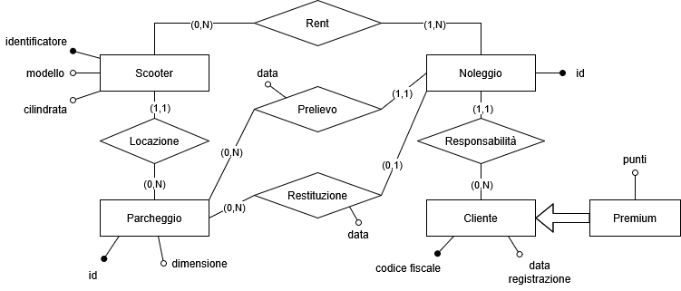

*dato*: immediatamente presente alla conoscenza, prima di ogni elaborazione
*informazione*: notizia o elemento che consente di avere conoscenza di fatti, situazioni e modi di essere
I dati codificano le informazioni.

> Una base di dati è un insieme organizzato, persistente e condiviso di dati utilizzati per lo svolgimento delle attività <u>automatizzate</u> dell'organizzazione.

- grandi, il limite è quello fisico dei dispositivi
- persistente, indipendente dalle singole esecuzioni dei programmi
- condivise, diverse applicazioni e utenti accedono a una porzione (sovrapponibile) dei dati. 
	Può riportare alcuni problemi quali rindondanza, incoerenza (versioni non coincidono) e privacy (gestione accesso a dati autorizzati)
	Risolvibili con meccanismi di autorizzazione, controllo della concorrenza e uso di lock e semafori

I basi di dati sono gestiti da **DBMS (Data Management System)**
- privacy, si possono definire meccanismi di autorizzazione
- affidabilità, resistenza a malfulzionamenti hardware e software
	-> gestione delle *transazioni*, l'insieme di operazioni indivisibili e corretti anzhe in presenza di concorrenza  e effetti definitivi
- efficienza
- efficacia, rendere produttive le attività dei loro utilizzatori

## Modello Relazionale
Modello dei dati = insieme di construtti utilizzati per organizzare i dati e descriverne la dinamica
Usiamo il *modello relazionale*.

L'insieme $D_{1}\times...\times D_{n}$$ è relazione matematica
$$\begin{array}{ccccc}\text{Partite}\subseteq&\text{string}\times&\text{string}\times&\text{int}\times&\text{int}\\&\text{Juve}&\text{Lazio}&3&1\\&\text{Lazio}&\text{Milan}&2&0\end{array}$
1. nessun ordine delle n-uple
2. n-uple distinte
3. ogni n-upla è ordinata: l'i-esimo valore proviene dall'i-esimo dominio

La relazione in basi di dati è simile a quella matematica ma non è posizionale (3.); ogni dominio/colonna è associato a un nome unico (*attributo*)

I riferimenti fra dati in relazioni diverse sono per valore.
$R(A_{1},...A_{n})$$ relazione R su attributi $$A_{1},...,A_{n}$$
$$R=\{R_{1}(X_{1}),...,R_{k}(X_{k})\}$ schema di base di dati, ovvero insieme di relazioni

`null` per valore sconosciuto, inesistente o senza informazione

chiave primaria
chiave esterna, vincolo di integrità relazionale

Operatori insiemistici
- *Unione $(\cup)$$*
- *Intersezione $$(\cap)$$*
- *Differenza $$(-)$*
devono avere lo stesso schema.

Altri operatori
*Ridenominazione* (p),
  modifica lo schema lasciando inalterate le istanze

*Selezione $$(\sigma)$$*, 
  decomposizione orizzontale: ottengo un sottoinsieme delle tuple che soddisfano una condizione

*Proiezione $$(\pi)$$*, 
  decomposizione verticale: restituisce relazione con una parte di attributi
  sottoinsieme delle tuple (eliminazione duplicati)

*Join $$(\bowtie)$$*,
  prodotto cartesiano tra relazioni mantenendo quelli con valori uguali su attributi uguali. Può risultare completo, non completo, vuoto o nxm (prodotto cartesiano).
  In generale $$0\leq|R_{1}\bowtie R_{2}|\leq|R_{1}|\times|R_{2}|$$
  
  Join esterno,
   mette null in attributi quando non ha un relativo nell'altra tabella. Può essere sinistro $$(\bowtie_{\text{left}})$$, destro $$(\bowtie_{\text{right}})$$ o completo $$(\bowtie_{\text{full}})$$ a seconda di quali tuple mantiene. Risolve il problema dei join non completi e la perdita di informazioni.
  
  *Semi-join*, restituisce le tuple che contribuiscono allo join
  *Theta_join*: $$\sigma_{\text{condition}}(R_{1}\bowtie R_{2})\quad\Longleftrightarrow\quad R_{1}\bowtie_{\text{condition}}R_{2}$$
  Equi-join è un theta-join con condizione di equivalenza

In algebra relazione, due espressioni sono equivalenti se producono lo stesso risultato per qualunque istanza delle relazioni della base di dati. Il DBMS cerca sempre di eseguire espressioni equivalenti ma più efficienti.
1. $$\sigma_{\text{C1 and C1}}(R)\equiv\sigma_{C1}\sigma_{C2}(R)$$
2. $$\pi_{X}(\pi_{XY}(R))\equiv\pi_{X}(R)$$
3. $$\sigma_{C1}(R_{1}\bowtie R_{2})\equiv R_{1}\bowtie\sigma_{C1}(R_{2})$$
   se C1 condizione su $$X_{2}$$
4. $$\pi_{X_{1}Y_{2}}(R_{1}\bowtie R_{2})\equiv\pi_{X_{1}Y_{2}}(R_{1}\bowtie\pi_{Y_{2}}(R_{2}))$$
   se $$X_{2}-Y_{2}$$ non coinvolti dal join
5. $$\sigma_{C}(R_{1}\bowtie R_{2})\equiv R_{1}\bowtie_{C}R_{2}$$
6. $$\sigma_C(R_{1}\cup R_{2})\equiv\sigma_{C}(R_{1})\cup\sigma_{C}(R_{2})$$
7. $$\sigma_{C}(R_{1}-R_{2})\equiv\sigma_{C}(R_{1})-\sigma_{C}(R_{2})$$

**Viste (relazioni derivati)**
Rappresentazioni diverse per gli stessi dati. Non hanno contenuto autonomo ma si basano sulle relazioni di base. Vengono usati per mascherando informazioni in base ai diversi utenti o per semplificare la scrittura di interrogazioni complesse.

Possono essere di due tipi
- viste materializzate sono salvate su disco
  contro: rindondanti, da aggiornare se la relazione base è modificata, non sempre offerto
- relazioni virtuali sono salvate in cache
  una interrogazione su essa viene eseguita "ricalcolando" la vista
Non influenzano l'efficienza.

Si possono riversare i cambiamenti dalle viste alle relazioni base solo in caso di join completo.

### SQL
Ci sono due linguaggi
1. DDL (Data Definition Language), definizione dello schema
2. DML (Data Manipulation Language), interrogazione e aggiornamento

**DDL**
Definisce lo schema di relazione e crea un'istanza vuota. 
Specifica attributi, domini e vincoli.
``` sql
CREATE TABLE NomeTabella (
	Id VARCHAR(6) PRIMARY KEY,
	A CHAR(10),
	B NUMERIC(9) DEFAULT 0,
	Ref VARCHAR(6),
	UNIQUE(A,B),
	FOREIGN KEY(Ref) 
		REFERENCES Tab2(Id) ON DELETE CASCADE
)
```

*Politiche di reazione* su delete/update
- cascade, monodirezionale
- set null
- set default
- no action

Vincoli di CHECK(condizione)

**DML**
- modifica: INSERT, DELETE, UPDATE
- interrogazione: SELECT

``` sql
INSERT INTO NomeTabella(attr1,attr2,...)
	VALUES(val1,val2,...)

DELETE FROM NomeTabella
	WHERE condizione /* senza condizione, tutto viene cancellato */

UPDATE NomeTabella
	SET attributo = espressione
	WHERE condizione
```

Condizione LIKE
\_ qualsiasi carattere
% qualsiasi sequenza anche vuota

Operatori aggregati COUNT, MIN, MAX, AVG, SUM
spesso usati con GROUP BY

``` sql
CREATE VIEW NomeVista[(ListaAttributi)]
AS SELECT ... FROM ...
```
*Viste* che possono essere usate come tabelle. Vengono ricalcolate ogni volta.
Aggiornamenti sulle viste sono possibili se fanno riferimento a una sola relazione.

Controllo dell'accesso
Il creatore ha tutti i privilegi su di essa: INSERT, UPDATE, DELETE, SELECT, REFERENCES, USAGE

CREATE VIEW Stadi_Italia(NomeStadio, NumeroPartite) AS
SELECT NomeStadio, COUNT(\*)
FROM Incontro
WHERE Squadra1='Italia' OR Squadra2='Italia'
GROUP BY NomeStadio

SELECT Citta
FROM Stadi_Italia, Stadio
WHERE Nome=NomeStadio AND NumeroPartite = (SELECT MAX(NumeroPartite)
	FROM Stadi_Italia)

CREATE VIEW SpeseCitt(Cittadinanza, SpeseTotali) AS
SELECT Cittadinanza, SUM(Costo)
FROM Viaggio
JOIN (SELECT CodViaggio, Cittadinanza
	FROM Effettua
	JOIN Cliente ON Effettua.CF=Cliente.CF) AS a
ON Viaggio.CodViaggio=a.CodViaggio
GROUP BY Cittadinanza

SELECT Cittadinanza, MAX(SpeseTotali)
FROM SpeseCitt

CREATE VIEW Viaggi_G(CF, NViaggi) AS
SELECT CF, COUNT(\*)
FROM Viaggio, Effettua
WHERE Viaggio.CodViaggio=Effettua.CodViaggio AND Paese='Giappone'
GROUP BY CF

SELECT CF
FROM Viaggi_G
WHERE NViaggi = (SELECT MAX(NViaggi)
	FROM Viaggi_G)

CREATE VIEW X(Paese, Cittadinanza, CostoMedio) AS
SELECT Paese, Cittadinanza, AVG(Costo)
FROM Viaggio, Effettua, Cliente
WHERE Viaggio.CodViaggio=Effettua.CodViaggio AND Viaggio.CF=Cliente.CF
GROUP BY Paese, Cittadinanza

CREATE VIEW Y(Paese, CostoMedioMax) AS
SELECT Paese, MAX(CostoMedio)
FROM X
GROUP BY Paese

SELECT Paese, Cittadinanza
FROM X JOIN Y ON X.Paese=Y.Paese
WHERE CostoMedio = CostoMedioMax

## Metodologie e modelli per il progetto di una base di dati

Parte del ciclo di vita dei Sistemi Informativi
1. Studio di fattibilità
2. ==Raccolta e analisi dei requisiti==
3. ==Progettazione==
4. ==Realizzazione==
5. Validazione e collaudo
6. Funzionamento
Ad ogni passo è possibile tornare indietro

In questo corso ci soffermeremo nei punti 2. 3. 4. per una base di dati.
### Progettazione concettuale
**Modello Entity-Relationship**
Detto anche Entità-Relazione. E' il modello concettuale per base di dati più diffuso.

| Costrutti                                                                                 |                                              |
| ----------------------------------------------------------------------------------------- | -------------------------------------------- |
| Entità                                                                                    |  |
| Attributo                                                                                 |  |
| Relazione (relationship)<br>sostantivi invece di verbi,<br>non hanno direzione            |  |
| Cardinalità<br>(min occorrenze, max occorrenze)<br>possibile associare anche ad attributi |  |
| Identificatore<br>interno o esterno (in tal caso cardinalità deve essere (1,1))           |  |
| Generalizzazione<br>mette in relazione più entità come sue specializzazioni<br>           |  |

Nello schema concettuale rappresentiamo le entità e non le singole istanze.

Le entità specializzate di una generalizzazione ereditano tutte le relazioni dell'entità generale.
- totale, quando le specializzazioni sono complementari
- parziale
Sono esclusive ovvero, se è un tipo di specializzazione, non può esserne un altro.

E' importare affiancare un dizionario all'ER anche per descrivere vincoli non esprimibili in ER.


Requisiti da
- utenti e committenti
	- intervista
	- documentazione fornita
- documentazione esistente
	- normative
	- regolamenti interni
	- realizzazioni preesistenti
- modulistica

Reificazione: prendere l'astratto per concreto
- attributo di entità, un attributo in un'entità
- Part-of, se un elemento ha senso senza l'altro di cui fa parte
- Istance-of, un elemento è un caso specifico di un altro
- relazione binaria, una relazione in un'entità che ha relazione con entrambe le entità che collegava
- relazione ricorsiva, due o più relazioni tra due entità
- attributo di relazione, relazione binaria + attributo della relazione in una entità con relazione alla entità (che era relazione)
- storicizzazione di concetto, 
  generalizzazione di una entità in storico e corrente
  o relazione ricorsiva storico e corrente
- evoluzione di concetto, generalizzazione
- relazione ternaria, in un'altra entità 

Qualità di uno schema ER
1. correttezza, <u>riguardare ER alla fine</u>
2. completezza
3. leggibilità

### Progettazione logica
"Tradurre" lo schema concettuale in uno schema logico. Da considerare ottimizzazioni e ristrutturare costrutti non rappresentabili.

*Rindondanze*
Vantaggi: semplificare le interrogazioni
Svantaggi
- appesantimento degli aggiornamenti
- maggiore spazio
- rischio di <u>inconsistenze</u>
Si deve fare una analisi di ridondanze considerando le operazioni da fare, la loro frequenza e il carico delle tabelle.

*Eliminazione delle generalizzazioni*
Quattro possibilità
1. accorpare figlie nel genitore
   possibilità che ci siano relazioni pertinenti a una sola delle figlie, null
2. accorpare genitore nelle figlie
   solo se la generalizzazione è totale
   meno efficienza nelle interrogazioni pertinenti al genitore
3. sostituire la generalizzazione con relazione
4. soluzione ibrida

*Partizionamento/accorpamento entità e relationship*
Ristrutturazione per rendere più efficienti le operazioni; da analizzare con la frequenza di operazioni e il carico.
In specifico se si accedono agli attributi insieme o no.
#### Modello relazionale


Scooter (<u>identificativo</u>, modello, cilindrata, locazione)
	Scooter.locazione -> Parcheggio
Noleggio (<u>id</u>, cliente, data_prelievo, luogo_prelievo, data_restituzione*, luogo_restituzione*)
	Noleggio.cliente -> Cliente
	Noleggio.luogo_prelievo -> Parcheggio
	Noleggio.luogo_restituzione -> Parcheggio
Rent (<u>Noleggio, Scooter</u>)
	Rent.Scooter -> Scooter
	Rent.Noleggio -> Noleggio
Parcheggio (<u>id</u>, dimensione)
Cliente (<u>codice fiscale</u>, data_registrazione, punti*)

Specie (<u>nome</u>)
Terriccio (<u>tipo</u>)
Adatto (<u>specie, terreno</u>)
	Adatto.specie -> specie.nome
	Aldatto.terreno -> terriccio.tipo
AltoFusto (<u>id</u>, età, clima, nome, specie, terriccio)
	AltoFusto.specie -> specie.nome
	AltoFusto.terriccio -> terriccio.tipo
Fiorita (<u>nome</u>, num_esemplari, costo, fiorituraDa, fiorituraA, durata_fioritura)
Vendita (id, data, grossista*)
	Vendita.grossista -> Grossista.pIva
Vendita_AltoFusto (<u>id, altofusto</u>, prezzo)
	Vendita_AltoFusto.id -> Vendita.id
	Vendita_AltoFusto.altofusto -> AltoFusto.id
Vendita_Fiorita (<u>id, fiorita</u>, numero)
	Vendita_Fiorita.id -> Vendita.id
	Vendita_Fiorita.fiorita -> Fiorita.nome
Grossista (<u>pIva</u>, CF, nome, cognome)

Evento (<u>nome</u>, inizio, fine, sito_web*)
Padiglione (<u>codice</u>, tipo)
Espositore (<u>pIva</u>, nome, email)
Assegnazione (<u>evento, padiglione, inizio, fine</u>, espositore)
	Assegnazione.evento -> evento.nome
	Assegnazione.padiglione -> Padiglione.codice
Sessione (<u>evento, titolo</u>, padiglione, data)
	Sessione.evento -> Evento.nome
	Sessione.padiglione -> Padiglione.codice
Partecipante (<u>email, cognome</u>, nome)
Iscrizione (<u>evento, email, cognome</u>)
	Iscrizione.evento -> Evento.nome
	Iscrizione.(cognome, email) -> Partecipante.(cognome, email)
NonSpeaker (<u>email, cognome</u>)
Speaker (<u>email, cognome</u>)
Biglietto (<u>codice</u>, costo, evento, email, cognome)
	Biglietto.evento -> Evento.nome
	Biglietto.(email, cognome) -> NonSpeaker.(email, cognome)
Relazione (<u>titolo, evento</u>, email, cognome)
	Relazione.evento -> Evento.nome
	Relazione.(email, cognome) -> Speaker.(email, cognome)

#### Normalizzazione
Ci sono 
- anomalia di cancellazione
- anomalia di inserimento
quando ci sono *dipendenze funzionali* in una stessa relazione.

>**Forma normale di Boyce e Codd (BCNF)**
>Una relazione R con chiavi $K_{1},...,K_{n}$$ è in forma normale di Boyce e Codd:
>se ogni dipendenza funzionale non banale $$X\rightarrow Y$$ è "buona" cioè $$\exists i, K_{i}\subseteq X$ (X è superchiave)

La normalizzazione è l'eliminazione delle dipendenze funzionali decomponendo la tabella in più tabelle in forma normale di Boyce e Codd.
Non è sempre possibile scomporre in BCNF.

>**Terza forma normale (3NF)**
>Una relazione R con chiavi $K_{1},...,K_{n}$$ è in Terza Forma Normale se:
>per ogni dipendenza funzionale non banale $$X\rightarrow Y$$, almeno una delle seguenti condizioni sono valide
>- X è superchiave (BCNF)
>- ogni attributo in Y è contenuto in almeno una tra le chiavi $$K_{1},...K_{n}$

Dipendenze violano 3NF se parte sinistra non è chiave e la parte destra non è parte della chiave.
E' sempre possibile scomporre nella terza forma normale.

*Chiusura transitiva di un insieme di attributi*
A->B, A->C allora B->C
Prendendo uno ad uno le dipendenza funzionali aggiungiamo gli attributi a destra nella chiusura quando quelli a sinistra sono già nella chiusura. Questa chiusura è chiave.

1. Calcolo della copertura: rimozione di dipendenze rindondanti, ovvero deducibili per transizione

R(A, B, C, D, E, F)

| dipendenze |                    | ridondante     | 3NF   |
| ---------- | ------------------ | -------------- | ----- |
| CE -> A    | C->A<br>~~E->A~~   |                |       |
| C -> D     |                    |                |       |
| A -> B     |                    |                | viola |
| D -> BE    | D->B<br>D->E       |                | viola |
| B -> F     |                    |                | viola |
| AD -> CF   | AD->C<br>~~AD->F~~ | <br>A->B, B->F |       |

$$C^{+}=\{C,D,B,E,A,F\}$$ candidato chiave
$$A^{+}=\{A,B,F\}$$
$$D^{+}=\{B,E,F\}$$
$$B^{+}=\{F\}$$
$$AD^{+}=\{A,D,C,F,B,E\}$$ candidato chiave

2. G viene partizionato in sottoinsiemi tali che dipendenze funzionali $$X\rightarrow A\text{ e }Y\rightarrow B$$ sono insieme se $$X^{+}_{G}=Y^{+}_{G}$$
$$\{C\rightarrow A,C\rightarrow D, AD\rightarrow C\},\ \{A\rightarrow B\},\ \{D\rightarrow B, D\rightarrow E\},\ \{B\rightarrow F\}$$
3. Viene costruita una relazione per ogni sotto-insieme

R1(<u>C</u>, <u>A, D</u>)
R2(<u>A</u>, B)
R3(<u>U</u>,B, E)
R4(<u>B</u>, F)

4. Se esistono due relazioni S(X) e T(Y) con $$X\subseteq Y$$ allora viene eliminata
5. Se, per qualche i, non esiste una relazione S(X) con $$K_{i}\subseteq X$$, viene aggiunta una relazione $$T(K_{i})$$
Indici

## Transazione
```
begin-transaction;
<operazioni SQL>
commit work;
```

*Principio dell'atomicità*
Garantisce che le operazioni al suo interno vengano tutte compiute all'avvenuta del commit.
Nel caso di un abort, nessuna delle operazioni vengono eseguite sulla base di dati.

*Consistenza*
I vincoli del db vengono verificati alla fine della transazione. Se sono violati, non avviene il commit.

*Isolamento*
Le transazioni non risentono degli effetti delle transazioni concorrenti. I loro stadi intermedi sono inaccessibili.

*Persistenza (durabilità)*
gli effetti di una transazione andata a buon fine non vanno più perduti

### Gestore dell'affidabilità
(atomicità e persistenza)
Usa un **file log** che archivia le operazioni svolte permanentemente
- memorizzato in una memoria stabile (RAID, nastri, ...)
- record del log
  operazioni delle transazioni
	  - B(T): begin transaction T
	  - I(T,O,AS): T inserisce O con valore AS
	  - D(T,O,BS): T cancella O con valore BS
	  - U(T,O,BS,AS): T aggiorna il valore di O da BS a AS
	  - C(T): commit transaction T
	  - A(T): abort transazione T
  record di sistema
	- dump
	- checkpoint

Il log continua dall'attivazione del db e può andare indietro anche di anni. Cosa fare quando c'è stato un guasto e si vogliono riprendere le transazioni?
Checkpoint, registra quali transizioni sono attive in un certo istante

#### Processo di restart
Classifichiamo le transazioni
- completate (in memoria stabile)
- in commit ma non necessariamente completate (possibile redo)
- senza commit (vanno annullate, undo)

**Ripresa a caldo**
1. trovare l'ultimo checkpoint (ripercorrere a ritroso)
2. costruire gli insiemi UNDO e REDO
3. ripercorrere il log all'indietro fino alla più vecchia azione delle transazioni in UNDO e REDO, disfacendo tutte le azioni delle transazioni
4. ripercorrere il log in avanti, rifacendo tutte le transazioni in REDO

Modalità immediata: db è scritto immediamente dopo il log, REDO non necessario
Modalità differita: db è scritto solo dopo un commit, UNDO non necessario

Modalità ibrida
possibile che viene fatto undo di operazioni che non hanno più effetto sul db, undo(undo(A))=undo(A)
possibile che viene fatto redo di operazioni che hanno già effetto sul db, redo(redo(A))=redo(A)

Guasti
- di sistema (software)
- di dispositivo (hardware)

Utile fare una copia totale del db su memoria stabile
**Ripresa a freddo** per guasti di dispositivo
1. ripristinare i dati dal backup
2. eseguire le operazioni registrate sul log fino all'istante del guasto
3. eseguire la ripresa a caldo

Dump, copia completa della base di dati
Prodotta e salvata in memoria stabile mentre il sistema non è operativo

Concorrenza da problemi
**Schedule**, sequenza di operazioni di I/O di transazioni concorrenti
Scheduler è un sistema che accetta o rifiuta (o riordina) le operazioni richieste dalle transazioni
*Schedule seriale*, transazioni separate, una alla vota
*Schedule serializzabile* producono gli stessi risultati di uno schedule seriale sulle stesse transazioni
view conflict
Uno schedule è CSR (conflict serializzabile) se e solo se il suo grafo è aciclico

|           | libera                      | r_locked                                      | w_locked          |
| --------- | --------------------------- | --------------------------------------------- | ----------------- |
| r_lock(x) | OK / r_locked<br>conta(x)++ | OK / r_locked<br>conta(x)++                   | NO / w_locked     |
| w_lock(x) | OK / w_locked               | NO / r_locked                                 | NO / w_locked     |
| unlock(x) | error                       | OK / if(--conta(x)=0)<br>libera else r_locked | OK / not w_locked |

*Locking a due fasi (2PL)*: in una transazione, dopo aver rilasciato un lock non può acquisirne altri

Dopo checkpoint i commit sono scritti sul disco

S=r1(x) w2(x) r3(x) w1(u) w3(v) r3(y) r2(y) w3(u) w4(t) w3(t)

\2. r1(x) w1(x) w1(y) r2(y) r2(x) w2(x)
\3. r1(x) r1(y) w1(z) r2(y) w2(z) w3(z) w3(x) VSR

