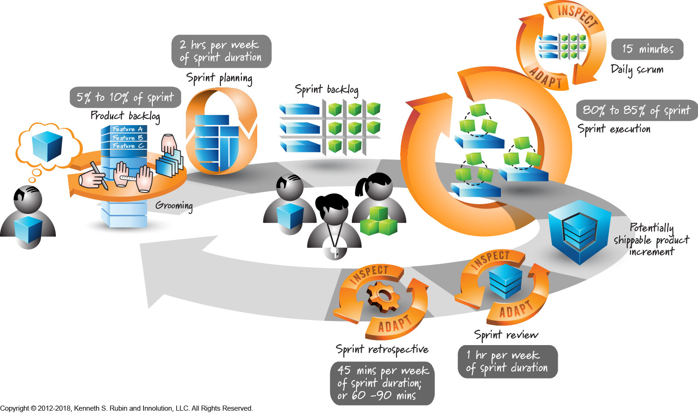

>"Software engineering is the multi person construction of multi version program."
>- 1970, Brian Randell

Cosa si deve fare
- gestire il tempo
- collaborare
- assumere responsabilità
- auto-apprendimento
in un modo professionale (a regola d'arte)

Skill (competenza), unione di conoscenza e abilità

Di un progetto[^1] definiamo la
- pianificazione
- analisi dei requisiti
- [progettazione / design](Software_Design.md)
- realizzazione / implementation (utile all’uso)

Nasce quando uno stakeholder finanzia un'opportunità (customer)
Way of working (metodo di lavoro) regge un progetto, viene da una fonte autorevole e si adatta al progetto
Requisiti che soddisfino l'opportunità

Scienza risponde alle domande del perché
Ingegneria applica le conoscenze per costruire le risposte

**Efficacia** si calcola su quanti requisiti sono stati soddisfatti
**Efficienza** si calcola sul numero di risorse che servono per essere efficaci
Sono considerate lungo l'intero **ciclo di vita** del progetto.

Più un prodotto SW è utile, più è in uso. 
L'azione più intensiva del SWE[^2] è la *manutenzione*.
Manutenzione correttiva è sempre di deficit. 
Adattiva per soddisfare i reali casi d’uso.
Evolutiva per migliorare la struttura presente.

## Ciclo di vita
Un prodotto SW non è mai un pezzo unico ma è composto da un insieme di parti.
Per favorire alla manutenzione, si ha bisogno di
- controllo di *configurazione*, determinare come le parti sono tenute insieme
- controllo *versione*, determinare la "storia" di ogni parte

Stati di vita di un prodotto sono i (bisogni -> needs) dall'uso al suo ritiro.

**Processi[^3] di ciclo di vita**
Le attività da svolgere per effettuare transizioni di stato di vita in modo efficiente ed efficace.

Per controllare (anche in automatico) i processi, si hanno bisogno delle loro misurazioni.

Un programma è una composizione di algoritmi più piccoli.

Attività utili per passare da uno stato del ciclo di vita del progetto all'altro.

Queste attività si suddividono in task più piccoli per maggiore efficienza.

Quando un progetto è significativo, si associano ai processi un *sistema di qualità* che aiuta a migliorarli e garantire conformità.

**Ciclo di miglioramento continuo (PDSA)**
1. Plan, guarda cosa hai già fatto e pianifica un miglioramento *localizzato*
2. Do, attua il miglioramento pianificato
3. Study, studia cosa si ha fatto; è andato bene? Com'è andato?
4. Act, adotta il cambio o no e ricomincia il ciclo

I processi si pongono come way of working alla base del progetto.

## Modelli di sviluppo
Concezione -> Sviluppo -> Utilizzo -> Ritiro
Sono i principali stati di vista di un prodotto SW. 

Modello è una descrizione oggettiva del fenomeno di interesse (astratto o concreto) dimostrabile come corretto.
Un modello specifica cosa sia un oggetto, come funzioni e perché fa quel che fa nel modo che lo fa.

| Modello      | Caratteristiche                                |
| ------------ | ---------------------------------------------- |
| Cascata      | Rigide fasi sequeziali                         |
| Incrementale | A più passi                                    |
| A componenti | Orientata al riuso                             |
| Agile        | Dinamico, brevi cicli iterativi e incrementali |

Iterazione: rivisitazione per correzioni o raffinamenti
Incremento: aggiunte successive a un impianto base
Prototipo: attività di prova

**Modello a cascata**
Analisi -> Progettazione -> Realizzazione -> Manutenzione
Rigido con stretta sequenzialità senza permettere modifiche ai requisiti
Il risultato viene presentato solo alla fine, mancanza di feedback
Bisogno di ritorni: iterazione o incremento?

**Modello a incremento**
Produrre valore a ogni incremento presentabile al cliente
Introduciamo *technical debt*, ovvero componenti temporanei che permettono di far funzionare il progetto. Sono da modificare il prima possibile.

### Modello agile
Si basano sul feedback
1. Init: *"user story"*, ovvero a un scenario d'uso
   Riunioni per discutere del problema individuato dallo stakeholder
2. Corresponsabilità: tutti sono consapevoli della situazione
   gli obiettivi, il loro stato e a chi sono assegnate

Kanban non basta:
- non assicura lavoro per tutti
- le scelte non sono volte a un obiettivo
- non comprende il peso dei "to do"

**SCRUM**

Oggetti
1. *Product backlog*: requisiti to do del progetto
2. *Sprint backlog*: to do fatti e quelli da fare
3. Sprint: sviluppo per saldare il backlog

Passi
1. Sprint planning
2. Daily scrum: controllo giornaliero di avanzamento
3. Sprint review: controllo prodotti dello sprint
4. Sprint retrospective: controllo della qualità dello sprint
I riscontri possono essere negativi.

Pianificazione
- stabilire il way of working
- determinare le risorse disponibili
- fissare gli obiettivi di avanzamento
  *milestone*: punto nel tempo nel quale ci si aspetta un progresso, individuate all'indietro dall'obiettivo finale alla partenza
  *baseline*: versione approvata di un prodotto che ha raggiunto la milestone

calcoliamo l'avanzamento con push
pianificazione futura secondo l'avanzamento rilevato (preventivo a finire)

Misurazione oggettiva misurabile, quindi quantitativa
*Diagramma di Gantt*

*PERT*
Indica la possibilità di margine temporale (slack)
	QB (quanto basta), utile per gestire imprevisti 

tempo/persona

Gestione di rischio
otteniamo indicatori utili al PERT
1. Identificazione
2. Analisi
3. Pianificazione cosa fare per evitarli e mitigare i danni
4. Controllo, rilevazione rischi

Il modo in cui si impara ad avanzare si chiama *ciclo a spirale*, ovvero quando un ciclo termina (ritorno all'inizio) si avanza per prodotto e comprensione.
1. Elenco di cosa si ha fatto
2. E' andato bene o male? Perché?
3. Cosa fare per andare meglio?
4. Pianificazione futura e ricalcolo dei costi

#### Analisi dei Requisiti
Requisito
- capacità necessaria a un utente per raggiungere un obiettivo, *lato utente*
- capacità necessaria a un sistema per rispondere ad una aspettativa, *lato soluzione*

Studia <u>cosa</u> di deve fare.
User story, diagrammi dei casi d'uso espliciti o impliciti (dominio d'uso)

Tracciamento dei requisiti
checkpoint nel corso del progetto per validare se un requisito è soddisfatto

Verifica: accertare che lo svolgimento dello sviluppo sia corretto
Validazione: accertare che il prodotto finale corrisponda alle aspettative
Piano di Qualifica V&V

Baseline requisiti è solida quando si sa motivarli.
La specifica dei requisiti deve essere
- priva di ambiguità
- corretta
- completa
- verificabile
- consistente
- modificabile
- tracciabile, identificatore unico

Aquisizione di conoscenze: *brainstorming* (ceremoniale)
Ha un gestore che organizza l'attività e uno scriba che trascrive i punti importanti. Tutti quelli che discutono hanno importanza paritaria. E' a tempo limitato.
Utile usare il loro risultato per discutere con i clienti. Usare diagrammi per esporre le informazioni.

**Classificazione di requisiti**
Richieste di progetto(what) > Richieste di sistema < Richieste di processo(how)

| Requisiti di sistema               |                              |                     |
| ---------------------------------- | ---------------------------- | ------------------- |
| Requisiti funzionali               | Caratteristiche              | Vincoli             |
| funzionali e  sul comportamento | di performance di qualità | fisici, legali, ... |

Requisiti hanno diversa rilevanza:
1. obbligatori
2. desiderabili
3. opzionali
Non devono essere contradditori.

RTB[^4] specifica
- quali vincoli le tecnologie hanno sul design
- capire come le tecnologie eterogenee possono essere usate insieme (proof of concept)

Il PoC non deve contenere design se non quello implicato dalle tecnologie.

### Progettazione software
Il *modello a V* dello sviluppo di un progetto

|         1. Capitolato         |    <-->     |  9. Collaudo   |
|:-----------------------------:|:-----------:|:--------------:|
|   2. Analisi dei requisiti    |    <-->     | 8. Validazione |
|    3. Progettazione logica    |    <-->     |  7. Verifica   |
| 4. Progettazione di dettaglio |    <-->     |  6. Verifica   |
|               >               | 5. Codifica |       ^        |

La progettazione software non è un processo lineare: stabiliamo prima quello che accadrà dopo.

"Making a thing satisfying our needs" come singola responsabilità, è diviso in due
1. Dichiarare le sue proprietà attese, Analisi
2. Crearlo assicurandoci le proprietà attese, Codifica
Correttezza per costruzione, invece di correttezza per correzione.

*Architettura logica (design)*
Individuando le parti (unità atomica), coerente con i requisiti, con la proprie specifiche (risorse, mantenimento).
Facciamo adozione e adattamento di paradigmi.

*Schema in dettaglio* unità archittetturali a cui corrispondono moduli di codice

Il codice non da componenti archittetturali. Il software non riconosce struttura. Codice è conseguenza, il design viene prima.

La quantità di SW prodotto si misura in delivered source lines of code dopo la verifica.

Procedura
- top-down: dalla logica al dettaglio
- botton-up: OOP concepito dalle parte volte al riuso e specializzazione
- agile: progressivo (feedback-refactoring) su una archittetura base che si specifica in corso della sua realizzazione

Modifica del codice da un processore a un altro, re-targeting

Proprietà dell'architettura
- sufficienza, a soddisfare tutti i requisiti
- comprensibilità
- modularità, suddivisa in parti chiare e ben distinte
separazione esposizione (interfaccia) e componenti interni (implementazione)
- robustezza, gestisce diversi input
- disponibilità

#### Qualità del software
ISO (International Standardisation Organisation)
>*Qualità del software*
>Insieme delle caratteristiche di un'entità, che ne determinano la capacità di soddisfare esigenze sia espresse che implicite.
>- ISO

Dal punto di vista di chi lo fa fatto, chi lo usa e valutato da terze parti.
Deve essere misurabile.

>*Sistema qualità*
>Struttura organizzativa, responsabilità, procedure, risorse, atte al perseguimento della qualità.
>- ISO

Si riassume in tre elementi:
- Piano della Qualità
- Controllo di Qualità
- Miglioramento continuo

**Piano di Qualità**
Le attività del Sistema Qualità mirate a fissare gli obiettivi di qualità con i processi e le risorse necessarie per conseguirli.
- Visione orizzontale: trasversale all'organizzazione
- Visione verticale: specifica di prodotto/servizio
Conformità riflessa nel *cruscotto di controllo* informato e non troppo costoso.

**Controllo di Qualità**
Le attività del Sistema Qualità pianificate e attuate per assicurare che il prodotto soddisfi le attese.
Questo è *Quality Assurance* (garanzia di qualità).

Engagement of people (comunicazione)
Improvement quantitativo
Evidence-based decision making

Valutazione quantitativa (metrica)
Il processo con cui assegnare simboli o numeri ad attributi di una entità con regole definite.

Qualità d'uso
Qualità esterna (funzionale) sono spesso aspettative
Qualità interna (strutturale): manutenibilità e portabilità

Manutenibilità
Correttiva, di adattamento, evoluzione

Fattori misurabili
- numero di parametri
- complessità ciclomatica
- linee di codice
- numero di messaggi d'errore
- lunghezza del manuale utente, etc...

Valutazione
Prodotto ->
1. selezione delle metriche
   -> Misurazione ->
2. interpretazione delle misure
   -> Valutazione ->
3. criteri di accettazione
   -> Accettazione ->
-> Giudizio
Cruscotto facilmente comprensibile

#### Qualità del processo
Sviluppo non è una attività ma, un processo.
La qualità di un processo è una esigenza primaria. Un processo mal costruito porta a risultati mal fatti.

Un processo di qualità ha due piani:
![[Pasted image 20251126105855.png|Pasted image 20251126105855.png]]
Controllo di processo su ogni attività di processo significato.

Prima definire i processi (nel way of working)
Poi controllarli in modo di migliorarli in efficienza e efficacia

Norme di qualità ISO:9000
Politica di qualità, aziendale 
-> Manuale di qualità -> Piano di qualità (Piano di qualifica)
- procedura -> istruzioni operative
  way of working
- modello
- linea guida

SPY (SW Process Assessment & Improvement)
![[Pasted image 20251126112238.png|Pasted image 20251126112238.png]]

CMM (Capability Maturity Model, 1987)
- Capability: capacità di fare bene un singolo processo
- Maturity: bottom delle capability dei processi
- Model: insieme dei criteri di valutazione (in scala assoluta)

Ci sono 5 livelli di maturità
1. Impredicibile e reattivo
2. Per progetto, pianificazione, misurazione e controllo
3. Organizzazione proattiva
4. Organizzazione misurata e controllata
5. Concentrarsi al miglioramento

SPICE (Software Process Improvement Capability dEtermination, 1992)

PdQ (Piano di Qualifica)
Obiettivi di qualità e fotografia di avanzamento

#### Verifica e Validazione
*Verifica* provvede tutti gli strumenti per una facile validazione. Si fa ad ogni passo.
*Validazione* conferma tramite evidenza oggettiva che il prodotto soddisfa i requisiti (aspettative utente e usi intesi). Si fa ai momenti culmine.

Una *milestone* è un punto fissato nel tempo nel quale abbiamo aspettative sul grado di avanzamento.
La *baseline* è il contenuto di una versione del prodotto stabile e approvata che può essere modificato solo dopo procedure formali di controllo delle modifiche.

La verifica fa (analisi di comportamento e proprietà)
- Analisi Statica sul documentazione e codice sorgente
- Analisi Dinamica sull'esecuzione del codice

**Analisi Statica**
AS può essere fatta tramite *metodi di lettura* (desk check) o *metodi algebrici* dalla quale si deriva una descrizione simbolica con significati che possono essere validati in automatico.

<u>Metodi di lettura</u> può essere eseguita tramite Walkthrough e Inspection.
*Walkthrough* si fa quando non si sa dove cercare. Si controlla tutto il perimetro. Non ha aspettative e non ha presupposti.
Passo 1: pianificazione con autori e verificatori
Passo 2: lettura dai verificatori
Passo 3: discussione con autori e verificatori
Passo 4: correzione dei difetti dagli autori
Ogni passo documenta le attività svolte e i risultati.

*Inspection* mirata su un oggetto di verifica; ha aspettative e presupposti.
Passo 1.2: definizione della lista di controllo

**Analisi Dinamica**
AD viene fatta tramite test ripetibili specifici a
ambiente d'esecuzione: stato iniziale
attese: input richiesti e output attesi
Devono essere automatizzati usando
- *Driver*: componente attiva fittizia per pilotare il test
- *Stub*: componente passiva fittizia per simulare le parti del sistema non oggetto di test ma utili per la sua esecuzione
- *Logger*: componente non intrusivo di registrazione dei dati di esecuzione per analisi dei risultati

![[Pasted image 20251202094555.png|Pasted image 20251202094555.png]]
La definizione delle unità sono responsabilità del progettista.

Unità, singola componente vista dal main.
Quando si trovano errori, si deve fare la minore modifica possibile per correggere.

**Test di regressione**
Modifiche effettuate per aggiunta, correzione e rimozione, non devono condizionare funzionamenti già verificati, altrimenti causano *regressione*.
I test di regressione sono molto onerosi.

Nightly build è una build automatica fatta una volta al giorno.
Continuous Integration, fatta ogni volta viene completata una unità.

Validazione
- *test di sistema* è interna dal fornitore
- *collaudo* è supervisionata dal committente

Per ogni punto del modello a V (eccetto la codifica) viene affiancato da un documento.

Una SW deve possedere proprietà non-funzionali di
- costruzione: architettura, codifica, integrazione;
- uso: esperienza utente, affidabilità, precisione;
- funzionamento: prestazioni, robustezza, sicurezza;

La verifica traccia, accerta, assicura e soddisfa.
Dobbiamo rendere la verifica meno costosa e automatica possibile.
Il costo di rilevazione e correzione di errori cresce con l'avanzare dello sviluppo.

Correttezza per costruzione, programmi verificabili con comportamento predicibile

Codice predicibile = senza ambiguità di
- effetti laterali, es. variabili condivise
- ordine di elaborazione e inizializzazione
- modalità di passaggio dei parametri

Riflettere l'architettura (design) nel codice
Separare interfaccia con implementazione
Massimizzare l'incapsulazione
Tipi specializzati per specificare dati

La verifica è più efficace quando il codice è ben strutturato (es. singola uscita)
Mette in relazione i segmenti di codice con porzioni di specifica.

Tracciamento
Sono tabelle che specificano i requisiti e traccia il loro conseguimento. Deve essere automatizzato il più possibile.
Tracciamento in avanti su progettazione di dettaglio e codifica per assegnamento requisiti a unità e moduli.
Tracciamento all'indietro per assicurarsi che tutti i requisiti sono presi in carico dallo stadio di avanzamento corrente.

*Analisi di flusso di controllo*
per accertare l'esecuzione nella sequenza specificata e identificare dei rischi di non terminazione

*Analisi di flusso dei dati*
per accertare che nessun cammino di esecuzione acceda a variabili non valorizzate, non usare variabili globali

*Analisi di limite*
per accertare la gestione dei limiti
- overflow produce valori maggiori del massimo rappresentabile
- underflow produce valori minori del minimo rappresentabile
e controllo di non accedere fuori dal range della struttura dati (range-checking)

*Analisi dell'uso di stack*
per gestire la massima domanda di stack richiesta e verificare che non ci siano collisioni tra stack e heap
stack = memoria che ospita dati locali e indirizzi di ritorno
heap = memoria che ricorda dati dinamici, tende ad essere frammentato

*Analisi temporale*
per studiare le dipendenze temporali (latenza) tra le uscite e ingressi del programma
Non si conosce il costo temporale di statement new e flussi senza limite.

Analisi dinamica
Catena causale
Debugging = rimuove causa di comportamenti inattesi
Test < Casi di esecuzione reali
Ogni test (caso di prova) deve avere
- valori d'ingresso del programma
- stato iniziale atteso
- effetto atteso che decise l'esito dell'esecuzione

PdP (piano di pianifica) determina la massima quantità di risorse assegnate alla verifica
PdQ (piano di qualità) fissa gli obiettivi minimi di qualità da raggiungere la verifica e quali e quante prove per avere il massimo grado di copertura

Attività onerose devono produrre tanto valore quanto costano: legge del rendimento decrescente (diminishing returns)

I test senza errori non provano l'assenza di difetti (Dijstra).
- sono costruiti in modo da rompere il programma
- riproducibili ed valutabili obiettivamente
- qualità più importante è trovare difetti
- gli oracoli (aspettative) fanno parte del programma

**Test funzionali (black-box)**
Controllano l'accoppiamento di input e stato iniziale con l'output dell'oggetto. Contribuiscono ai *Requirements Coverage*.
Problema: ci sono tantissimi input possibili
Valutazione secondo le classi di equivalenza: 
- valori nominali 
- valori di limite legali
- valori illegali
Più argomenti vengono passati, più è complicato fare questi test.

**Test strutturali (white-box)**
Verificano che ogni cammino di esecuzione fanno quello che ci si aspetta. Perseguendo un alto structural coverage.
Structural Coverage è composta da:
- *Statement coverage* calcola che tutti i comandi vengano eseguiti almeno una volta da test con esito atteso
- *Branch coverage*, calcola che ogni ramo venga attraversato almeno una volta da test con esito atteso
  Il numero di cammini indipendenti di una singola unità è detta complessità ciclomatica
- *Decision/Condition coverage* calcola che ogni decisione assuma almeno una volta entrambi i valori di verità dal test

Strategie di integrazione
bottom-up, si integrano incrementalmente le componenti con poche dipendenze d'uso (vengono chiamate più di quanto chiamano)
top-down, si integrano incrementalmente le componenti con tante dipendenze d'uso (vengono chiamate meno di quanto chiamano)

Test di sistema
Verificano che l'esecuzione del sistema soddisfi i requisiti software. Completano i requirements coverage.

Test di regressione
Controlla che le modifiche effettuale sul alcune unità non danneggino il resto del sistema. Attua processi di Problem Resolution e Change Management.

Da notare: gli errori più gravi sono meno costosi di quelli più lievi.
Il costo degli errori residui cresce esponenzialmente con l'avanzare del progetto.
Il numero di errori rilevati cresce linearmente con la durata del progetto.

Il debito tecnico si dovrebbe usare solo quando si ha piena consapevolezza e controllo. Introducono difetti dalla loro definizione.

[^1]: **Project**
	Un progetto è un insieme di attività per raggiungere un obiettivo in un inizio e un fine fissato mentre si dispongono di risorse limitate (denaro, strumenti, etc...) che si consumano avanzando.

[^2]: **Software engineering**
	L'approccio sistematico, disciplinato e quantificabile allo sviluppo, l'uso e la manutenzione e il ritiro del software. (Glossario IEEE)
	*Sistematico*: lavoro metodico e rigoroso
	*Disciplinato*: che segue le regole
	*Quantificabile*: permette la misura dell'efficienza e dell'efficacia

[^3]: **Processo**
	L'insieme di attività correlate e coese che trasformano ingressi (bisogni) in uscite (prodotti) secondo regole date consumando risorse nel farlo.

[^4]: **RTB**
	Requirements and Technologies Baseline, analisi dei requisiti e prototipo del prodotto.