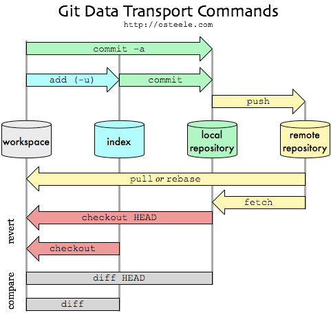
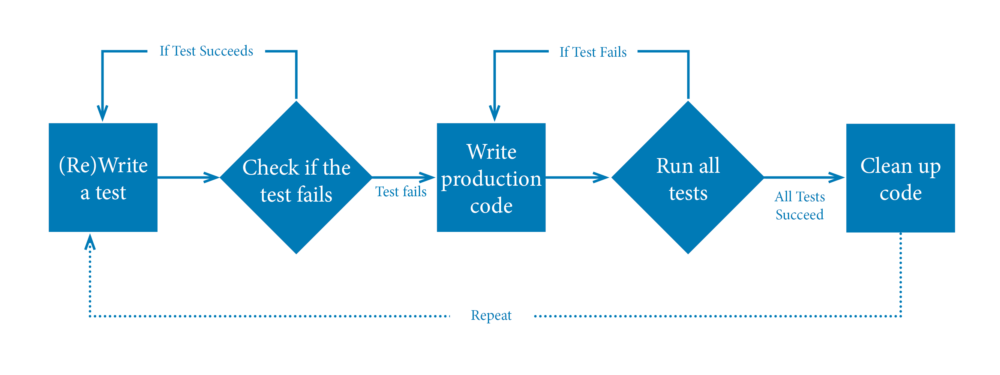

### Issue Tracking System (ITS)
*Issue* (criticità) = attività/evento da gestire
*Tracking* = registrare, lasciare delle tracce

> Un Issue Tracking System (ITS), detto anche support ticket issue system, gestisce e mantiene una lista di criticità. E' solitamente usata in un contesto collaborativo.

E' simile a un bugtracker e vengono spesso usati insieme.

A cosa serve?
- condivisione di informazioni con il team di sviluppo, il project manager e il cliente
- unico repository dove trovare le informazioni
- processo per misurare la qualità del progetto
- istantanea dello stato del progetto: attività da fare, in corso e completare
- assegnare priorità alle attività
- segna il tempo impiegato sulle attività (utile per stime)
- ogni attività ha un proprio responsabile
- memoria storica di tutti i cambiamenti del progetto

Un *Work Item* è un'attività "atomica" del progetto gestito mediante un workflow e mantenuto in un unico repository.

Un *Workflow* è l'insieme di stati e transizioni che un Work Item attraversa durante la sua vita. Permette di implementare il processo da seguire per completare un'attività e di definire la relazione tra work item.


### Version Control System (VCS)

> Il Version Control System (VCS) gestisce il versionamento offrendo un'informazione univoca del file. Anche detto Source Code Management System (SCM).
> - registrano tutte le modifiche di un insieme di file
> - condivisione del codice e modifiche
> - tracciamento e merge

Perché li usiamo?
- offrono l'intera storia del codice, possibile rollback
- facilita l'individuazione e risoluzione di conflitti
- collaborare senza interferenze (branching)

Ci sono 3 diverse versioni di VCS
1. locali, database dentro l'IDE
2. centralizzati, in un server
3. distribuiti
Ora vengono usati solo quelli distribuiti

I VCS locali registrano solo la storia del codice e non gestiscono la condivisione.
I VCS centralizzati sono come quelli locali ma in un server, offrendo la condivisione. Tuttavia quando essa cade, tutto il sistema VCS cade ed è solo possibile fare commit al master.

I VCS distribuiti è duplicato per ogni nodo. Offre diversi metodi di issue tracking e workflow che favoriscono la condivisione.
#### Terminologia
Ogni insieme di righe modificate in un singolo file è detta *DIFF*.
Un insieme di diff che sono esplicitamente convalidate sono un *COMMIT*.
L'ultimo commit sulla storia è *HEAD*.


*BRANCH* sono i rami in cui si trova il codice. Per integrare un branch al master, si ha un *merge*.
*Pull Request* chiede di seguire un merge al branch master. Permette di commentare.

Ci sono diverse tipologie di workflow
- **centralizzato**, non ha funzionamento di merge e si deve gestire conflitti in locale pausando commit al server con un *checkout*
- **feature branch**, abbiano un branch per feature
	- <u>gitflow</u>
	  il *master branch* viene solo usato per codice rilasciato
	  il *development branch* viene usato per codice da portare a rilascio
	  ci sono *feature branches* per ogni feature da mergere quando pronta
	  il *release branch* è usato per i testing
	- <u>github</u>, simile a gitflow ma che merge i feature branch direttamente al master dopo una pull request
	- <u>gitlab</u>, simile a github ma con pre-produzione e poi produzione
- **forking branch**, usato nei progetti open-source
  si fa fork ovvero copia del repository open-source dove lavorare. Non si ha accesso diretto al master. Si deve fare pull request al master per contribuire al codice, dove viene giudicato dall'amministratore del progetto.
#### Git
E' piccolo e veloce, sviluppato in C. Usa il modello distribuito.

**working directory** -git add-> **staging area** -git commit-> **repository (locale)**
nello staging area vengono convalidati i file prima del commit

A differenza dei diff, git fa uno snapshot di tutti i file in un dato momento a cui poi fa link.

un file può avere uno dei 3 stati
- untracked, nuovo e non versionat
- unmodified, non modificato rispetto alla versione precedente
- modified, modificato rispetto alla versione precedente
- staged, salvata come snapshot nella staging area
- committed, salvato dalla staging area alla repository locale



non si possono chiudere le issue via commit
git config pull.rebase false
git pull origin master > sistemo conflitti
`> git merge [--no-ff] new-feature` 
`[--no]` per bypassare  al main locale quando vengono solo aggiunti file

### SCRUM
E' un metodo agile per la quale si producono anche poche righe di codice alla volta per rispondere subito agli obiettivi e per presentare al cliente qualcosa di funzionante per ogni sessione (*sprint*).

Il metodo inverso a quello agile è chiamato waterflow per la quale si ritorna al cliente solo quando si è finito tutto.

I requisiti sono trattati come elementi di una lista detta *product backlog*.
Si basa su attività empiriche per cui si risolvono solo cose a cui si hanno le conoscenze necessarie.

Persone e iterazioni > Processi e strumenti
Software funzionante > Documentazione ampia
Collaborazione con il cliente > Negoziazione del contratto
Risposta al cambiamento > Seguire un piano


Per ogni punto del Product Backlog ne scrivo n per lo Sprint Backlog.

Prodotto progettato, realizzato e testato durante lo sprint.
Requisiti -> Progetto -> Codifica -> Test
Piuttosto che fare di tutto, si fa un pezzetto del tutto alla volta

Non si cambia durante lo sprint
Alla fine dello sprint c'è una fase di revisione e rischio per cui lo sprint backlog può essere chiarito e rinegoziato con il product owner.

**Ruoli**
- *Product Owner*
  può essere o lato cliente o lato dell'azienda
  è responsabile della redditività del prodotto (ROI, Return On Investiment) ovvero se siamo in positivo o negativo
  responsabile del product backlog
  accetta o rifiuta i risultati del lavoro
- *Scrum Master*
  rappresenta la conduzione del progetto SCRUM
  protegge il gruppo di lavoro da interferenze esterne e assicura che il gruppo di lavoro è pienamente operativo e produttivo
  mediatore tra product owner e il development team
- *Development Team*
  tipicamente di 5-9 persone
  competenze trasversali: programmatori, tester, progettisti di user experience, sistemisti, etc

**Eventi**
- *Sprint Planning*
  8 ore prima dello sprint
  scompongo i punti del product backlog in user stories e poi in punti per lo sprint backlog
  si definiscono il cosa, il come e si stima il tempo necessario
- *Daily Scrum Meeting*
  breve incontro giornaliero di 15 minuti (circa) in piedi
  aggiornamenti della situazione per lo scrum master
  non serve per risolvere problemi
  si rispondono a 3 domande
  1. cosa hai fatto ieri?
  2. cosa farai oggi?
  3. c'è qualcosa che ti impedisce di farlo?
- *Sprint Review*
  4 ore al termine dello sprint
  si presenta il lavoro compiuto al cliente, tipicamente con una demo
  informale: si evitano slides
  partecipa tutto il gruppo e anche esterni
- *Sprint Retrospective*
  3 ore dopo lo sprint review
  si valuta lo sprint appena concluso e si parla di cosa ha funzionato o no
  partecipa tutto il gruppo (anche product owner)

Sprint goal: obiettivo che assegnamo a uno sprint
Definizione di Done: ogni gruppo assegna una definizione di done
Criterio di accettazione: permette di confermare se la storia è completa e funziona come dovuto; frasi semplici condivise tra product owner e development team

### Build automation
La build automation è il processo di automare la creazione di una build software e i processi associati inclusa la compilazione del source code in codice binario, packaging del codice binario ed eseguire test automatizzati.

Caratteristiche CRISP
- Completo
- Ripetibile
- Informativo
- Schedulabile
- Portabile

Perché usare una tool di build?
Dal codice sorgente, creare un artefatto utilizzabile.

Tipi di build-automation
- Scripting tools
  si definisce un automatismo tramite l'uso di un linguaggio di scripting
- Artifact oriented tools
  si definisce e crea un artefatto (prodotto)

In questo corso useremo Apache Maven che usa artefatti.

**POM (Project Object Model)**
Il POM è l'unità di lavoro fondamentale di Maven. E' un file .xml che contine informazioni su progetto e dettagli di configurazione utilizzati per creare il progetto.

``` powershell
mvn archetype:generate "-DgroupId=com.mycompany.app" "-DartifactId=my-app" "-DarchetypeArtifactId=maven-archetype-quickstart" "-DarchetypeVersion=1.4" "-DinteractiveMode=false"
```

*Super-POM*
`mvn help:effective-pom`
E' il POM di default che pulliamo alla generazione del progetto.

*Plugin*
specifichiamo quando vengono lanciati nel pom `<execution><phase>`
I plugin oltre a quelli di default vengono aggiunti in una tag `<plugin>` fuori da `<pluginManagement>`.

*Dipendenze*
Aggiungiamo la dipendenza che vogliamo usare in `<dependecies><dependency>`.
`mvn compile` per scaricare la dipendenza e tutte quelle transitive richieste.
`mvn dependency:tree` per vedere quali dipendenze sono utilizzate.

Project Archetype è definito come un modello da cui vengono realizzate tutte le altre cose dello stesso tipo. Aiuta gli autori a creare modelli e agli utenti i mezzi per generare versioni parametrizzate del progetto.

### Software testing
La fase di testing e quella di sviluppo devono andare di passo a passo.
Il test è un'indagine che da informazioni sulla qualità del software e del servizio messo a test.

> Testing (nella definizione di International Software Testing Qualification Board):
> Il processo che consiste su tutte le attività del ciclo di vita, sia *statiche* che *dinamiche*, interessate con la pianificazione, preparatione ed evaluazione di prodotti software e lavori correlati per determinare che soddisfino i requisiti specificati, dimostrare che sono adatti per lo scopo e trovare difetti.

**Categorie di testing**
- *Funzionale*: condotti per valutare la conformità a requisiti funzionali. Reappresentano cosa fa la nostra applicazione.
  *Non funzionale*: condotti per valutare la conformità a requisiti non funzionali come performance, sicurezza, usabilità e accessibilità. Rappresentano come la nostra applicazione risponde alle esigenze.
- *Statico*: analisi del prodotto senza l'esecuzione del codice
  *Dinamico*: collaudo con esecuzione del software
- *Verifica*: realizzato secondo le specifiche tecniche e funziona correttamente. Conforme ai suoi obiettivi 
  *Validazione*: realizzato rispettando le specifiche dell'utente

Definizione di caso di test
I casi di test aiutano a ridurre l'ambiguità nei requisiti, migliorando la descrizione. Sono i testable requirements.

**Processo di test**
1. <u>Test planning</u>, creare o aggiornare un test plan
2. <u>Test control</u>, controllare se il piano è rispettato
3. <u>Test analysis</u>, cosa testare
4. <u>Test design</u>, come testare
5. <u>Test implementation</u>, definizione casi di test
6. <u>Test execution</u>, esecuzione
7. <u>Checking result</u>, verificare che i risultati e capire se il test è superato
8. <u>Evalutating exit criteria</u>, verificare se sono stati raggiunti gli exit criteria definiti nel test plan
9. <u>Test results reporting</u>, segnare il progresso rispetto agli exit criteria
10. <u>Test closure</u>, chiusura del processo e definizione di azioni di miglioramento

*7 principi di un test*
1. Test rivelano presenza di difetti
2. Test esautivi non esistono
   il rischio(risk based) e le priorità(priority based) vengono usati per concentrarsi sugli aspetti più importanti
3. Test il prima possibile
4. Clustering dei difetti
   regola del 80/20, 80% degli errori nel 20% del codice
5. Il paradosso dei pesticidi
   rifare i test passati con l'evoluzione del sistema
6. Test dipendono dal contesto
7. Assenza di errori non è garanzia
   equilibrio tra costi, funzionalità e tempo

V-model

*Unit testing* SUT
Test sul sottosistema più piccolo possibile. 
E' un test white box, ovvero abbiamo accesso al codice.

*Integration testing* SUT
Verificano che i contratti di interfaccia tra più moduli e sottinsiemi siano rispettati e se i sottoinsiemi atomici sono ben integrati. E' white box.

*System testing* SUT
Verificano il comportamento dell'intero sistema rispetto alle specifiche tecniche. Può essere white o black box.

Acceptance testing (UAT, *User Acceptance testing*)
Relativo agli use cases e ai requisiti concordati con il cliente.
E' un test black box.

#### Unit Testing
Vedremo quelli automatici, in specifico **JUnit**.

Proprietà desiderabili (ATRIP)
- Automatic
- Through
- Repetible
- Indipendent
- Professional

*Automatici*
- in modo rapido
- senza richiedere interazione umana
- in modo automatico
  deve essere in grado di capire quando e dove i test falliscono e notificare gli sviluppatori

*Esaustivi, accurati*
devono verificare il comportamento del più codice possibile (>80%)
ci sono plugin che calcolano la percentuale del codice esercitate dal test, la percentuale di possibili diramazioni e il numero di eccezioni

*Ripetibile*
- indipendenti dall'<u>ordine</u> di esecuzione
- indipendenti dall'<u>ambiente</u> di esecuzione
  creamo mock-object per simulare il comportamento di strutture (db, etc)

*Indipendente*, controlla solo uno o più metodi
*Professionali* tanto quanto il codice, le linee di test sono >= a quelle di produzione

Framework aiutano
1. configurare un ambiente di test
2. selezionare un test
3. analizzare i valori inaspettati
4. un modo standard per eseguire ed esprimere un esito

Useremo JUnit
- Annotations
  `@BeforeClass` e `@AfterClass` a livello di classe, `@Before` e `@Before` a livello di metodo
- Suite, aggregatori di classi
  `@RunWith(<classe>)` insieme a `@Suite.SuiteClasses({ ... })`
- Assertion
  metodi forniti per verificare risultato

Il test non viene scritto solo per passare ma anche in modo che fallisca in buon modo (CORRECT)
- Conformance, valori conformi al valore atteso
- Ordering, valori seguono un ordine o no
- Range, valori all'interno di un range appropriato
- Reference, valori possono provenienti da codice che fa riferimenti esterni o no
- Existence, valori esistono
- Cardinality, valori nella quantità richiesta
- Time, valori rispettano un ordine temporale

**Test-driven Development**

1. fase rossa, scrivere un test che fallisce
2. fase verde, scrivere il minor codice possibile per farlo passare
3. fase grigia, ristrutturare il codice

#### Analisi statica 
L'analisi statica del codice avviene senza eseguire il codice.
Ci sono vari tool che ci aiutano a controllare il codice e che forniscono anche possibili soluzioni.

Teoria delle finestre rotte: se un quartiene viene mantenuto in ordine allora, chi vuole creare disordine si troverebbe fuori luogo.

Funzionalità
- imporre convenzioni e stili
- verificare che il codice ha documentazione
- mostra metrice e indicatori (n di cicli, dipendenze, linee di codice)
- ricercare codice copiato in più punti
- ricercare errori comuni nel codice
- misura percentuale di codice testato
- ricercare indicatori di parti incomplete

Plugin per analisi statica
Checkstyle
SpotBugs (FindBugs obsoleto)
PMD, individua difetti nel codice

SonarQube, piattaforma web che aggrega tutti i plugin precedenti. Registra l'evoluzione della metriche del codice.

Le issue segnalate vengono classificate in base alla gravità (Blocker, Critical, Major, Minor, etc.)
- Vulnerabilità
- Bug
- Code Smell

**Feedback loop**
Chi avvisare per feedback? Dipende dallo stage di produzione.

Engineers
Product manager
End users 

### Artifact Repository
Binary Repository 

Artifact Repository lascia gestire le versioni e build: eliminarle, tenere le firme e rigenerarle. 

Caratteristiche
- definisre ambiente dove pubblicare
- intermediario verso l'esterno (per librerie esterne)
- gestione di accessi
- segnalazioni di vulnerabilità
- verifica licenze (dipendenze a prodotti terzi)
- documentare artifatti con metadati

GAV identifica univocamente un artefatto
metadati (es. pom.xml)
- artefatto di produzione/sviluppo
- riferimento del commit nel VCS da cui è stato creato
- informazioni licenze e dipendenze
- md5, sha1 che garantiscono autenticità
- identificativo univoco

Maven ha 2 tipi di repository
1. *Proxy remote repository*, configurare il repository interno in modo che recuperi artefatti da repository esterni. Se l'artefatto non è presente, viene consultato il repository esterno.
2. *Hosted internal repository*, condivisione all'interno di una organizzazione di arterfatti di terze parti con vincoli di licenza
e ha 2 tipi di artifatti
3. release artifact
4. snapshot artifact

Perché usare repository interno?
- maggiore controllo di repository da importare
- maggiore controllo di artifatti passati

| DEV                                                                    |                     | OPS        |
| ---------------------------------------------------------------------- | ------------------- | ---------- |
| - version control<br>- build tools<br>- CI (continuos integration)<br> | artifact repository | deployment |

### Continuous Integration
Build automation NON E' continuous integration

La **Continuous Integration** nasce per avere un allineamento frequente degli ambienti di lavoro dei sviluppatori verso l'ambiente condiviso. Per risolvere problemi di integrazione nel caso di lunghi sviluppi individuali.

Prerequisiti
- codice di progetto gestito da VCS
- build automatico
- build esegue verifiche automatiche
- il team adotta CI

Processo
1. controllo se il processo di build è in esecuzione nel sistema CI
2. aggiorno il codice locale con il codice di VCS e effettuo integrazione in locale
3. eseguo processo di build in locale
4. aspetto che CI esegua il processo di build
5. se il processo di build fallisce mi fermo, sistemo e riprendo da passo 3.
6. al suo successo, procedo alla prossima attività

Buone pratiche
versionare spesso
test e build brevi
correggere errori di build subito
tutti devono vedere cosa succede

Le applicazioni possono essere eseguite
- "on the metal", direttamente nella macchina
- tramite container (es. Docker)

**Github actions**
Le componenti chiavi sono
- workflow
  un file YAML che descrive l'insieme dei jobs da eseguire e i suoi trigger
- eventi
  meccanismi di avvio
- job
  serie di step da eseguire insieme in uno stesso runner (macchina virtuale)
  possono girare in parallelo o in sequenza
- action
  singole operazioni riutilizzabili che costituiscono gli step di uno job
- runner
  ambiente in cui vengono eseguiti i job
  possono essere github-hosted o self-hosted

mvn -B install --file pom.xm
-B è per evitare che chieda iterazioni

| Continuous             |     |
| ---------------------- | --- |
| Continuous Delivery    |     |
| Continuous Deployment  |     |
| Continuous Integration |     |
| Continuous Testing     |     |
### Continuous Delivery
Stai eseguendo la Continuous Delivery quando:
- il software è rilasciabile per tutto il ciclo di vita
- il team dà la priorità a mantenere il software distribuibile
- avere un feedback rapido e automatizzato sulla disponibilità di produzione
- possibile eseguire distribuzioni rapide di qualsiasi versione
- integriamo continuamente il software creando eseguibili ed eseguendo test automatizzati; il software viene rilasciato in ambienti sempre più simili alla produzione

C.I. si basa sulla parte DEV. L'obiettivo della C.D. è di favorire la comunicazione tra DEV e OPS.
Migliorare il processo che permette di rilasciare una modifica al codice sorgente del progetto in produzione. Isolare 

Aggiungere parte del CD nella build di CI.

1. Only Build Your Binaries Once
   garantisce di usare lo stesso artefatto per effettuare tutte le verifiche in ogni ambiente
2. Deploy the Same Way to Every Environment
3. Smoke-Test Your Deliveries
4. Deploy into a Copy of Production
   l'ambiente dovrà essere:
	   - la stessa configurazione di rete
	   - lo stesso sistema operativo (versione e patch) <-
	   - lo stesso stack applicativo (application server, versione db, etc) <-
	   - i dati gestiti devono essere in uno stato consistente <- configuration management
5. Each Change Should Propagate through the Pipeline Instantly
6. If Any Part of the Pipeline Fails, Stop the Line

Benefici:
- riduce il rischio legato al deploy
- velocizza il time to market
- maggiori feedback da parte degli utenti
- progressi tangibili: monitoramento di progressi in un ITS
- minor costo: maggior costo iniziale ma ci si salva da costi di manuntenzione
- prodotti migliori
- team meno stressanti e più collaborativi
- maggiore documentazione implicita

Requisiti
- VCS
- Build automation
- Unit testing
- Artifact repository
Continuous testing
Orchestrator
Configuration management

### Configuration Management
Configuration Management è il processo di ingegneria dei sistemi per la configurare l'infrastruttura del prodotto per tutta la sua vita. 
ITIL l'obiettivo del CM è di fornire un modello logico dell'infrastruttura attraverso l'identificazione, il controllo, la gestione e la verifica di tutte le versioni, solitamente tramite script.

Il Configuration Management Database (CMDB) viene usato per tracciare tutti i CI e le relazioni tra loro.

Obiettivo
- riproducibilità
- tracciabilità

La gestione del nostro prodotto con Configuration Management la stiamo già facendo con l'impostazione del CI, git, test, etc. Manca però la configurazione; impostiamo un file.

Infrastructure as code
Per ogni modifica, deve esserci un check-in

Configuration Models

| Modello                                                            |                                                                                                                         |
| ------------------------------------------------------------------ | ----------------------------------------------------------------------------------------------------------------------- |
| config server(config tool) -push-> asset, asset, ...               | - più facile da gestire<br>- meno <br>- ASSET è gestito in centrale                                                     |
| config server(config tool) <-pull- asset(agent), asset(agent), ... | - meglio ad assicurarsi che gli asset sono in sync con il config<br>- più complesso<br>- ASSET può registrare se stesso |

*Idempotency*, la proprietà per la quale, applicando molteplici volte una stessa funzione, il risultato è lo stesso della sua singola applicazione.

**Living Infrastructure**
1. salta lo step di provisione ad ogni update
2. accumula update col tempo
Implicazioni:
- idempotenza non è garantibile
- drift di configurazione con update manuali

**Immutable Infrastructure**
1. creo una nuova immagine
2. provisione della nuova istanza con una immagine read-only
Implicazioni:
- update più lenti
- immagini costruite offline e poi caricate

#### Ansible
- non richiede l'installazione di agents
- è idempotente
- multipiattaforma
- permette un approccio graduale

Parole chiave
Module

All'inizio ogni applicazione viveva su un **server fisico** dedicato
- deploy lento
- costi alti
- risorse deprecate

### Virtualizzazione
IaaS (Infrastructure as a Service)
**Virtualizzazione** disaccoppia l'infrastruttura con l'hardware sottostante
- le applicazione non possono accedere alle risorse di altre VM se non tramite interfacce di rete

HyperVisor aiutano la virtualizzazione. Sono responsabili a creare ed eseguire VM isolate e a gestire 
Possono essere
- Bare-metal, Type 1
  senza sistema operativo e usato solo per la virtualizzazione
- Type 2
  gira in un sistema operativo
- KVM, sia elementi di Type 1 che Type 2

Componenti
Host, macchina fisica su cui avviene la virtualizzazione
Guest, macchine che accedono all'Host

Virtualizzazione in cloud

Limiti della vistualizzazione
- ogni VM richiede molte risorse: CPU, RAM, spazio in disco e un intero sistema operativo
- molte risorse sprecate
- portabilità non garantita
#### Container
**Container**, utilizza il kernel del sistema operativo per avere differenti root file system
- applicazione completamente isolata che gira nativamente nel kernel della macchina host
- container che girano sull'host condividono il kernel dell'host

Namespaces forniscono un ambiente isolato. Un processo in un namespace ha accesso limitato in quel namespace. 
Control groups (cgroups) limitano le risorse

Sono creati a partire da un immagini. Ogni immagine contiene informazioni sul codice eseguibile e l'ambiente necessario per avviare il codice.

Container VS Virtualizzazione
- veloce e leggero
- facile da gestire
- portabile


Docker image è la base per costruire un container. E' l'intera applicazione.
Un'immagine è un file immutabile che rappresenta un'istantanea di un container. Sono costituite da strati di altre immagini e vengono create con l'operazione di build descritta in Dockerfile.s
Possono essere condivise.

Docker registry
Il registry più conosciuto è Docker hub
E' consigliato avere un trusted Registry privato dove salvare ed utilizzare le immagini certificate.
Fare patching delle immagini è molto complicato: si deve entrare nell'immagine e sostituire parte di essa

**Orchestratore**
- schedulare il running dei container sui server
- distribuire i container sui nodi
- monitorare

Docker Swarm non ha preso piede
- nodo master è un container eletto in un certo momento
Kurbenetes, sviluppato da Google e poi reso opensource
- nodo master è fisso e dedicato solo alla gestione dei altri nodi
Pod è un gruppo di containers con stessa memoria e script di build

