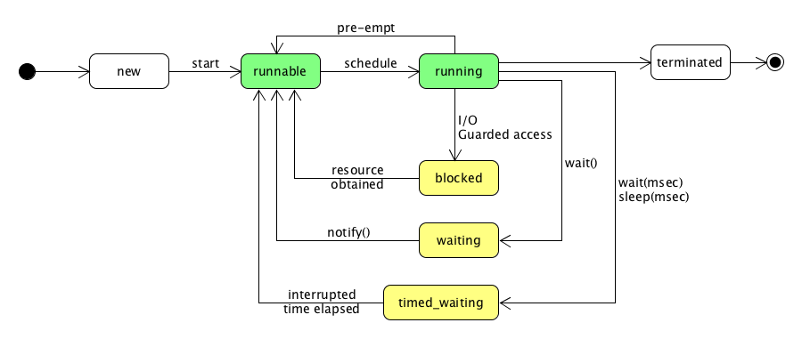

Paradigmi
- *concorrenza*, asincrone con risorsa condivisa
- *parallelismo*, asincrone che si coordinano per risolvere uno stesso calcolo
- *in rete*, collaborazione con altri sistemi tramite comunicazione asincrona in rete
- *distribuito*, nodi indipendenti in una rete non affidabile che si coordinano per eseguire uni stesso lavoro. Devono condividere il consenso dello stato complessivo del sistema
- *reattività*, sistema distribuito costruito sulle basi della comunicazione asincrona con caratteristiche di

Alan Kay, inventore della programmazione ad oggetti.

### Java
Ogni parte del codice fa parte di una classe (tipo). 
Per convenzione ogni classe è maiuscola. Ogni classe fa parte in un package gerarchici. l package di default è "". Package sono definite come nome di dominio all'inverso. 
La compilazione di un insieme di sorgenti Java è un *processo deterministico*. 

Visibilità 
- Default, la classe è visibile a tutte le altre classi nello stesso package
- Public, la classe è visibile a qualsiasi altra classe caricata nella JVM
  un file sorgente 

Una classe può non essere unica in diversi ClassLoader.
Variabile statica esiste "una sola copia" legata alla classe. Assomigliano a variabili globali e vengono allocate e inizializzate al caricamento (tempo variabile, problema se mutabili).
static final in maiuscolo, altre variabili in minuscolo.
Un metodo stati è legato all'oggetto e non vede le sue variabili istanza. 
- private: nella classe, 
- protected: discendenti della classe, 
- default: altre classi nello stesso package, 
- public: tutte le altre classi

Tutte le eccezioni derivano dalla classe Throwable che si suddivide in Exception e Error. 
RuntimeException sono lanciate direttamente dalla JVM.

Classe interne
Static nested classes, sono classi nello stesso package
Inner classes, classi dentro altre

Inizializzatori, blocchi static
*Ereditarietà singola*, una sola superclasse
Tutte i metodi sono virtual. A una classe final non si possono derivare sottoclasse. Sealed permette la derivazione a specifiche classe. Queste classi possono riaprire l'ereditarietà con non-sealed.

Interfaccia dichiara le caratteristiche del Tipo senza implementarla. Tutti i suoi metodi sono publici.
Un'interfaccia può essere private o protected se è membro di una classe.
Può essere estesa solo da un'altra interfaccia.
*Una classe* può implementare *multiple interfacce*.

Un'interfaccia con un solo metodo è detto "functional interface"
Annotazione è una interfaccia speciale usata per aggiungere metadati al codice

Dal Java 8, è possibile definire metodi privati e sono stati aggiunti metodi di default.
``` java
interface Top {
	default String name() { return "unnamed"; }
}
interface Left extends Top {
	default String name() { return getClass().getName(); }
}
interface Right extends Top {}

```
Viene così reintrodotto il diamond problem. Vengono bloccate al momento di compilazione.

Un'interfaccia il cui nome inizia con @ è un tipo particolare: l'annotazione. Questo viene usato per arricchire i metadati.

| Tipo                 | Uso                                                                           |
| -------------------- | ----------------------------------------------------------------------------- |
| @Deprecated          | metodo che verrà rimosso                                                      |
| @Override            | metodo che implementa un membro di superclasse o interfaccia                  |
| @SuppressWarnings    | istruisce al compilatore di sopprimere i warning del costrutto annotato       |
| @FunctionalInterface | indica al compilatore che l'interfaccia può essere usata in modo "funzionale" |

#### Tipo generici
Nella versione 5, vengono introdotti i Generics, ovvero *1-kind parametric types*.
Una classe generica dichiara uno o più parametri di tipo che verranno specificati successivamente.
``` java
interface MappableList<T> {
	void add(T element);
	T head();
	List<T> tail();
}
class StringList implements MappableList<String> {
	public void add(String element);
	public String head() { return ""; }
	public List<String> tail() {
		return Collectrion.emptyList();
	}
}
```
Le eccezioni non possono essere generiche.

E' possibile estendere i tipi anche senza averli specificati.
``` java
interface SortableList<T extends MappableList<T>> {}
```
E' possibile non esprimere vincoli sul tipo ma solo sul tipo parametrizzato.
``` java
class Test {
	static void printCollection(Collection<?> c) {
		for(Object o:c) {
			System.out.printIn(o);
		}
	}
	public static void main(String[] args) {
		Collection< > cs = new ArrayList<String>();
	}
}
```

Le informazioni sui generici viene cancellato al runtime. Al runtime è possibile violare i vincoli espressi al momento di compilazione.

#### Valori primitivi

| Universo  | Tipo Corto         | Tipo Lungo |
| --------- | ------------------ | ---------- |
| Interi    | `byte, short, int` | `long`     |
| Decimali  | `float`            | `double`   |
| Caratteri | `char`             |            |
| Booleani  | `boolean`          |            |

I valori primitivi sono in minuscolo Tutti i caratteri sono utf-16.
Non è possibile indicare una costante di tipo byte o short senza l'operatore di cast.

I valori primitivi non sono oggetti. Esistono una loro contropparte oggetto con la maiuscola. Non possono essere null.
Gli array sono oggetti istanziati autonomamente dal compilatore quando viene incontrata la loro dichiarazione.
``` java
array = new int[10];
```

**enum** è una particolare categoria di classe che può contenere un solo determinato numero di elementi. Può implementare metodi e campi ed è utile per definire classi piccole che non estendiamo.

**records** sono un lontano parente dello struct in C. Sono disponibili dal Java 14.
``` java
record Name(String firstName, String lastName) {}
```
Il record è *immutabile* ed è *final*. Ottiene automaticamente
- membri privati con metodi di accesso pubblici (stesso nome dei membri)
- costruttore di default
- metodi di equals, hashCode, toString
E' strato introdotto per aggiungere a Java, una sintassi di decostruzione delle classi per arrivare a un Pattern Matching.

#### Classi non testuali
``` java
interface Top {
	default String name() { return "unnamed"; }
}
Top inst = new Top() {
	@Override public String name() { return "anonymous"; }
};
```
Una *classe anonima* è una classe che non ha un nome e quindi non può essere indicato in altre parti del codice.

Una *classe nascosta* è usata dal compilatore per la generazione del codice, definendo tecniche che usano caratteristiche della JVM non documentate o private.
- non può essere individuata
- non può essere usata in nessuna definizione
- può estendere il control nest (più classi in un singolo file, così connessi) a cui appartiene
Le Lambda Expressions sono implementate con la classe nascoste.

Lynn Conway, *Generalized Dynamic Instruction Handling (OOOE)*
Non c'è nessuna garanzia che l'ordine delle istruzioni sia lo stesso di quello del codice. Il compilatore, lo JVM e pure il processore hanno la libertà di riorganizzare il codice in uno con la stessa sintassi funzionale.
var è usato quando il tipo della variabile è ovvio così ne assume una automaticamente dal valore da cui è inizializzato.

Gli oggetti String
- non hanno bisogno dell'operatore `new`
- possono essere su più righe
- sono immutabili, evitare concatenazioni in un ciclo

E' possibile istanziare direttamente un'interfaccia implementandola al momento della creazione
``` java
Comparator<> reverse = new Comparator<String>() {
	@Override
	public int compare(String o1, String o2) {
		return -o1.compareTo(o2);
	}
};
```

Operatore ternario `<cond> ? <val1> : <val2>`

`this` indica l'oggetto corrente
`super` indica la superclasse da cui si eredita

*Lambda expression* `(<lista param>) -> istruzione`
Attenzione: la lambda espression non rende Java un linguaggio funzionale. La lambda expression non ha tipo di ritorno e serve solo per abbreviare la sintassi.

Method Reference è usato per indicare un metodo di una classe o oggetto da usare come lambda. `Class::method`

Switch-case usato come
- *istruzione switch*: sceglie un blocco di istruzioni da eseguire
  `case :` interrompiamo il fall-through con `break`, non ha bisogno di default
  `case ->`  inserire una sola espressione o blocco, no fall-through
``` java
switch (seasonName) {
	case "Spring" -> {
		System.out.print("primavera!");
		numLetters = 5;
	}
	case "Summer", "Winter" -> numLetters = 6;
	case "Fall" -> numLetters = 4;
	default -> numLetters = -1
}
```
- *espressione switch*: sceglie un valore da restituire
  `case :` ritorniamo un valore con `yield`; fall-through possibile
  `case ->` seguito da un valore letterale, un'espressione o un blocco che ritorna yield, no fall-through
``` java
int numLetters = switch (seasonName) {
	case "Spring":
		System.out.print("primavera!");
	case "Summer", "Winter":
		yield 6;
	case "Fall":
		yield 4;
	default:
		yield -1;
};

int numLetters = switch (seasonName) {
	case "Spring" -> {
		System.out.print("primavera!");
		yield 5;
	}
	case "Summer", "Winter" -> 6;
	case "Fall" -> 4;
	default -> -1;
};
```

*Pattern matching*, costruzione di una condizione basandoci sulla struttura dell'oggetto

For può ciclare su un oggetto che implementa un Iterable o array. `for(String s:List.of("a","b","c"))`

`assert` consente di verificare le condizioni al momento di esecuzione del programma.
`syncronized` davanti a un blocco o metodo, cambia il suo comportamento rispetto alla concorrenza.

### Libreria standard
Haskell Brooks Curry
- logica combinatoria
- isomorfismo Curry-Howard
- Currying, multiple funzioni che compongono una funzione
- linguaggi Haskell, Brooks, Curry

JDK (Java Development Kit)
JRE (Java Runtime Environment)

Un modulo è un'insieme di package e moduli e controlla il loro accesso all'esterno. Consentono di separare il JDK (per compilare) in parti più piccole e creare distribuzioni più leggere.

Per il corso basta java.base
java.io per input e output
La libreria standard è organizzata per gerarchia di capacità che promuove l'uso della composizione.

System è in java.lang che è sempre implicitamente implementato.

**Collection API**
L'interfaccia Collection ha i metodi più semplici che viene inclusa da interfacce più specifiche. Diversi metodi sono marcati come opzionali per cui viene lanciato UnsupportedOperationException.

`java.lang.Object::equals()` è diverso da == che confronta solo l'identità dell'oggetto. Tutti i oggetti sono riferimenti.
Hashcode viene usato per distinguere gli oggaetti

Iterator permette di percorrere una Collection e controllare se si è raggiunti la fine. Una classe Iterable fornisce un Iterator.

| Iterator           | Significato                       |
| ------------------ | --------------------------------- |
| `next`             | Prossimo elemento                 |
| `hasNext`          | Se ci sono altri elementi         |
| `remove`           | Rimuove l'elemento attuale        |
| `forEachRemaining` | Applica al resto della collezione |

| Iterable      | Significato                                                     |
| ------------- | --------------------------------------------------------------- |
| `forEach`     | Applica ad ogni elemento                                        |
| `iterator`    | Fornisce un iterator                                            |
| `spliterator` | Fornisce un spliterator, usato per percorrere in modo parallelo |

**Sequenced Collections**
L'interfaccia List rappresenta un elenco ordinato di elementi, indirizzati per posizione.

L'interfaccia Set definisce un insieme, ovvero un contenitori senza ripetizioni (equals da false) non ordinato.

L'interfaccia Dequeue rappresenta una coda a doppia entrata (Double Ended Queue). Può essere usata come coda FIFO o stack LIFO.

L'interfaccia Map definisce una mappa chiave-valore. I metodi equals e hashCode devono essere ben definite.
Può essere implementata come
- HashMap, chiavi distinte per hashCode
- TreeMap, chiavi ordinate
- HashTable, sincrona
- EnumMap, chiavi enum
- IdentityHashMap, basata sull'identità
Si può definire una mappa immutabile con Map.of.
` var map = Map.of("A", 1, "B", 2, "C", 3); `

Stream è una sequenza anche infinita di elementi. Può essere costruita da collezioni o anche altre astrazioni come file, canali di I/O e generatori casuali.

| Stateless        | Significato                                          |
| ---------------- | ---------------------------------------------------- |
| `filter`         | Prende solo gli elementi che soddisfano un predicato |
| `drop/takeWhile` | Esclude/mantiene elementi finché vale un predicato   |
| `map`            | Trasforma ogni elemento                              |
| `peek`           | Esegue un'operazione senza consumare l'elemento      |

al-Khwarizmi
- cifre indiane
- zero
- al-jabr, algebra

**TDD (Test Driven Development)**
1. pensare al problema e a come scrivere il test
2. scrivere un test
3. osservarlo fallire
4. scrive il <u>minimo</u> codice necessario a farlo passare
5. ristruttura
6. ripeti

pair supporta la scrittura di test

**Kata**, risolvere un problema più volte ponendo attenzione sul processo che ci porta alla soluzione piuttosto che sul risultato

Lady Augusta Ada Byron King, Countess of Lovelace
il primo programma per il calcolo dei numeri di Bernulli (1843)

## Programmazione concorrente

| Risorse / Scopo | Diverso     | Comune        |
| --------------- | ----------- | ------------- |
| Comuni          | Concorrenza | Parallelismo  |
| Isolate         | Rete        | Distribuzione |

Teorie e tecniche per la gestione di più processi sulla stessa macchina che operano contemporaneamente condividendo le risorse disponibili.

La macchina di Turing è un fondamentale teorico mentre quello di Von Neumann è base dal punto di vista tecnologico. Subito però anche quello Von Neumann non riesce a tenere il passo: la singola CPU è un bottleneck. IBM introduce il concetto di I/O "intelligente" che non avevano bisogno di interagire costantemente con la CPU.
Abbiamo bisogno di gestire questi processi paralleli.

Legge di Amhdal individua i limiti matematici della possibile efficienza che si può ottenere con la parallelizzazione.

“The purpose of abstracting is not to be vague, but to create a new semantic level in which one can be absolutely precise.” - Dijkstra

Un processo descrive per il sistema operativo un programma in esecuzione e tutte le risorse che gli sono dedicate:
- memoria
- canali I/O
- interrupt e segnali
- stato dello CPU

Per gestire il parallelismo in uno stesso processo si instaurano i thread. I thread condividono le risorse di uno stesso processo rendendo più economico il costo di passaggio da un ramo di esecuzione all'altro.
La gestione dei thread ricade però sul programma.

| Dati / Stato | Condiviso            |                            Non condiviso |
| ------------ | -------------------- | ---------------------------------------: |
| Mutabili     | **prog concorrente** |                       *prog distribuita* |
| Immutabili   | prog funzionale      | prog funzionale / <br>*prog distribuita* |

### I problemi della programmazione concorrente
- *Non determinismo*
  un'esecuzione concorrente è inerentemente non deterministica (nessun ordine sequenziale)
- *Starvation*
  un thread che non riceve abbastanza risorse non può fare il suo lavoro
  sono da gestire
- *Race Conditions*
  l'ordine di esecuzione può essere rilevante per il risultato ma è difficile da determinare
- *Deadlock*
  se due thread hanno ciascuno bisogno di una risorsa che è stata presa da un'altra, nessuna dei due può proseguire

**Coffmann Conditions** individua le condizioni necessarie per cui avvenga una deadlock. La mancanza di anche una sola di queste porta all'eliminazione di possibilità di deadlock.
- <u>mutual exclusion</u>
  la mutua esclusione può essere fondamentale per alcune risorse
- <u>hold and wait or resource holding</u>
  rimuovere l'attesa può portare a situazioni di starvation
- <u>no preemption</u>, non è possibile sottrarre una risorsa che è stata assegnata
  introdurre la preemption può essere molto costoso o impossibile
- <u>circular wait</u>

| Tipi di concorrenze | Strutture               |
| ------------------- | ----------------------- |
| Collaborativa       | Co-routines             |
| Pre-emptive         | Processi, threads       |
| Real-time           | Processi, threads       |
| Asincronica         | Future, events, streams |

Nella concorrenza collaborativa, i programmi devono esplicitamente cedere il controllo ad intervalli regolari. Viene ancora usato in ambiti embedded o che richiedono high performance.

Nella concorrenza pre-emptive, il sistema operativo è in grado di interrompere l'esecuzione di un programma e sottrargli il controllo delle risorse per affidarle a un altro.

La concorrenza real-time è un caso specifico di quello pre-emptive che richiedono prestazioni precise sulla suddivisione delle risorse fra i programmi.

Nella concorrenza event driven/async, i programmi dichiarano le operazioni che vanno eseguite e lasciano all'ambiente di esecuzione la decisione di quando eseguirle e come assegnare le risorse. Non si usano più i thread ma gli stream.

Nel linguaggio Java un Thread è rappresentato da un'istanza dell'omonima classe.
``` java
public Thread(Runnable target); 
void start(); // avvia un nuovo percorso di esecuzione (simile a un fork)
static void sleep(long millis); 
// setta un timer nella quale il processo dorme, usato per sincronizzazione
```

L'interfaccia Runnable modella un compito da cui non ci si aspetta un risultato.
``` java
@FunctionalInterface
public interface Runnable {
	/* Definizione di metodi
	 * Non puoi gestire qui le eccezioni. Da fare quando viene implementato.
	 */
	void run();
}
```

Adele Goldberg
- GUI
- Alto's demo

Il thread è "alive" quando è in uno stato in cui può rientrare in esecuzione. 
`final boolean isAlive();`


Ci sono 3 tipi di attesa
- *blocked* quando il thread è in attesa che le si venga assegnata una risorsa hardware dal sistema.
- *waiting* quando il thread è in attesa di una risorsa software e deve quindi sincronizzarsi con un altro processo in esecuzione. Se ne esce quando riceve una notify().
- *timed_waiting* quando il thread è in una attesa a tempo limite.
Si può uscire da tutte queste attese quando si viene interrotti.
``` java
public void Interrupt(); // throws InterruptException
```

Runnable sono privi di risultato. Usiamo Callable quando vogliamo thread che ritornano risultato.
``` java
public interface Callable<E> {
	/* Definizione di metodi
	 * Può gestire eccezioni
	 */
	 void run();
}
```

La classe Future viene usata per catturare il risultato della Callable alla fine della sua esecuzione.
``` java
T get(); // ritorna il risultato del Callable in Future
boolean isDone();
```

``` java
<T> T invokeAny(
	<T>
);

<T> List<Future<T>> invokeAll(callables);
```

I virtual thread sono simili ai thread normali ma non sono legati da una OS thread e sono molto più leggeri.
Le operazioni di montaggio e smontaggio sono molto più economiche di un passaggio di Thread. 

#### Gestione sezione critica
Chiamiamo *sezione critica* la parte di codice dove vengono accessi dati condivisi. La soluzione è impedire a più Thread di trovarsi insieme nella sezione critica.

**Syncronized**
`syncronnized` è la parola chiave che impedisce a un blocco di instruzioni di essere percorso contemporaneamente da più Thread.
Tutti i blocchi sincronizzati di un oggetti hanno lo stesso *monitor lock* associato all'oggetto stesso.

Quando un Thread rilascia un monitor uscendo da un blocco syncronized abbiamo una relazione di *happens-before* fra l'azione di rilascio del lock e ogni successiva acquisizione dello stesso. Questa relazione è una garanzia forte riguardo l'ordinamento delle istruzioni.

Da Java 21 a 24, syncronized aveva problemi con i virtual thread.

Attenzione: syncronized da solo spesso porta a deadlock!

**Lock**
``` java
void wait() throws InterruptedException; // causa al thread attuale di aspettare finché non riceve un notify()
void notify(); // sveglia un thread
void notifyAll(); // sveglia tutti i thread
```
Attenzione: la documentazione avvisa che un blocco wait può essere svegliato senza un notify(), "spurious wake".

``` java
public interface Lock // implementa operazioni di lock
void lock(); // ottenere un lock se è libero, bloccati se no
void unlock(); // rilascia un lock
boolean tryLock(); // ritorna se possiamo acquisire il lock
```

ReentrantLock può essere controllato manualmente.

Produttori / Consumatori

Conditions (condition queues)
Non tutti i Thread che cercano di acquisire un lock sono uguali; ci potrebbe essere bisogno di segnarli con condizioni differenti.
Una Condition permette di separare l'accomodamento in attesa dal possesso del lock che controlla l'attesa.
``` java
// ritorna una nuova istanza di Condition che è legata a questa istanza di Lock
public Condition newCondition()
```

Dover gestire un Lock richiede molta responsabilità: se salta un signal(), c'è una wait() in più o se non gestiamo un'eccezione, c'è deadlock.

**Semaforo**
Un Semaforo è simile a un Lock contenente dati.
A differenza di un Lock, il Semaforo può essere rilasciato da un Thread differente da quello che lo ha lanciato.

tryAcquire ritorna immediatamente se non è riuscito ad ottenere i permessi. Può violare la fairness.

Margaret Hamilton
- Apollo 
- Software engineering

Raramente scriveremo codice che gestisce esplicitamente le sezioni critiche data la complessità del problema.

Dobbiamo comunque trovare un modo per condividere dati tra Thread in modo sicuro. 
Una struttura non thread-safe non consente a più thread di operare contemporaneamente.

Variabili atomiche in `java.util.concurrent.atomic` sono strutture thread-safe.
``` java
public final boolean compareAndSet(boolean expect, boolean update); // compara che valore attuale=valore aspettato
public class AtomicMarkableReference<V>; // ritorna un riferimento al thread, usato dal grarbage collector
public class AtomicStampedReference<V>; // ritorna un timestamp
```
Non funzionano sempre. 

`volatile` indica che una variabile deve sempre essere letta dalla "memoria principale" e non da cache intermedie.
Stabilisce una relazione di happens-before delle istruzioni.
"A write to a volatile field happens-before a consecutive read."

Nel package `java.util.concurrent` ci sono classi costruite con syncronized per lavorare in un thread. Si deve leggere la documentazione per sapere la garanzia di atomicità dei metodi.

ConcurrentMap
``` java
public interface ConcurrentMap<K,V> extends Map<K,V>
```
I metodi di trasformazione delle mappe <u>non devono</u>
- dipendere dall'ordinamento
- dipendere da uno stato condiviso durante il call (tranne forEach)

BlockingQueue, estende il Queue con diverse semantiche di metodi di modifica

| Aggiunta               | risultato negativo |
| ---------------------- | ------------------ |
| `add(e)`               | eccezione          |
| `offer(e)`             | `false`            |
| `put(e)`               | attesa             |
| `offer(e, time, unit)` | attesa limitata    |

| Prelievo           | risultato negativo |
| ------------------ | ------------------ |
| `remove()`         | eccezione          |
| `poll()`           | `null`             |
| `take()`           | attesa             |
| `poll(time, unit)` | attesa limitata    |

| Lettura     | risultato negativo |
| ----------- | ------------------ |
| `element()` | eccezione          |
| `peek()`    | `null`             |

``` java
/* Rimuove tutti gli elementi da questa queue e li aggiunge a una collezione
 * @param c la collezione in cui transferire elementi
 * @return il numero di elementi transferiti
 */
int drainTo(Collection<? super E> c);
```

**Variabili Thread Local**
Potremo volere una variabile che ha una propria versione per ogni thread che esegue il codice. Si dicono variabili Thread Local.
``` java
public class ThreadLocal<T> {
	...
	// crea una variabile local thread
	static <S> ThreadLocal<S>
		withInitial(Supplier<? extends S> supplier)
}
```

Virtual Threads
### Parallel Stream
Lo Stream è una iterazione su un insieme di oggetti di cardinalità non nota, anche infinita.

Possiede
- API per comporre passi di elaborazione riusabili su una successione di oggetti
- una reificazione della trasformazione che ne permette il riuso su sorgenti diverse e testabili in isolamento
- approccio funzionale al trattamento iterattivo dei dati
- modello di esecuzione in cui esecuzione sequenziale e parallela non richiedono modifiche di codice

Lo Stream ha controllo sull'algoritmo.

Stream Flags
Consideriamo i Stream di `java.util.Stream`.
La sorgente di uno Stream può dichiarare caratteristiche da usare.

| Flag       | Caratteristica                  |
| ---------- | ------------------------------- |
| CONCURRENT | Parallelizzabile                |
| DISTINCT   | Elementi distinti               |
| IMMUTABLE  | Immutabile nel consumo          |
| NOTNULL    | Elementi non nulli              |
| ORDERED    | Elementi ordinati               |
| SIZED      | Dimensione nota                 |
| SORTED     | Ordinamento definito            |
| SUBSIZED   | Suddivisioni di dimensione nota |

L'operazione terminale ha piena visibilità di quali sono le caratteristiche della pipeline di esecuzione e può effettuare ottimizzazione.

Una pipeline può essere eseguita in modo sequenziale o parallelo se è configurata come tale.

``` java
interface BaseStream<T,S extends BaseStream<T,S>>
S parallel()
S sequential()
// l'ultima chiamata ha effetto su tutto lo Stream
```

Una pipeline ORDERED conserva l'ordinamento idella sorgente.
Una pipeline SORTED mantiene gli elementi ordinati secondo un Comparator.
Una pipeline DISTINCT garantisce che non ci siano due elementi uguali secondo `equals()`.
Una pipeline SIZED garantisce una dimensione nota. Se è anche SUBSIZED, allora può fornire sottoinsiemi dimensionati per esecuzione parallela.

Le operazioni nei passi intermedi devono essere
- non invasive
- prive di stato interno

Splititerator

L'operazione di riduzione reduce crea nuovi valori per arrivare al risultato. Non è efficiente.

Collector permette di gestire una riduzione dove l'accumulatore è un oggetto mutabile.
``` java
/* Operazione di riduzione mutabile
 * @T tipo degli elementi di input
 * @A tipo mutabile dell'accumulatore
 * @R tipo restituito
 */
interface Collector<T,A,R>

.collect(
	//supplier
	() -> new StringBuffer();
	//accumulator
	(acc,el) -> acc.append(el);
	//combinator
	(resA,resB) -> resA.append(resB))
)
```

Quanti gradi di parallelismo sono efficienti?$$\#\text{ threads}\leq\dfrac{\#\text{ of cores}}{1-BF}$$dove BF (Blocking Factor) è l'intensità del calcolo di un algoritmo. BF=0 occupa constantemente la CPU, BF=1 è costantemente in attesa di I/O.

Da JEP 485 è stata introdotta una nuova API, Stream Gatherer, che permette di avere variabili stateful nelle operazioni intermedie.

## Programmazione distribuita
Prevede la programmazione per un insieme di macchine che eseguono un algoritmo

Abbiamo già visto le problematiche della programmazione concorrente, perché continuare in quella linea aggiungendo complessità?
- Ridondanza, che un'attività è ancora in corso anche se alcune macchine sono fermi o in errore
- Suddivisione del carico, una mole di lavoro troppo grande per una singola macchina può essere suddivisa fra più macchine piccole in modo concorrente
- Diffusione, più macchine possono accedere ai risultati del lavoro da un qualsiasi nodo

Caratteristiche
totale asincronia
fallimenti imperscrutabili

Qualsiasi nodo comunica con l'altro tramite una rete di comunicazione. Questo introduce una serie di ploblematiche sulla gestione dell'attesa e ricezione di messaggi.

E' mascherare una chiamata remota con una chiamata locale.
RPC (Remote Procedure Call) era finalizzato a rendere trasparente dove è stato chiamato un codice.
1. il cliente chiama lo stub locale
2. lo stub mette i parametri in un messaggio (marshalling)
3. lo stub invia il messaggio al nodo remoto

RMI (Remote Method Invocation)
CORBA (Common Object Broker Architecture) descrive gli oggetti tramite il linguaggio IDL (Interface)
1. il cliente chiama lo stub locale
2. lo stub mette i parametri in un messaggio
3. lo stub invia il messaggio. 
4. Cosa succede se il messaggio non viene ricevuto? Se il client e il server hanno versioni differenti del messaggio? Se il server fallisce durante una chiamata del client?

Ormai non si usano più queste metodologie perché la rete è sempre più grande, imprevedibile e non sicura. Si mostra in chiaro se una chiamata è remota o locale.

Il metodo in cui un processo viene trasformato in un messaggio viene chiamato *serializzazione*.

Per motivi di sicurezza, la serializzazione nativa di Java è sconsigliata. Inoltre per come funzionano le reti oggi, è preferibile l'uso di protocolli testuali. 

Classiche primitive del modello TCP/IP:
- Sockets (Connessioni TCP)
- Datagrams (Pacchetti UDP)

java.util.nio
HttpClient

OkHttp: gestione di chiamate http
Jackson: un/marshalling di dati json
Netty: I/O asincrono ad eventi
Thrift: RPC scalabile, efficiente e sicuro
gRPC: serializzazione e RPC efficace

Lo standard JEE (JakartaEE) introduce un framework di sviluppo di applicazioni client/server e web basato su astrazioni.

benchmark JVM TechEmpower
non sono accuratissime per benchmark fallacy

#### Socket
Astrazione della comunicazione peer-to-peer fra due sistemi, TCP/IP: flusso di dati non limitato, bidirezionale, asincrono.

``` java
package java.net;
/*
 * @param address remote address
 * @param port remote port
 * @param localAddr local address or null for anyLocal
 * @param localPort local port, 0 for arbitrary
 */
public Socket(InetAddress, address, int port, InetAddress localAddr, int localPort)
	throws IOException
```
Eccezione se la porta è occupata

Un Socket rappresenta un collegamento attivo:
lato client: si instaura una connessione quando il handshake viene completato
lato server: viene ritornato quando un collegamento è ricevuto

``` java
// Ascolta il canale per richieste di connessione
public Socket accept() throws IOException
```
Attenzione che questo metodo mette in attesa

``` java
public InputStream getInputStream();
public OutputStream getOutputStream();
```
Sono stream di bit quindi l'encoding è da gestire.

Questi stream sono
- thread-safe, ma un solo thread può scrivere o leggere alla volta
- i buffer sono limitati e in alcuni casi i dati in eccesso possono essere scartati senza avviso

La comunicazione via socket richiede la definizione esplicita di un confine tra richiesta e risposta. Dallo Stream non è possibile capire se la richiesta è terminata.
Devono essere definite dal protocollo usato.

#### Datagram
Astrazione dell'invio di un pacchetto singolo verso una o più destinazioni.
Non c'è garanzia di ricezione e ordine di ricezione.

``` java
public DatagramPacket(byte[] )
```
Un DatagramPacket è pur sempre un pacchetto UDP, quindi la sua grandezza massima è 64 e ha MTU, Maximun Trasmission Unit, per cui un messaggio deve essere suddiviso.

| Protocollo                   | MTU (bytes) |
| ---------------------------- | ----------- |
| IPv4 (link,<br>peer-to-peer) | 68          |
| IPv4 (host)                  | 576         |
| IPv4 (Ethernet)              | 1500        |
| IPv6                         | 1280        |
| 802.11                       | 2304        |

``` java
public void connect(InetAddress address, int port)

public void send(DatagramPacket p);
public void receive(DatagramPacket p) throws IOException; // deve fornire un luogo per ricevere il messaggio

public void close(); // chiude la connessione
```

Rispetto ai Socket perdiamo
- l'affidabilità: niente garanzia o avviso di consegna
- la reciprocità: una sola direzione
- dimensione: messaggi lunghi hanno grandi penalità di affidabilità

(lesson15)
Fin dalle prime versioni, java ha metodi che gestiscono URL e URI. Ma sono deprecati. 
Ora si gestiscono solo le connessioni e richieste HTTP (json, etc).

Mancano metodi di gestione della connessione nei Socket.
#### Channel
Astrazione Channel lavora sopra al metodo di connessione. 
``` java
public interface Channel extends Closeable
```
Rappresenta un canale di I/O che può ricevere e mandare dati. Può essere legato a un indirizzo e dich
AsyncronousServerSocketChannel è un canale basato su un server socket che permette di accettare connessioni e gestirle in modo asincrono.

Metodo completed permette di gestire un'iterazione in caso di messaggio completato.
Metodo failed permette di gestire un'iterazione in caso di eccezione.
Il parametro attachment permette di circolare informazione di contesto riguardo lo stato della conversazione a un CompletionHandler.
Possibile anche avere l'intera conversazione in un Future.

### Fallacies e Frameworks
Fallacia (Peter Deutsch)
1. "the network is reliable"
   Si deve tenere conto della possibilità che le connessioni si interrompano, vengano negate o i messaggi vadano persi.
   rischio/costo vs rindondanza/affidabilità
2. "latency is zero"
   C'è limite finisco della velocità di un messaggio: la velocità della luce.
   Con informazioni che dipendono dal tempo, bisogna essere calcolata come parte della comunicazione.
3. "bandwidth is infinite"
   Dati da trasferire tendono ad aumentare col tempo.
   Se il messaggio da trasferire è grande, deve essere gestita come un insieme di parti trasferite singolarmente.
4. "the network is secure"
   La diffusione delle reti ha portato maggiori possibilità di attacchi e di errori per i costruttori di dispositivi.
   Se il messaggio è importante, il protocollo deve essere reso sicuro: autenticato, autorizzato, integro, confidenziale.
5. "topology doesn't change"
   La struttura della rete può cambiare.
   La comunicazione deve essere in grado di usare un metodo di indirizzamento dinamico.
6. "there is only one administrator"
   La frammentazione della rete ha portato a una divisione di responsabilità della sua gestione; difficile sapere se requisiti siano soddisfatti.
7. "transport cost is zero"
   Il costo sia in termini monetari (ora meno) sia quelli energetici non è mai zero.
8. "the network is homogeneous"
   Le reti non sono più costruite da una sola tecnologia. Il protocollo di comunicazione deve usare funzioni standard che non dipendono dalla tecnologia.

Per gestire queste fallacies, si usa un *Framework*
Astrazione di un programma distribuito che ha una parte che fa tante richieste e uno che riceve le loro risposte.
Non si lavoro in un livello così basso, ma si usano astrazioni per semplificare codice e sfruttare implementazioni già testate e corrette.

Vert.x
- modularità e compattezza delle dipendenze
- event-driven, asincrona
- poliglotta, usabile con diversi linguaggi di programmazione
- scalabile
Tuttavia
- approccio non-standard
- "unopinionated" non sceglie un singolo modulo per gestire un componente
- opensource

Creare un API deve essere facile da usare non per la macchina ma agli altri programmatori

Il modulo vertx-web ci mette a disposizione un router che ci lascia associare una URL a una lambda.

text/html è MIME type
application/json

richiesta GET non modifica la struttura nel server
richiesta POST modifica il la struttura nel server

curl
HATEOAS, lo stato è nel messaggio
REST

Perché usare un framework?
Fornisce un ambiente nella quale l'insieme di casi d'uso fondamentali sono facili da implementare, usare e gestire.

Perché non usre un framework?
Quando il caso d'uso non è tra quelli che il framework prevede. Per esempio per richieste esotiche e quando si vuole controllare finemente l'erogazione di risposta.
Il framework può anche rendere oscure informazioni su errori.

#### Stato distribuito
Si può volere avere i stessi vantaggi della programmazione distribuita per i dati.
- disponibili continuamente, anche in presenza di guasti
- quantità superiore di quella gestibile da una singola macchina
- accessibilità da più posizioni geografiche

RFC-952
All'inizio l'host name per address mappings erano gestite dal Network Information Center (NIC) con un singolo file HOST.txt
Subito gli host sono diventati troppi e si sono dovute stabilire le Domain Name System (DNS).

#### Consenso
- un guasto non porta alla perdita di dati
- all'aggiunta di nodi, aumenta la capacità dei dati
Problema del consenso: i nodi che contengono lo stesso dato devono garantire che contengano la stessa versione del dato

L'algoritmo PAXOS risolve il problema del consenso.
Il proponente inoltra la richiesta ai votanti. Gli ascoltatori aspettano la risposta dei votanti. Se viene raggiunto il consenso, cambia lo stato del dato.

L'algoritmo RAFT suddivide il problema in sottoproblemi. Replica una macchina a stati su tutti i nodi.

Tramite il consenso, possiamo ottenere un sistema in uno stato coerente. Tuttavia nel caso di guasti estesi o molteplici

**Cap Theorem**
- Consistency: ogni lettura ritorna il valore più recente o un errore
- Availability: ogni richiesta riceve una risposta valida
- Partition tolerance: funzione anche se la rete fallisce a una parte di nodi
Il teorema afferma che in caso di partizione di rete, un sistema può essere o consistente o disponibile, ma non entrambe le cose.

Nel caso di partizioni, si deve scegliere se renderlo consistenza (C) o disponibili (A)
Quando il sistema è tutto funzionante (E), si fa comunque una scelta tra latenza (L) e consistenza (C).
NoSQL si orienta verso PA/EL. I database relazionali invece sono tipicamente PC/EC.

PACLE

In alcuni sistemi operativi è normale che ogni nodo abbia nuove informazioni da fornire e che queste vadano riunite l'uno con le altre. L'esigenza non è la coerenza ma quello di ricongiungere i dati differenti in locale.

E' risolvibile con
- Operational Transformation
  c'è una copia modificabile liberamente per ogni nodo. Queste modifiche vengono propagate agli altri nodi. Usato in google docs
- *Conflict-Free Replicated Data-Type (CRDT)*
  può essere replicato su più nodi, modificata indipendentemente, ma garantisce che il dato riunito è lo stesso tra i nodi 
  tuttavia ha semantica limitata 

Reti complesse
dp3t "Decentralized Privacy Preserving Proximity Tracking" usato durante la pandemia COVID-19 per segnare i contatti con persone malate in un modo che garantisca la privacy.

Paradigmi recenti
### Reattività 
Reactive X
- un protocollo che gestisce il termine di uno Stream
- gestione di errori
==forniscono una semantica per la definizione di elaborazioni asincrone di flussi di dati illimitati==
Stream e dati nel tempo
Observable "osserva" lo stream e reagisce.

Reactive manifesto (marketing)
Resistenza di errori ottenuta da una separazione degli elementi
Elastico, 
il carico può essere suddiviso fra copie di esecuzione su nodi differenti. L'asincronia della comunicazione permette un miglior consumo delle risorse
richiedono quindi una architettura molto precisa a cui il manifesto voleva quindi spingere

Il problema dei Big Data
Si elaboravano in batch che risultavano troppo onerosi temporamente
Il problema viene ora anche chiamata Fast Data, di dimensione simili a quelli dei Big Data
Nel caso di elaborazioni massicce parallele, il componente più lento è il collo di bottiglia e stabilisce la velocità massima di elaborazione.

Reactive Streams aumenta le interfacce e garanzie fornite da ReactiveX introducendo la gestione della back-pressure

Programmazione Reactive era un modo per cercare di risolvere un problema. Senza il problema, non è più necessario tranne alcune specifiche situazioni.
Virtual Threads hanno di fatto un po' "ucciso" Reactive. 

### Attori
Il modello degli attori è nato per Erlang per OTP (Open Telecom Platform).
==Semantica di alto livello per modellare la concorrenza e la distribuzione dei processi che garantisce forte affidabilità.==

Un attore è una unità indipendente che può mandare messaggi solo ad altri attori. Un attore ha un determinato comportamento su come reagisce a un messaggio. Può
- mutare il suo stato interno
- creare nuovi attori
- inviare messaggi ad altri attori noti
- cambiare il suo comportamento
Dentro l'attore non c'è concorrenza, è strettamente sequenziale. Al di fuori dell'attore, tutto è concorrente e distribuito.

Il fallimento di un attore è normale. 
- avvio di nuovi processi/attori è estremamente economico
- affidabilità è molto alta
- performance e efficienza sono molto alte
- scalabilità lineare (o quasi), molto stabile

Ha un overhead più piccolo rispetto alla programmazione tradizionale ma è molto complicata concettualmente. 
Programmarlo con preconcetti della programmazione tradizione è dannosa e controproducente.

*AKKA*, framework di attori scritto in SCALA
- compatibile con Java
- gli attori comunicano fra loro in modo pilotato dai tipi
- supporta l'implementazione di Reactive Streams

Subramanian <3 Java

Java ha una compilation just in time con la sua JVM. Questa sua proprietà è vincente perché molto compatibile con gli application server.
CGI

Tuttavia con l'introduzioni di applicazioni serverless
GraalVM
- backend che usa LLVM a runtime minimale per generare un eseguibile nativo
- strumenti di debug e ottimizzazione, agnostiche rispetto al linguaggio

GraalPy è 4x più veloce di CPython (nativo)

Java in container

Eliminare il tempo di start-up ma mantenendo una JVM, JDK 

Tutte queste tecnologie
- evidenziano la flessibilità e le innovazioni possibili con la JVM
- dipendono sui loro effetti sul mercato e uso

Asakawa Chieko, screen-reader IBM

### Protocollo
Abbiamo bisogno di un protocollo standard per accordare comunicazione tra programmi differenti.

**Livelli OSI**

| Liv | Unità     | Funzionalità                                              | Strumenti            |
| --- | --------- | --------------------------------------------------------- | -------------------- |
| 7   | Dati      | Applicazioni: web, stream, file                           | WAF, traffic manager |
| 6   | Dati      | Codifica del messaggio                                    | TSL acceleration     |
| 5   | Dati      | Collegamento persistente                                  | Load balancer        |
| 4   | Segmento  | Affidabilità (connessioni) e distribuzione (multicasting) | Firewall             |
| 3   | Pacchetto | Communicazione strutturata ed indirizzata                 | Router, Switch       |
| 2   | Frame     | Suddivisione della comunicazione                          | Switch, Hub          |
| 1   | Bit       | Specifiche trasmissive (fisico)                           | Cablaggio            |

Ad livello ci dono standard differenti a cui le parti devono fare esserne a conoscenza per comunicare tra loro.

| Liv | Protocollo                     |
| --- | ------------------------------ |
| 7   | http/s, ftp, smtp, xmpp        |
| 6   | tls, gzip, http/s              |
| 5   | pptp, rpc, smpp                |
| 4   | tcp, udp, rsvp, quic           |
| 3   | IPv4/v6/Sec, icmp, rip         |
| 2   | PPP, wifi, zigbee, fddi        |
| 1   | USB, ethernet, bluetooth, SATA |

**FTP (File Transfer Protocol)**
E' uno dei primi protocolli. Protocollo testuale usato per il trasferimento di file da un server a un client.
Ha modalità Attiva, quando le *connessioni erano monodirezionali*
- il client si connette al server, e apre una porta in ingresso
- il client informa il server della porta a cui può essere contattato
- il server apre una connessione verso il cliente sulla porta indicata
In modalità Passiva
- il client si connette al server con quella che diventa la connessione di controllo
- chiede al server 

**SMTP (Simple Mail Trasfer Protocol)**
E' un altro protocollo "storico" ed è quello ancora molto usato. Si usa per lo scambio di mail, ovvero di trasferimento tra macchine che solo occasionalmente si connettevano tra loro.
Per design non c'è autenticazione
Ora SMTP viene usato solo per gestire l'invio. 

**NTP (Network Time Protocol)**
E' il protocollo "storico" a cui non è stata fatta alcuna modifica. Il suo uso aiuta a mantenere la sincronizzazione tra macchine. Il protocollo si basa a livelli
- livello zero ci sono i sorgenti di riferimento (GPS, orologi otomici, ecc)
- livello uno ci sono i server collegati fisicamente ai sorgenti di riferimento
- dal livello due in poi, ogni nodo si connette ai suoi peer nello stesso livello o livello superiore
Una particolarità di questo protocollo è che non trasporta solo informazioni ma a anche la misura della trasmissione.

**HTTP (Hyper-Text Transfer Protocol)**
Protocollo testuale volto allo scambio di messaggi tra macchine. E' un protocollo ampliabile

- HTTP1, una connessione per richiesta
- HTTP1.1, riuso della connessione per più richieste
- HTTP2, singola connessione(compressa, crittografia) per stream multipli, biridirezionali, asincrone; permette al server di anticipare risposte
- HTTP3, trasporto QUIC e UDP

GET, HEAD, PUT, DELETE, OPTIONS, TRACE devono essere idempotenti

Oltre allo scopo originario di traportare html, ora è usato per gestire lo scambio di messaggi di altri formati quali json, xml, ecc

**Websockets**
Dopo la diffusione di Ajax (Asyncronous Javascript Access), la direzione client/server di HTTP da problemi. 
La prima soluzione era Comet che gestiva il timeout della connessione TCP. Il client effettua una richiesta con lo solo scopo di attendere una eventuale risposta del server, al timeout il cliente ripete la richiesta.
Con html5 viene ideato un protocollo bidirezionale per lo standard. Websockets di Google si appoggia su HTTP per iniziare la connessione e poi negozia un cambio di protocollo 101 Switching Protocols. Al cambio, il server e client si scambiano Frame di messaggi. I messaggi possono essere dati oppure controlli della connessione. Appoggiandosi a HTTP, sfrutta la facilità di gestione nei apparati e proxy.

**Bittorrent**
Protocollo peer-to-peer usato per gestire la domanda di contenuti multimediali (es aggiornamenti), sfruttando la banda dei singoli nodi per non sovraccaricare il server centrale. I nodi seed contengono l'intero contenuto da distribuire, ogni nodo client ne ha una parte ed è in grado di richiedere le parti che gli mancano all'uploader o altri seed.
L'uso di hash crittografici alle singole parti permettono di verificare l'integrità. La finalità è di raggiungere velocità elevate senza un server centrale super performante.
